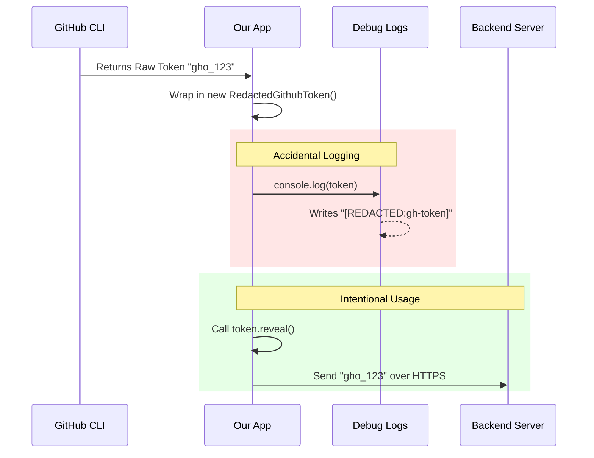

# Chapter 4: Redacted Token Security

In [Chapter 3: GitHub CLI Integration](03_github_cli_integration.md), we successfully hired a "subcontractor" (the GitHub CLI) to fetch a user's authentication token.

Now we are holding a **GitHub OAuth Token** in our hands. This is a powerful secret key. If a hacker gets it, they can impersonate the user.

## Motivation: The Sealed Envelope

Imagine you are a courier delivering a top-secret message.
1.  **The Risk**: If you hold the message in your hand while walking, you might accidentally read it aloud, or drop it where someone can see it.
2.  **The Solution**: You put the message in a **Sealed Envelope**.

In programming, we often print things to the console (`console.log`) to debug errors.
*   **Without Protection**: If we print the token object, the secret key appears in plain text in the logs.
*   **With Protection**: We want the logs to say `[REDACTED:gh-token]` instead of the actual key.

This chapter teaches you how to create a "Sealed Envelope" class that keeps secrets safe until the exact moment they need to be used.

## Key Concepts

### 1. The Wrapper Class
We don't store the token as a simple text string. We wrap it inside a JavaScript **Class**. This class acts as the envelope.

### 2. Overriding String Conversion
When you try to turn an object into text (like printing it), JavaScript looks for a method called `toString()`. We will replace the default behavior with our own version that lies and says "I am redacted."

### 3. The `reveal()` Method
We need a specific, deliberate way to open the envelope. We will create a method called `.reveal()` that returns the actual secret. We only call this when we are absolutely sure we are talking to a secure server.

---

## How to Create the Envelope

We are working in `api.ts`. Let's build the `RedactedGithubToken` class.

### Step 1: Storing the Secret
We use a private field (starting with `#`) to store the value. In TypeScript, private fields cannot be accessed from outside the class.

```typescript
export class RedactedGithubToken {
  // The '#' makes this strictly private
  readonly #value: string;

  constructor(raw: string) {
    this.#value = raw;
  }
  // ... methods coming next
}
```
*   **Input**: `new RedactedGithubToken("gho_SECRET_KEY")`
*   **State**: The class holds the secret, but nobody can touch `#value` directly.

### Step 2: The "Lie" (Redaction)
Now we define what happens if someone tries to print this object. We override `toString()` and `toJSON()`.

```typescript
  toString(): string {
    return '[REDACTED:gh-token]';
  }

  toJSON(): string {
    return '[REDACTED:gh-token]';
  }
```
*   **Action**: A developer writes `console.log("Token is: " + token)`.
*   **Output**: `"Token is: [REDACTED:gh-token]"`

### Step 3: Handling Node.js Console
Node.js has a special way of inspecting objects using `util.inspect`. We need to block that too using a Symbol.

```typescript
  // Special method for Node.js console.log(obj)
  [Symbol.for('nodejs.util.inspect.custom')](): string {
    return '[REDACTED:gh-token]';
  }
```
*   **Action**: A developer writes `console.log(token)`.
*   **Output**: `[REDACTED:gh-token]`

### Step 4: The Truth (Reveal)
Finally, we provide the **only** way to get the real value.

```typescript
  reveal(): string {
    return this.#value;
  }
}
```
*   **Usage**: `token.reveal()` returns the raw string `"gho_SECRET_KEY"`.

---

## Under the Hood: The Safety Check

What happens when we pass this token around our app?

1.  **Creation**: We wrap the raw string immediately after getting it from the CLI.
2.  **Logging**: If an error occurs and we log the state, the token protects itself.
3.  **Transmission**: Only when we are inside the API client do we call `.reveal()`.



## Implementation Deep Dive

Let's look at how this fits into the real `api.ts` file.

### The Class Definition
This is the complete class. It is a small but powerful security tool.

```typescript
// File: api.ts
export class RedactedGithubToken {
  readonly #value: string
  constructor(raw: string) {
    this.#value = raw
  }
  reveal(): string {
    return this.#value
  }
  toString(): string {
    return '[REDACTED:gh-token]'
  }
  // ... other overrides (toJSON, inspect) ...
}
```

### Usage in the Previous Chapter
In [Chapter 3: GitHub CLI Integration](03_github_cli_integration.md), you might remember this line in `checkLoginState`:

```typescript
// remote-setup.tsx
return {
  status: 'has_gh_token',
  token: new RedactedGithubToken(trimmed) // <--- Wrapping it here!
};
```
From this point forward, the `token` variable is safe to pass around.

### Usage in the Next Chapter
In the next chapter, we will see how to use `reveal()`. We only use it inside the `importGithubToken` function, right before sending the data to `axios` (our HTTP client).

```typescript
// File: api.ts (Preview)
const response = await axios.post(
  url,
  { token: token.reveal() }, // <--- Opening the envelope
  { headers }
);
```

## Conclusion

You have learned a vital security practice: **Defense in Depth**.

*   We don't trust ourselves (or future developers) not to accidentally log secrets.
*   We created a `RedactedGithubToken` class that acts as a **Sealed Envelope**.
*   We ensured the secret is only visible when we explicitly call `.reveal()`.

Now that we have the token safely wrapped up, how do we actually send it to our backend server to finish the setup?

[Next Chapter: Backend API Client](05_backend_api_client.md)

---

Generated by [Code IQ](https://github.com/adityasoni99/Code-IQ)