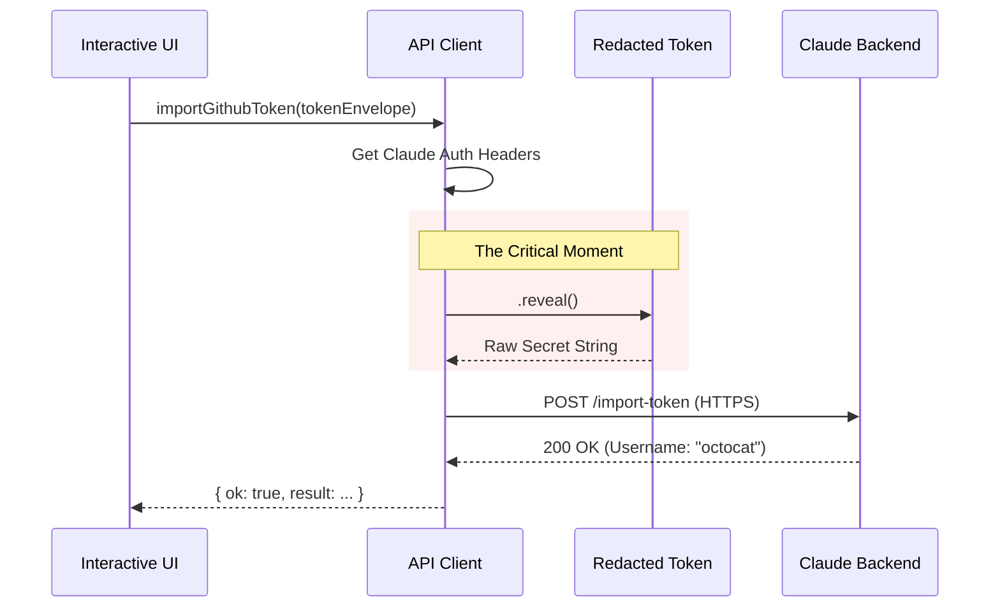

# Chapter 5: Backend API Client

In [Chapter 4: Redacted Token Security](04_redacted_token_security.md), we learned how to treat the user's GitHub token like a top-secret document. We sealed it inside a `RedactedGithubToken` envelope so it wouldn't accidentally leak into our logs.

Now, we have reached the final step. We need to take that sealed envelope and securely deliver it to the Claude servers.

## Motivation: The Private Courier

Imagine you have a sealed letter for the CEO of a company. You don't just walk into the building, wander the halls, and hope you find the right office. You also need your own ID badge to even get through the front door.

In software, communicating with a backend server involves similar challenges:
1.  **Authentication**: You need to attach your own "ID Badge" (Claude headers) to every request.
2.  **Addressing**: You need to know the exact URL (the office number).
3.  **Delivery**: You need to hand over the package safely.

If we wrote this logic inside our UI code, it would be messy and insecure. Instead, we create a **Backend API Client**. This acts as our dedicated **Private Courier**. The UI simply says "Deliver this," and the Client handles the IDs, the maps, and the secure transport.

## Key Concepts

### 1. The ID Badge (Request Headers)
Before we can send the GitHub token to the server, we need to prove who *we* are. We use a helper function `prepareApiRequest` to get our current Claude authentication headers.

### 2. The Unveiling
This is the most critical moment in the application. We take the `RedactedGithubToken` (the sealed envelope), and for a split second, we open it using `.reveal()` to put the secret data into the secure HTTPS request.

### 3. Structured Results
Network requests can fail in many ways (internet down, server error, invalid token). Instead of throwing messy "Exceptions" that crash the app, our client returns a tidy object telling us exactly what happened (e.g., `{ ok: false, error: 'network' }`).

---

## How to Use the Client

We are working in `api.ts`. The main function we need is `importGithubToken`.

### Example Usage
The UI code (from Chapter 2) doesn't need to know about URLs or headers. It just calls this function:

```typescript
// Inside the UI logic
const result = await importGithubToken(userToken);

if (result.ok) {
  console.log("Success! Connected as:", result.result.github_username);
} else {
  console.log("Something went wrong:", result.error);
}
```
*   **Input**: The sealed `RedactedGithubToken` object.
*   **Output**: A clean result object indicating success or failure.

---

## Under the Hood: The Delivery Route

What happens inside `importGithubToken`?

1.  **Prep**: The client looks up the user's Claude credentials.
2.  **Open**: It calls `.reveal()` on the token envelope.
3.  **Send**: It uses `axios` (an HTTP library) to POST the data to the server.
4.  **Interpret**: It translates the server's numeric code (like 401 or 200) into a readable status.



## Implementation Deep Dive

Let's look at the code in `api.ts` that handles this sensitive operation.

### Step 1: Gathering Credentials
Before we talk to the server, we ensure the user is logged into Claude.

```typescript
// file: api.ts
let accessToken: string, orgUUID: string;
try {
  // Get our "ID Badge"
  ({ accessToken, orgUUID } = await prepareApiRequest());
} catch {
  return { ok: false, error: { kind: 'not_signed_in' } };
}
```
*   **Explanation**: If `prepareApiRequest` fails, the user isn't logged into Claude CLI, so we stop immediately.

### Step 2: Sending the Request
This is where we combine the Headers (ID Badge) and the Body (Secret Token).

```typescript
const headers = {
  ...getOAuthHeaders(accessToken), // Attach ID badge
  'x-organization-uuid': orgUUID,
};

const response = await axios.post(
  url,
  { token: token.reveal() }, // <--- OPENING THE ENVELOPE
  { headers, timeout: 15000 }
);
```
*   **`token.reveal()`**: This is the **only** place in the entire application where we uncover the secret. Because `axios` sends data over HTTPS (encrypted internet traffic), it is safe to reveal it here.

### Step 3: Creating a Workspace (Bonus)
After the token is imported, we want the user to have a cloud computer ready. We have a second function `createDefaultEnvironment`.

```typescript
export async function createDefaultEnvironment(): Promise<boolean> {
  // If they already have a computer, don't make a new one
  if (await hasExistingEnvironment()) {
    return true;
  }
  
  // Otherwise, ask the server to build one
  const response = await axios.post(createUrl, defaultPayload, { headers });
  return response.status >= 200;
}
```
*   **Goal**: This ensures that when the user opens their browser, they land on a ready-to-use coding environment, not a blank screen.

## Conclusion

Congratulations! You have completed the **Remote Setup** tutorial.

Let's review the journey we took to build this feature:

1.  **[Chapter 1](01_command_registration___gating.md)**: We built the **Front Door**, registering the `web-setup` command and guarding it with feature flags.
2.  **[Chapter 2](02_interactive_setup_ui.md)**: We created a **Friendly Wizard** (UI) to guide the user through the steps.
3.  **[Chapter 3](03_github_cli_integration.md)**: We built a **Bridge** to the local system to automatically fetch credentials.
4.  **[Chapter 4](04_redacted_token_security.md)**: We wrapped those credentials in a **Secure Envelope** to prevent leaks.
5.  **Chapter 5 (You are here)**: We delivered the package using a **Backend Client** that handles authentication and transport.

You now have a fully functional, secure, and user-friendly CLI command that connects a local developer environment to the cloud! 🚀

---

Generated by [Code IQ](https://github.com/adityasoni99/Code-IQ)