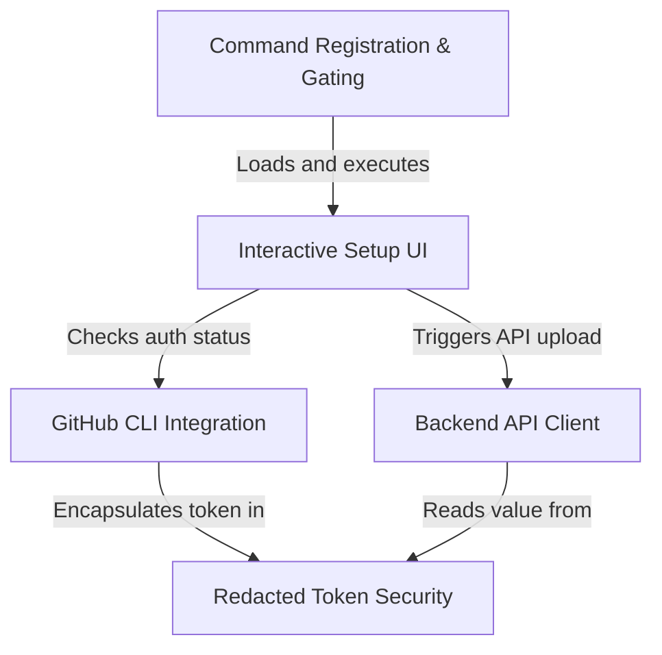

# Tutorial: remote-setup

This project facilitates connecting a local development environment to the **Claude** web platform by securely synchronizing GitHub credentials. It uses an interactive terminal interface to verify the local **GitHub CLI** status, wraps sensitive tokens in a secure *redacted* envelope, and transmits them to the backend to provision a cloud coding workspace.

## Chapters

1. [Command Registration & Gating](01_command_registration___gating.md)
2. [Interactive Setup UI](02_interactive_setup_ui.md)
3. [GitHub CLI Integration](03_github_cli_integration.md)
4. [Redacted Token Security](04_redacted_token_security.md)
5. [Backend API Client](05_backend_api_client.md)

---

Generated by [Code IQ](https://github.com/adityasoni99/Code-IQ)