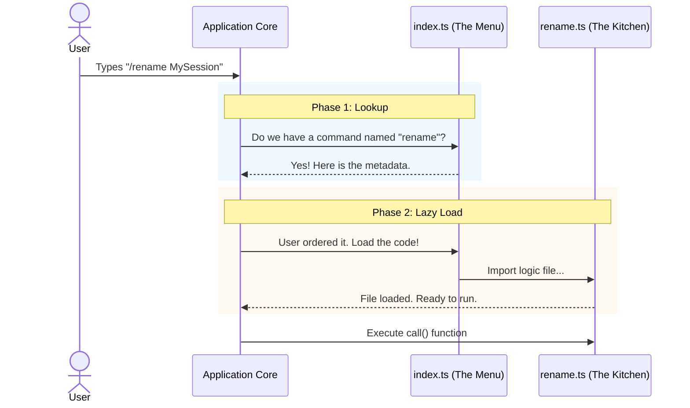

# Chapter 1: Command Definition & Registry

Welcome to the first chapter of our tutorial! We are going to build an understanding of the `rename` project from the ground up.

## The Motivation: The Restaurant Menu

Imagine you are building a complex application with dozens of tools. If the application loaded the code for *every single tool* the moment you started the app, it would be slow, heavy, and sluggish.

Think of this like a restaurant. When you sit down, the waiter hands you a **Menu**.
*   The menu lists the **Name** of the dish (e.g., "Spaghetti").
*   It gives a **Description** ("Pasta with tomato sauce").
*   It tells you the **Price** or input requirements.

**Crucially, the menu does not contain the actual Spaghetti.** The kitchen doesn't cook the spaghetti until you actually order it.

In our application, the **Command Definition** is the menu. It tells the system *what* commands are available without doing the heavy lifting of loading the code to execute them.

## Key Concept: The Command Definition

To define a new feature (like renaming a session), we create a lightweight contract. In our project, this lives in `index.ts`.

This file answers two main questions:
1.  **Metadata:** What does this command look like to the user?
2.  **Lazy Loading:** Where is the actual code located?

### 1. Defining the Metadata
Here is how we define the `rename` command. We create a simple object describing the tool.

```typescript
// index.ts
import type { Command } from '../../commands.js'

const rename = {
  type: 'local-jsx',     // The category of the command
  name: 'rename',        // The keyword the user types (e.g., /rename)
  description: 'Rename the current conversation', // Helper text
  immediate: true,       // Should it run immediately?
  argumentHint: '[name]',// Visual hint for inputs
  // ... loading logic comes next
} satisfies Command
```

**Explanation:**
This code doesn't "do" anything yet. It just declares that a command named `rename` exists. The system uses this to build the help menu or autocomplete suggestions.

### 2. Lazy Loading (The "Order" Mechanism)
This is the most important part of the definition. We want to keep the app fast, so we use a technique called **Lazy Loading**.

```typescript
// index.ts continued...
const rename = {
  // ... previous metadata ...
  
  // Only import the file when the user actually runs the command
  load: () => import('./rename.js'),
} satisfies Command

export default rename
```

**Explanation:**
The `load` property is a function. It uses `import()` to fetch the `rename.js` file *only* when the function is called. If a user never types `/rename`, the code in `rename.js` is never loaded into memory.

## Solving the Use Case

Let's look at our central use case: **The user wants to rename their current chat session.**

When you create this command definition, you are essentially plugging a new item into the application's "Motherboard."

1.  **Input:** User types `/rename ProjectAlpha`
2.  **Registry Check:** The system looks at `index.ts`. It sees `name: 'rename'`.
3.  **Output:** The system triggers the `load()` function, grabs the logic, and executes it.

## Internal Implementation: Under the Hood

How does the system move from the Definition (`index.ts`) to the Execution (`rename.js`)?

Let's visualize the flow when a user types a command.



### The Execution Logic (`rename.ts`)

Once `index.ts` has successfully loaded the file, the system expects to find a specific function exported from `rename.ts`: the `call` function.

This is the standard entry point for all commands.

```typescript
// rename.ts
import type { LocalJSXCommandOnDone, LocalJSXCommandContext } from '../../types/command.js'

// The system calls this function after loading the file
export async function call(
  onDone: LocalJSXCommandOnDone,     // Callback to finish the command
  context: LocalJSXCommandContext,   // Info about the app state
  args: string,                      // The user's input (e.g., "ProjectAlpha")
): Promise<null> {
  // Logic goes here...
  return null
}
```

**Explanation:**
*   `args`: This contains "ProjectAlpha" (what the user typed).
*   `context`: Gives us access to the application's memory (we will explore this in [Application State Management](04_application_state_management.md)).
*   `onDone`: A way to tell the system "I'm finished, print this message."

### Example Logic: Checking Permissions

Inside the `call` function, we can write normal TypeScript code. For example, checking if the user is allowed to rename the session.

```typescript
// rename.ts
import { isTeammate } from '../../utils/teammate.js'

// ... inside call() ...
  if (isTeammate()) {
    onDone(
      'Cannot rename: This session is a swarm teammate.',
      { display: 'system' }
    )
    return null
  }
```

**Explanation:**
This snippet checks a specific condition. If it fails, it calls `onDone` immediately to show an error message to the user, effectively canceling the renaming process.

## Summary

In this chapter, we learned:
1.  **Separation of Concerns:** We separate the **Definition** (Menu) from the **Implementation** (Kitchen).
2.  **Metadata:** `index.ts` defines the command name (`rename`) and hints.
3.  **Lazy Loading:** We use `load: () => import(...)` to keep the application lightweight, loading code only when requested.

Now that we have successfully defined our command and understood how the system loads it, we need to understand exactly what happens inside that `call()` function.

[Next Chapter: Command Execution Lifecycle](02_command_execution_lifecycle.md)

---

Generated by [Code IQ](https://github.com/adityasoni99/Code-IQ)