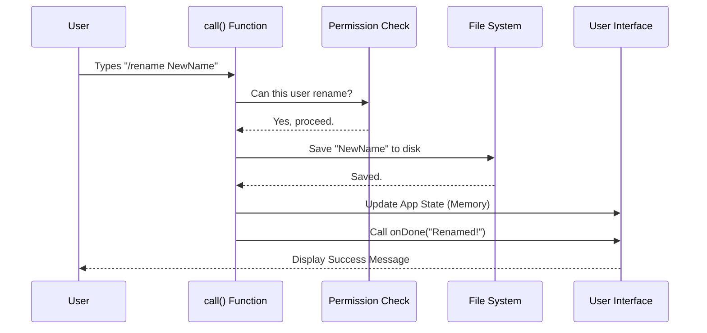

# Chapter 2: Command Execution Lifecycle

In the previous chapter, [Command Definition & Registry](01_command_definition___registry.md), we established the "Menu" of our application. We defined *what* the `rename` command is and *where* its code lives.

Now, we are entering the kitchen. This chapter explains what happens when the user actually orders off the menu. We will explore the **Command Execution Lifecycle**—the precise steps the system takes to process a request from start to finish.

## The Motivation: From Input to Action

Imagine a standard request/response cycle. A user gives an input, the system processes it, and then the system tells the user it's done.

Without a structured lifecycle, our code would be a mess of random functions calling each other. We need a standard **Contract**. Every command in our application follows the same routine:
1.  **Receive** ingredients (arguments).
2.  **Check** the recipe (validation).
3.  **Cook** the dish (execution).
4.  **Ring the bell** (notification).

### Central Use Case
We continue with our primary example: **The user types `/rename MyCoolProject`.**

Our goal is to take the string "MyCoolProject" and update the application's records, ensuring everything is valid before we do so.

## Key Concept: The `call` Function

In `rename.ts`, the entire lifecycle is encapsulated in a single exported function named `call`. This is the "General Manager" of the command.

It takes three critical inputs:

1.  **`onDone`**: A callback function (the "bell"). We call this to tell the main app we are finished and to display a message.
2.  **`context`**: The state of the application (the "kitchen pantry"). It holds user history, permissions, and settings.
3.  **`args`**: The text the user typed (the "ingredients").

## Solving the Use Case: Step-by-Step

Let's break down `rename.ts` into small, digestible blocks to see how we handle `/rename MyCoolProject`.

### Step 1: Receiving the Request
First, the function receives the data.

```typescript
// rename.ts
export async function call(
  onDone: LocalJSXCommandOnDone,    // The "Done" Signal
  context: LocalJSXCommandContext,  // The App State
  args: string,                     // "MyCoolProject"
): Promise<null> {
  // logic starts here...
```

**Explanation:**
The system automatically passes these three items to us. `args` is a simple string containing whatever the user typed after the command name.

### Step 2: Validation (Safety Checks)
Before we cook, we must ensure the order is valid. In our app, "Teammates" (AI agents or restricted users) aren't allowed to rename sessions.

```typescript
  // Inside call()...
  // Check if the current user is a restricted "Teammate"
  if (isTeammate()) {
    onDone(
      'Cannot rename: This session is a swarm teammate.',
      { display: 'system' }, // Show as a system message
    )
    return null // Stop execution immediately
  }
```

**Explanation:**
If `isTeammate()` is true, we ring the bell (`onDone`) with an error message and return `null`. This aborts the command effectively.

### Step 3: Handling the Input
Now we determine what the new name should be. If the user provided a name, we use it. If they didn't, we might need to generate one (we will cover the AI generation part in [AI-Driven Content Generation](03_ai_driven_content_generation.md)).

```typescript
  let newName: string
  
  // Did the user type something? (e.g. "MyCoolProject")
  if (args && args.trim() !== '') {
    newName = args.trim()
  } else {
    // Logic to auto-generate name goes here (See Chapter 3)
    // For now, let's assume they provided a name.
    return null 
  }
```

**Explanation:**
We clean up the input using `.trim()` to remove accidental spaces. `newName` now holds "MyCoolProject".

### Step 4: Execution (Saving the Data)
Now we perform the actual work. We need to save this name to the file system and update the application state.

```typescript
  const sessionId = getSessionId()
  const fullPath = getTranscriptPath()

  // 1. Save to disk so it persists after restart
  await saveCustomTitle(sessionId, newName, fullPath)

  // 2. Save to the agent's internal name reference
  await saveAgentName(sessionId, newName, fullPath)
```

**Explanation:**
We use helper functions to save the data. This ensures that if the user closes the app and comes back, the session is still named "MyCoolProject".

### Step 5: Updating State & Notification
Finally, we update the live memory (Context) and tell the user we are done.

```typescript
  // Update the live application state context
  context.setAppState(prev => ({
    ...prev,
    standaloneAgentContext: {
      ...prev.standaloneAgentContext,
      name: newName, // Update the name in memory
    },
  }))

  // Ring the bell! Notify user of success.
  onDone(`Session renamed to: ${newName}`, { display: 'system' })
  return null
}
```

**Explanation:**
*   `context.setAppState`: This updates the UI immediately without needing a reload. We will explore this deeper in [Application State Management](04_application_state_management.md).
*   `onDone`: Prints "Session renamed to: MyCoolProject" in the chat console.

## Internal Implementation: Under the Hood

How does this flow look from a system perspective? It acts like a pipeline.

### The Execution Flow



### Deep Dive: The `onDone` Callback

The `onDone` function is a crucial part of the lifecycle. It bridges the gap between our specific logic (`rename.ts`) and the generic system.

The system passes `onDone` to us essentially saying: *"I don't know how long you will take. Take your time. Just call this function when you are finished."*

This allows our command to be **Asynchronous**. We can wait for file saves, database calls, or API requests without freezing the application.

```typescript
// Conceptual example of onDone usage
export async function call(onDone, context, args) {
  
  // We can await slow operations here...
  await heavyDatabaseOperation()

  // The app waits patiently until we do this:
  onDone('Finished!', { display: 'system' })
}
```

## Summary

In this chapter, we learned:
1.  **The `call` Interface:** The standard entry point for all commands consisting of `onDone`, `context`, and `args`.
2.  **Input Validation:** How to check permissions (like `isTeammate`) before acting.
3.  **Execution & Notification:** Performing the task (saving the name) and using `onDone` to communicate success.

However, we skipped one detail. What if the user types `/rename` *without* an argument? We mentioned the system can "generate" a name automatically. To do that, we need the power of Artificial Intelligence.

[Next Chapter: AI-Driven Content Generation](03_ai_driven_content_generation.md)

---

Generated by [Code IQ](https://github.com/adityasoni99/Code-IQ)