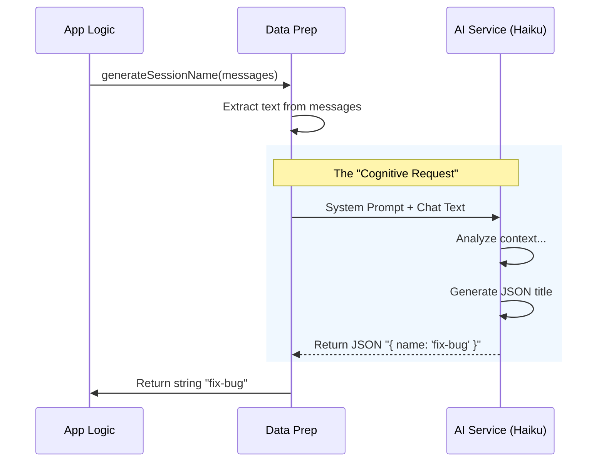

# Chapter 3: AI-Driven Content Generation

Welcome back! In the previous chapter, [Command Execution Lifecycle](02_command_execution_lifecycle.md), we learned how the application receives a command like `/rename MyProject` and executes it.

But what if the user is feeling lazy? What if they just type `/rename` and hit Enter, expecting the computer to figure out a good name for them?

In this chapter, we will explore **AI-Driven Content Generation**. We will look at how we treat an Artificial Intelligence model not just as a chatbot, but as a silent "function" that performs cognitive tasks for us.

## The Motivation: The "Hired Editor"

Imagine you are writing a book. You write the chapters, but you are terrible at coming up with titles. So, you hire a quick, specialized editor.
1.  You hand the editor your manuscript (the chat history).
2.  You give them a strict rule: "Read this and give me a 3-word title in lowercase format. Don't say anything else."
3.  The editor hands you back a slip of paper with just the title.

In our project, the file `generateSessionName.ts` is that editor.

Instead of writing complex code to analyze keywords (which is hard!), we simply send the conversation to a Language Model (specifically "Haiku," a fast and lightweight model) and ask it to summarize the context into a string.

## Central Use Case

**The User types `/rename` (with no arguments).**

Our goal is to look at the last few messages in the chat, understand the topic (e.g., debugging a login page), and automatically generate a title like `debug-login-page`.

## Key Concepts

### 1. The System Prompt (The Rules)
To make an AI behave like a function, we must give it strict instructions. We don't want it to say, *"Here is a suggestion: debug-login."* We want *just* the data.

### 2. Structured Output (JSON)
AI models usually speak in paragraphs. To use the output in our code, we force the AI to reply in **JSON format**. This ensures we get a predictable object we can use immediately.

## Solving the Use Case: Step-by-Step

Let's look at how we implement this "Editor" logic in `generateSessionName.ts`.

### Step 1: Preparing the Input
First, we define our function. It accepts the conversation history (`messages`) as input.

```typescript
// generateSessionName.ts
import { queryHaiku } from '../../services/api/claude.js'

export async function generateSessionName(
  messages: Message[], 
  signal: AbortSignal
): Promise<string | null> {
  // Logic begins...
```

**Explanation:**
This function returns a `Promise<string | null>`. It will either give us a name string or `null` if something goes wrong (like a network error).

### Step 2: Extracting Text
The `messages` array contains complex objects with timestamps and IDs. The AI only needs the text.

```typescript
  // Convert the complex message list into a simple text string
  const conversationText = extractConversationText(messages)

  // If the chat is empty, we can't summarize it!
  if (!conversationText) {
    return null
  }
```

**Explanation:**
We use a helper `extractConversationText` to turn the chat history into a single block of text that the AI can read.

### Step 3: The "Instructions" (System Prompt)
We need to tell the AI exactly what to do. We want a specific format: "kebab-case" (words separated by hyphens).

```typescript
  const prompt = [
    'Generate a short kebab-case name (2-4 words) that captures the main topic.',
    'Use lowercase words separated by hyphens.',
    'Examples: "fix-login-bug", "add-auth-feature".',
    'Return JSON with a "name" field.',
  ]
```

**Explanation:**
This acts as the "Job Description" for our AI editor. By giving examples, we ensure the AI understands exactly the style we want.

### Step 4: Calling the API
Now we send the request to the API. Notice the `outputFormat`.

```typescript
    const result = await queryHaiku({
      systemPrompt: asSystemPrompt(prompt), // Our rules
      userPrompt: conversationText,         // The content to summarize
      outputFormat: {                       // Force structured data
        type: 'json_schema',
        schema: {
          type: 'object',
          properties: { name: { type: 'string' } },
          required: ['name'],
        },
      },
      signal,
    })
```

**Explanation:**
This is the magic moment. We call `queryHaiku`.
*   **systemPrompt**: The rules.
*   **userPrompt**: The chat history.
*   **outputFormat**: We tell the AI, "You are forbidden from speaking normal text. You MUST reply with a JSON object containing a `name` property."

### Step 5: Parsing the Result
The AI sends back a response. Even though we asked for JSON, we must carefully check it (parse it) to ensure it's valid.

```typescript
    const content = extractTextContent(result.message.content)
    const response = safeParseJSON(content)

    // Check if we actually got a string back
    if (response && response.name) {
      return response.name // Returns "fix-login-bug"
    }
    return null
```

**Explanation:**
`safeParseJSON` attempts to turn the text response into a JavaScript object. If it succeeds, we return the name. If the AI hallucinated or the network failed, we return `null`.

## Internal Implementation: Under the Hood

Let's visualize the flow of data when this function is called. It is a "Ping-Pong" operation between our app and the AI Service.



### Why use `queryHaiku`?
You might wonder why we specifically use a model called "Haiku."
*   **Speed:** Summarizing a title should feel instant. Haiku is a smaller, faster model optimized for simple tasks.
*   **Cost:** It is cheaper to run than a massive reasoning model.
*   **Focus:** We don't need a PhD-level AI to write a 3-word title.

### Error Handling Strategy
In this specific module, we use a "Fail Silently" strategy.

```typescript
  } catch (error) {
    // Log it for developers to see, but don't crash the app
    logForDebugging(`generateSessionName failed: ${error}`)
    
    // Just return null so the app can fall back to a default name
    return null
  }
```

**Explanation:**
If the internet goes down or the API times out, we don't want the user to see a scary error popup just because an auto-rename failed. We log the error in the background and simply return `null`. The command logic (from Chapter 2) will handle the `null` gracefully (perhaps by leaving the name unchanged).

## Summary

In this chapter, we learned:
1.  **AI as a Function:** We can use LLMs to perform specific data processing tasks, not just for chatting.
2.  **Prompt Engineering:** Providing specific rules and examples helps the AI give us exactly what we need.
3.  **Structured Output:** Forcing `json_schema` ensures the AI returns code-readable data, not conversational fluff.

Now we have a command that runs, and an AI that generates data for it. But when the name changes, how does the rest of the application know? How does the sidebar update instantly?

We need to discuss how data flows through the application's memory.

[Next Chapter: Application State Management](04_application_state_management.md)

---

Generated by [Code IQ](https://github.com/adityasoni99/Code-IQ)