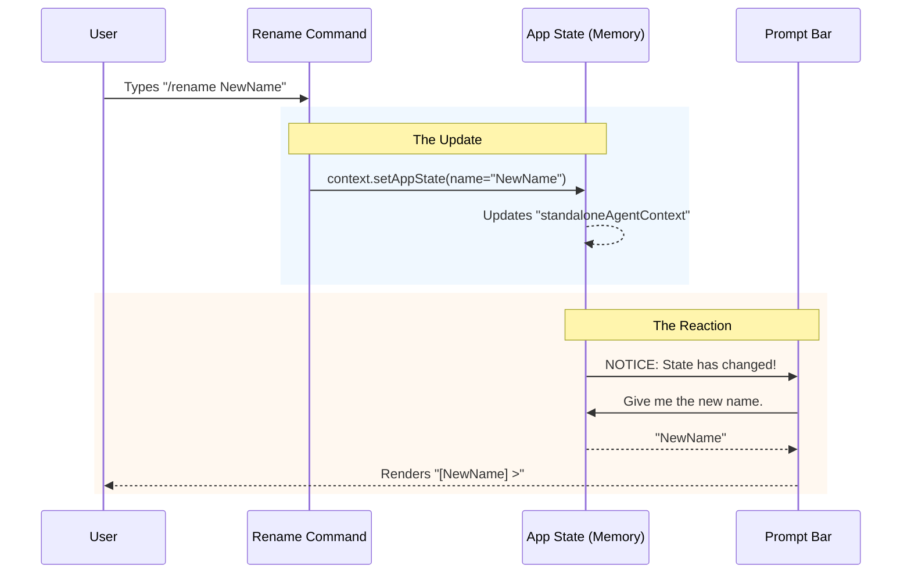

# Chapter 4: Application State Management

Welcome back! In the previous chapter, [AI-Driven Content Generation](03_ai_driven_content_generation.md), we learned how to use AI to automatically generate a smart name for our session.

We now have a command that receives a name and saves it to the hard drive. However, we have a problem. Even though the file is saved, **the visual interface (the UI) doesn't know about it yet.**

Imagine changing your name legally at the courthouse. The paperwork is filed (saved to disk), but until you actually *tell* your friends, they will keep calling you by your old name.

In this chapter, we will learn about **Application State Management**—the method we use to "tell" the running application that something has changed so it can update the screen immediately.

## The Motivation: The "Live" Feed

Applications have two types of memory:
1.  **Long-term memory (Files):** Data saved to the hard drive. This survives a restart.
2.  **Short-term memory (State):** Data currently held in RAM while the app runs. This powers the UI.

If we only update the files, the user won't see the new name until they close and reopen the app. That feels "buggy" and slow.

### Central Use Case

**The user successfully renames the session to "Project-Beta".**

Our goal is to update the **Prompt Bar** (the place where the user types) instantly. It usually displays the current session name (e.g., `[Project-Alpha] >`). We want it to flip to `[Project-Beta] >` the exact millisecond the command finishes.

## Key Concept: The Context Object

In [Command Execution Lifecycle](02_command_execution_lifecycle.md), we introduced the `context` argument. Up until now, we mostly ignored it.

```typescript
export async function call(
  onDone: LocalJSXCommandOnDone,
  context: ToolUseContext, // <--- This is the key!
  args: string,
)
```

Think of `context` as the **Nervous System** of the application. It connects your isolated command logic to the rest of the application's body. It allows you to:
1.  **Read** what is currently happening (Get State).
2.  **Write** changes to the live memory (Set State).

## Solving the Use Case: Step-by-Step

We need to perform two specific state operations to fully rename the session: updating the cloud connection (Reading) and updating the local UI (Writing).

### Step 1: Reading State (The Bridge)
Sometimes our local session is connected to a cloud session (a "Bridge"). We need to check the state to see if a Bridge ID exists.

```typescript
  // 1. Get the current snapshot of the app's memory
  const appState = context.getAppState()

  // 2. Read a specific value from that memory
  const bridgeSessionId = appState.replBridgeSessionId
```

**Explanation:**
We use `context.getAppState()` to take a snapshot. We check `replBridgeSessionId`. If this ID exists, we know we are connected to the cloud, and we might need to send an update there too (we will cover the specific synchronization code in the next chapter).

### Step 2: Writing State (The UI Update)
This is the most critical part for the user experience. We need to overwrite the old name in memory with the new one.

We use `context.setAppState` to do this.

```typescript
  // Update the live application state
  context.setAppState(prev => ({
    ...prev, // Keep all other existing state exactly the same
    standaloneAgentContext: {
      ...prev.standaloneAgentContext, // Keep other agent settings
      name: newName, // <--- CHANGE THIS ONLY
    },
  }))
```

**Explanation:**
*   `setAppState`: This function tells React (or the UI engine) that data changed.
*   `prev`: The previous state before our change.
*   `...prev`: This is the **Spread Operator**. It means "Copy everything else." We don't want to accidentally delete the user's settings; we only want to change the `name`.

### Step 3: Triggering the UI
You don't need to write code to "refresh" the screen. By calling `setAppState`, the application detects the change automatically and re-renders the Prompt Bar with the new name.

## Internal Implementation: Under the Hood

How does the `rename` command talk to the Prompt Bar? They are in completely different files!

They communicate through a shared **Store**.

### The Feedback Loop



### Deep Dive: `standaloneAgentContext`

You might wonder why the name is nested inside `standaloneAgentContext`.

The application is designed to be modular.
*   **App State:** The global container.
*   **Standalone Agent:** The specific "bot" or session you are currently talking to.

The `rename.ts` file doesn't just change a string; it modifies the identity of the active agent in memory.

```typescript
// Conceptual view of the App State object
{
  replBridgeSessionId: '123-cloud-id', // Cloud connection
  standaloneAgentContext: {
    role: 'engineer',
    name: 'OldName', // We target this specific field
    tools: [...]
  }
}
```

When we run our `setAppState` code, we are surgically targeting that `name` field while leaving the `role` and `tools` untouched.

## Summary

In this chapter, we learned:
1.  **State vs. Files:** Saving to a file isn't enough; we must update the running memory (`State`) to change the UI.
2.  **`getAppState`:** How to read global data (like cloud IDs).
3.  **`setAppState`:** How to write data back to the application to trigger immediate visual updates.

We have now handled the local file system (Chapter 2), the content generation (Chapter 3), and the local user interface (Chapter 4).

But there is one piece of data we read but didn't fully use yet: the `bridgeSessionId`. If we are connected to the cloud, simply updating our local UI isn't enough—we need to tell the server to rename the session too.

[Next Chapter: Cross-Environment Synchronization](05_cross_environment_synchronization.md)

---

Generated by [Code IQ](https://github.com/adityasoni99/Code-IQ)