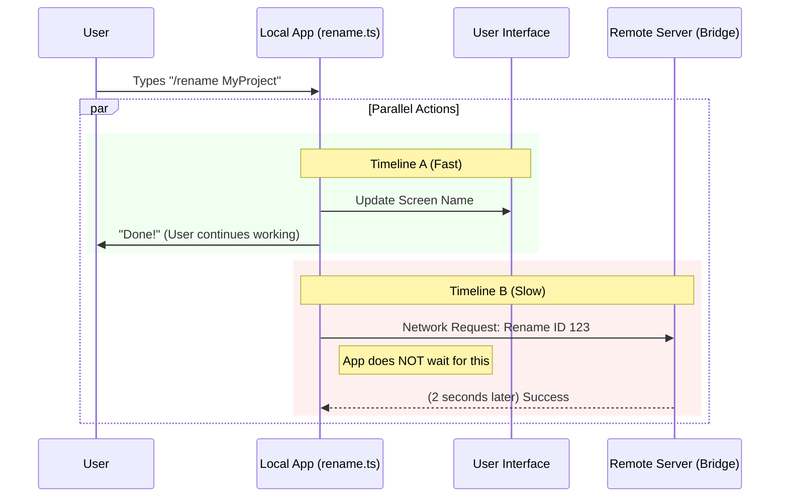

# Chapter 5: Cross-Environment Synchronization

Welcome to the final chapter of our tutorial series!

In the previous chapter, [Application State Management](04_application_state_management.md), we learned how to update the application's "brain" (the State) so the user interface updates instantly when a session is renamed.

However, our application often lives a double life. While it runs locally on your machine, it might also be "Bridged" to a cloud environment (like claude.ai).

If you rename your session locally to "My-Super-Project," but the cloud still calls it "Untitled Session," we have a **Synchronization Conflict**.

In this chapter, we will explore **Cross-Environment Synchronization**—the mechanism that ensures our local changes are mirrored to the remote server without slowing down the application.

## The Motivation: The "Split Brain" Problem

Imagine you have a physical notebook (Local) and a digital backup (Cloud).
1.  You scribble a new title on your physical notebook.
2.  If you don't immediately update the digital backup, they are out of sync.

In software, this is tricky because **Network calls are slow.** Writing to your hard drive takes milliseconds. Sending data to a server might take seconds.

If we wait for the server to say "Okay, I renamed it" before letting the user type again, the app will feel frozen and sluggish.

### Central Use Case

**The user is connected to the Cloud Bridge and types `/rename Cloud-Project`.**

Our goal is to update the local interface *instantly* (0.1s), while sending a message to the cloud in the background to update the server eventually (2.0s).

## Key Concept: "Fire and Forget"

To solve the speed problem, we use a pattern called **Fire and Forget**.

*   **Blocking:** You order coffee and wait at the counter until they hand it to you. You can't do anything else.
*   **Fire and Forget:** You drop a letter in the mailbox. You walk away immediately. You assume the post office will handle it.

In `rename.ts`, we "drop the letter" to the cloud API and immediately let the user get back to work.

## Solving the Use Case: Step-by-Step

Let's look at the specific block of code in `rename.ts` that handles this synchronization.

### Step 1: Checking for a Connection
First, we need to know if we even *have* a cloud connection. We do this by checking the `appState`.

```typescript
  // Get the current state
  const appState = context.getAppState()
  
  // Look for a Bridge Session ID
  const bridgeSessionId = appState.replBridgeSessionId

  // Only proceed if we are actually connected to the cloud
  if (bridgeSessionId) {
     // ... sync logic
  }
```

**Explanation:**
If `bridgeSessionId` is null or undefined, the user is working offline. We skip the entire network process. This saves resources.

### Step 2: Lazy Loading the Network Logic
Just like we learned in [Command Definition & Registry](01_command_definition___registry.md), we don't want to load network code if we don't need it.

```typescript
    // Inside the if (bridgeSessionId) block...
    
    // Dynamically import the file needed to talk to the bridge
    void import('../../bridge/createSession.js').then(
      ({ updateBridgeSessionTitle }) => {
         // This runs only after the file is loaded
      }
    )
```

**Explanation:**
We use `import()` inside the function. This ensures that users who never use the cloud bridge never have to load the heavy `createSession.js` file into memory.

### Step 3: Sending the Update
Once the function is loaded, we call it with the necessary credentials.

```typescript
      // Inside the .then() block...
      
      updateBridgeSessionTitle(bridgeSessionId, newName, {
        baseUrl: getBridgeBaseUrlOverride(),
        // Pass the token if it exists
        getAccessToken: tokenOverride ? () => tokenOverride : undefined,
      })
```

**Explanation:**
We pass the `bridgeSessionId` (who to rename) and the `newName` (what to rename it to). We also pass configuration options like the URL and access tokens so the server knows we are authorized to make this change.

### Step 4: The "Safety Net" (Catch)
What if the internet cuts out exactly when we send this request? We don't want the local app to crash just because the cloud failed.

```typescript
      // Attach an error handler to the Promise
      .catch(() => {
        // Do nothing. 
        // We failed to update the cloud, but the local app is fine.
      }),
```

**Explanation:**
We add `.catch(() => {})`. This essentially swallows any errors. Since this is a "nice to have" feature (syncing the name), we prefer to fail silently rather than popping up a scary error box to the user.

## Internal Implementation: Under the Hood

This entire process happens **Asynchronously**. This is the most important concept to understand about the flow.

### The Parallel Flow

When the `call()` function runs, it splits into two parallel timelines.



### Deep Dive: The `void` Operator

You might have noticed a strange keyword in the code:

```typescript
void import(...).then(...)
```

In TypeScript/JavaScript, `import()` returns a **Promise** (a guarantee that code will run in the future).

Usually, the system expects us to `await` that promise. But `await` pauses the code! We don't want to pause.

By putting `void` in front of it, we explicitly tell the compiler: *"I know this returns a Promise, and I am choosing to ignore it. Run this in the background, I am moving on."*

This is what enables the "Fire and Forget" behavior.

## Conclusion

Congratulations! You have completed the **`rename` Project Tutorial**.

Let's review what we built across these five chapters:

1.  **[Command Definition & Registry](01_command_definition___registry.md):** We created the "Menu" item so the app knows the command exists.
2.  **[Command Execution Lifecycle](02_command_execution_lifecycle.md):** We built the "Kitchen" logic to validate inputs and save files.
3.  **[AI-Driven Content Generation](03_ai_driven_content_generation.md):** We hired an "AI Editor" to automatically generate names when inputs are missing.
4.  **[Application State Management](04_application_state_management.md):** We wired up the "Nervous System" to update the UI instantly.
5.  **Cross-Environment Synchronization:** We added a background "Postal Service" to sync changes to the cloud without slowing us down.

You now understand the full stack of a modern, AI-integrated command! You can apply these patterns—Lazy Loading, State Management, and Fire-and-Forget Sync—to build any other tool in this ecosystem.

Happy coding!

---

Generated by [Code IQ](https://github.com/adityasoni99/Code-IQ)