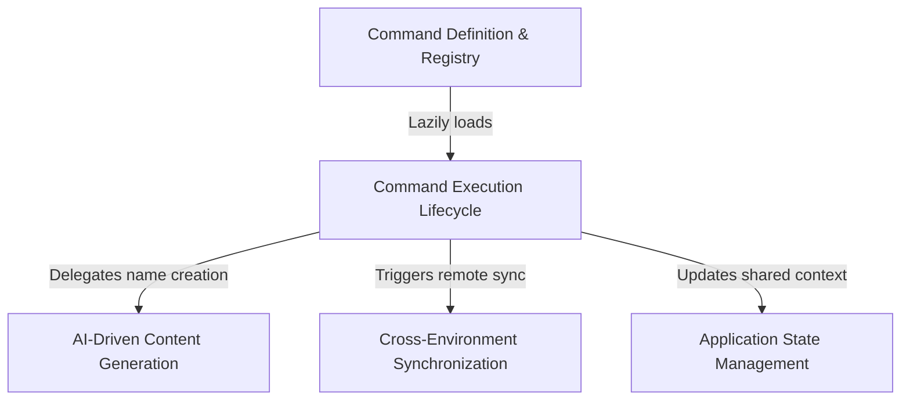

# Tutorial: rename

The `rename` project provides a feature to update the identifier of a current **conversation session**, either by accepting a user-defined string or by automatically generating a summary title using *artificial intelligence*. This functionality ensures a seamless user experience by persisting the new name locally, updating the active **application state** for immediate UI feedback, and synchronizing the change with remote cloud environments.

## Chapters

1. [Command Definition & Registry](01_command_definition___registry.md)
2. [Command Execution Lifecycle](02_command_execution_lifecycle.md)
3. [AI-Driven Content Generation](03_ai_driven_content_generation.md)
4. [Application State Management](04_application_state_management.md)
5. [Cross-Environment Synchronization](05_cross_environment_synchronization.md)

---

Generated by [Code IQ](https://github.com/adityasoni99/Code-IQ)