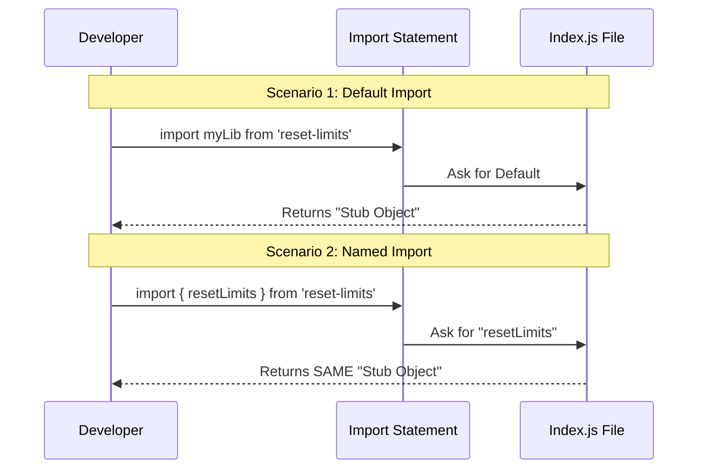

# Chapter 1: Unified Interface Exports

Welcome to the **reset-limits** project! In this first chapter, we are going to look at how this library greets the rest of your application.

## The Motivation: One Destination, Many Paths

Imagine you are trying to plug a lamp into a wall socket.
- Sometimes the plug is **round**.
- Sometimes the plug is **square**.

Usually, you need a specific adapter for each one. If you use the wrong adapter, nothing works.

In JavaScript, importing code works similarly. Developers have different preferences (or "styles") for bringing code into their files:
1.  **Default Import:** Asking for the main thing the module offers.
2.  **Named Import:** Asking for specific tools by their exact names.

**The Problem:** If a library only supports one style, a developer trying to use the other style will get an error (or worse, `undefined`), causing the app to crash.

**The Solution:** **Unified Interface Exports**. We design our library to act like a universal socket. Whether you plug in a "round" import or a "square" import, you get connected to the same electricity source.

## Concept: The Universal Adapter

This pattern ensures consistency. No matter *how* you ask for the library, you receive the exact same object.

Think of it like ordering pizza:
- You can order "The House Special" (Default).
- You can order "The Pepperoni Pizza" (Named).

In our case, the kitchen sends you the exact same pizza for both orders.

### Solving the Use Case

Let's look at how this helps a developer using `reset-limits`.

#### Scenario A: The Default Import
Some developers prefer importing the whole library as a single unit.

```javascript
// A developer writes this in their app:
import AnyNameIWant from './index.js';

console.log(AnyNameIWant.name);
```

**Output:**
```text
stub
```
*Explanation:* The code works perfectly. The developer got the object.

#### Scenario B: The Named Import
Other developers prefer being specific about what they want to use.

```javascript
// Another developer writes this:
import { resetLimits } from './index.js';

console.log(resetLimits.name);
```

**Output:**
```text
stub
```
*Explanation:* This also works perfectly! They received the exact same object as the developer in Scenario A.

## Internal Implementation: How It Works

How does the library achieve this magic trick? It's all about how we package the code in our entry file.

Here is a high-level view of what happens when your code asks to import `reset-limits`.



### Deep Dive: The Code

Let's look at the actual code inside `index.js`. It uses a clever trick to point every export to the same variable.

#### Step 1: Create the Source
First, we define the object we want to share. In this project, it is a "stub" (a placeholder object).

```javascript
// Define the single source of truth
const stub = { isEnabled: () => false, isHidden: true, name: 'stub' };
```

> **Note:** The properties inside this object, like `isHidden`, determine how the feature behaves. We will learn all about this in [Feature Visibility and Availability](02_feature_visibility_and_availability.md).

#### Step 2: The Default Export
Next, we handle the "Round Plug" (Default Import).

```javascript
// Allow "import X from ..."
export default stub;
```
*Explanation:* If someone imports this file without curly braces `{}`, JavaScript gives them the `stub` object.

#### Step 3: The Named Exports
Finally, we handle the "Square Plugs" (Named Imports). We create specific names that point to that **same** `stub` variable.

```javascript
// Allow "import { resetLimits } from ..."
export const resetLimits = stub;

// Allow "import { resetLimitsNonInteractive } from ..."
export const resetLimitsNonInteractive = stub;
```
*Explanation:* 
- We are not creating copies. 
- We are creating **aliases**. 
- `resetLimits` is just another name for `stub`.

## Conclusion

By using **Unified Interface Exports**, we have made our library extremely beginner-friendly and robust. The consumer of the code doesn't need to memorize strict import rules; they just import it, and it works.

Now that we know *how* to export the object, it's time to look at *what* is inside that object. The `stub` contains flags that control whether features are seen or used.

[Next Chapter: Feature Visibility and Availability](02_feature_visibility_and_availability.md)

---

Generated by [Code IQ](https://github.com/adityasoni99/Code-IQ)