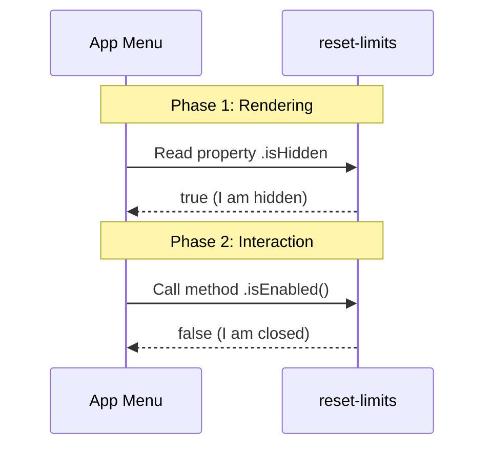

# Chapter 2: Feature Visibility and Availability

Welcome back! In the previous chapter, [Unified Interface Exports](01_unified_interface_exports.md), we learned how to import our library safely. We saw that no matter how you ask for the code, you get the same object.

Now, we need to look **inside** that object.

## The Motivation: avoiding the "Crash"

Imagine you are building a navigation menu for your application. You add a button called "Reset Limits."
1.  A user sees the button.
2.  The user clicks the button.
3.  **CRASH!** The logic for that button hasn't loaded yet, or perhaps the server is down.

This is a terrible user experience. It is like walking into a store, filling your cart, and then realizing there is no cashier to check you out.

### The Use Case: The "Closed" Sign

We need a way for our code to communicate its status **before** the user tries to use it.

Think of a store window:
*   **Visibility (`isHidden`):** If the store has gone out of business, they take down the sign. You don't even see the store.
*   **Availability (`isEnabled`):** If the store is there but it is 3:00 AM, the "Closed" sign is up. You see the store, but you know you can't go in.

This abstraction allows your application to ask, "Are you open for business?" before letting the user try the door.

## Concept: Safety Flags

To solve this, our library exposes two specific tools attached to the main object.

### 1. `isHidden` (The Property)
This answers the question: **"Should the user even know this exists?"**

*   **Type:** Boolean (`true` or `false`)
*   **Usage:** Used by menus to decide if a link should be rendered in the HTML.

### 2. `isEnabled` (The Method)
This answers the question: **"Can the user interact with this right now?"**

*   **Type:** Function returning a Boolean (`() => true` or `() => false`)
*   **Usage:** Used to gray out buttons or show a "Loading..." spinner.

## How to Use It

Let's see how a developer building a menu would use these flags to prevent bugs.

### Checking Visibility
Before drawing the menu, we check if the feature is hidden.

```javascript
import stub from './index.js';

if (stub.isHidden) {
    console.log("Skipping menu item...");
    // The code stops here. The button is never drawn.
} else {
    console.log("Drawing button!");
}
```

**Output:**
```text
Skipping menu item...
```
*Explanation:* Because `isHidden` is `true`, the application safely ignores the feature. No crash happens because the code never runs.

### Checking Availability
If the feature is visible, we might want to check if it works before letting the user click it.

```javascript
import stub from './index.js';

// The function returns false, meaning "Closed"
const canClick = stub.isEnabled(); 

if (canClick) {
   console.log("Action executed!");
} else {
   console.log("Sorry, this feature is disabled.");
}
```

**Output:**
```text
Sorry, this feature is disabled.
```
*Explanation:* The `isEnabled` method acts as a guard. It allows the application to handle the "Closed" state gracefully (e.g., by showing a grayed-out button) instead of throwing an error.

## Internal Implementation: How It Works

How does the library know if it is hidden or enabled?

At this stage in our project, we are using a **Stub**. A stub is like a movie set prop—it looks like a real object from the outside, but it doesn't do anything real on the inside.

### Sequence of Events

Here is what happens when your application queries these flags.



### Deep Dive: The Code

Let's look at `index.js` again to see how these flags are defined.

```javascript
// --- File: index.js ---

const stub = { 
    // The feature is hidden by default
    isHidden: true, 
    
    // The feature is disabled (returns false)
    isEnabled: () => false, 
    
    name: 'stub' 
};

export default stub;
```

**Breakdown:**

1.  **`isHidden: true`**: We set this property directly to `true`. This tells any consumer that this code is currently a placeholder (a stub) and shouldn't be displayed in a production menu.
2.  **`isEnabled: () => false`**: This is a function. Why a function and not just a property?
    *   **Future proofing:** In the real implementation, determining if a feature is enabled might involve checking a database or user permissions. A function allows us to run logic.
    *   **Current state:** Right now, it is a simple arrow function that immediately returns `false`.

## Conclusion

By implementing **Feature Visibility and Availability**, we have created a safe contract between our library and the application using it. The application never has to guess if the feature is ready; it can simply check the flags.

Currently, our flags are hardcoded to "Hidden" and "Disabled." This is intentional! This is called a **Stub Implementation**.

In the next chapter, we will discuss why we create this "useless" stub and how it helps us develop faster in the long run.

[Next Chapter: Stub Implementation](03_stub_implementation.md)

---

Generated by [Code IQ](https://github.com/adityasoni99/Code-IQ)