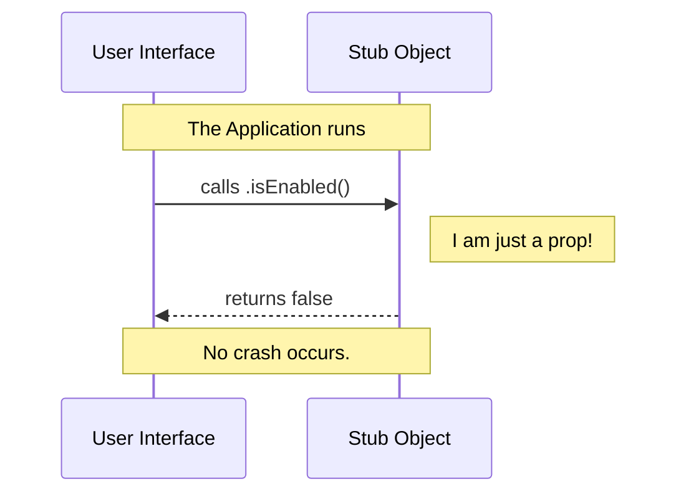

# Chapter 3: Stub Implementation

Welcome back! In the previous chapter, [Feature Visibility and Availability](02_feature_visibility_and_availability.md), we learned how to ask our code questions like "Are you hidden?" or "Are you enabled?"

In this chapter, we are going to explore the object answering those questions. Currently, it is a **Stub**.

## The Motivation: The Movie Set Prop

Imagine you are filming a movie. You need to shoot a scene where an actor walks up to a door. However, the carpenters haven't finished building the real door mechanism yet.

**The Problem:** You can't just leave a hole in the wall. The camera needs to see *something* that looks like a door, or the scene is ruined.

**The Solution:** You put up a **Prop Door**.
*   It looks like a door.
*   It has a handle.
*   **But you cannot open it.**

In programming, this is called a **Stub Implementation**. It occupies the space where the real code belongs so that other parts of the application (the camera) can function without crashing.

### The Use Case: blocking the "Undefined" Error

You are building the "Reset Limits" button in your user interface. You want to write the code that connects the button to the logic.

If the logic file is empty or doesn't exist yet, your application will crash with an error like:
`Uncaught ReferenceError: resetLimits is not defined`

By using a Stub, we provide a "fake" object. This allows you to finish building the UI buttons and menus *today*, even if the backend logic isn't written until *next week*.

## Concept: The "No-Op" (No Operation)

The core concept here is the **No-Op**.

A No-Op is a function that, quite literally, performs **No Operation**. It doesn't calculate math, it doesn't save data, and it doesn't call a server. It simply exists and returns immediately.

In our project, our stub is designed to fail safely. When asked "Can I run?", it explicitly says "No."

## How to Use It

Let's look at how a developer interacts with this stub. Even though it doesn't "work," it allows code to run safely.

### Example: Running the Logic

```javascript
import { resetLimits } from './index.js';

// We try to run the logic check
const ready = resetLimits.isEnabled();

console.log(`Is system ready? ${ready}`);
```

**Output:**
```text
Is system ready? false
```

*Explanation:*
1.  We imported the object.
2.  We called the function `isEnabled()`.
3.  Instead of crashing, it successfully returned `false`.
4.  Our application continues running smoothly.

## Internal Implementation: How It Works

How do we build this "Prop Door"? We create an object that satisfies the **interface** (the expected shape) but contains no **business logic** (the real work).

### Sequence of Events

Here is what happens when your application tries to open this prop door.



### Deep Dive: The Code

Let's look at the `index.js` file one more time to understand exactly how the stub is constructed.

```javascript
// --- File: index.js ---

const stub = { 
    // 1. The "No-Op" Logic
    isEnabled: () => false, 
    
    // 2. The Visibility Flag
    isHidden: true, 
    
    // 3. The Identity Tag
    name: 'stub' 
};

export default stub;
```

**Breakdown:**

1.  **`isEnabled: () => false`**:
    This is the classic No-Op. It is an arrow function that takes no arguments and immediately returns `false`. It effectively says, "I am here, but I am turned off."

2.  **`name: 'stub'`**:
    We added a simple string property called `name`.
    *   **Why?** This is very helpful for debugging.
    *   If you log this object to the console, you will see `name: 'stub'`. This confirms you are looking at the placeholder, not the real implementation.

## Conclusion

By using a **Stub Implementation**, we ensure our application is robust. We can reference `reset-limits` anywhere in our codebase without fear of breaking the app, even though the real functionality hasn't been written yet. It acts as a perfect placeholder.

Now that we have our place secured, we need to think about how the *real* implementation will behave. Will it require user input? Will it run automatically?

We will explore these different behaviors in the next chapter.

[Next Chapter: Operational Modes (Interactive vs. Non-Interactive)](04_operational_modes__interactive_vs__non_interactive_.md)

---

Generated by [Code IQ](https://github.com/adityasoni99/Code-IQ)