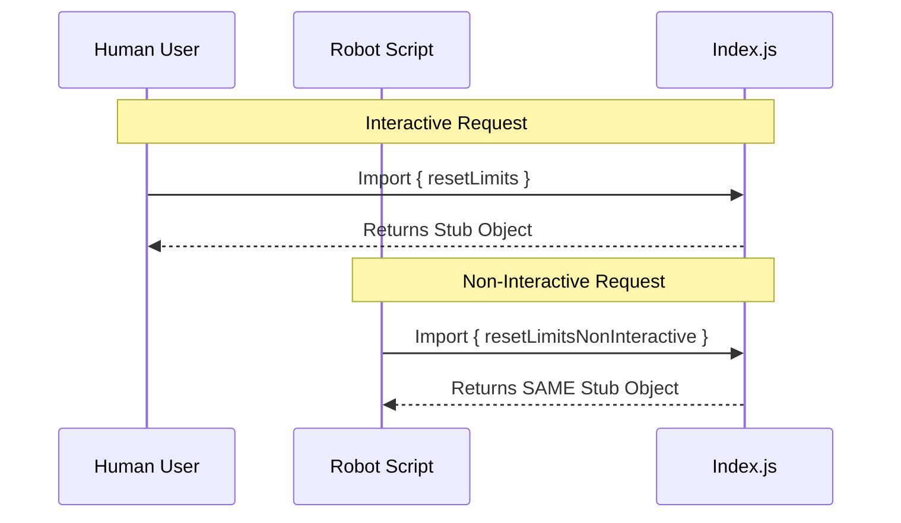

# Chapter 4: Operational Modes (Interactive vs. Non-Interactive)

Welcome back! In the previous chapter, [Stub Implementation](03_stub_implementation.md), we learned that our library currently relies on a "Stub"—a placeholder object that prevents crashes but doesn't perform real logic.

In this chapter, we are going to look at **how** we interact with that stub. Even though the machine isn't working yet, we have already installed two different buttons to operate it.

## The Motivation: The 3:00 AM Problem

Imagine you have written a program to "Reset Limits" on your server.
1.  **Daytime:** You click a button. A popup asks, *"Are you sure?"* You click *"Yes."* It works.
2.  **Nighttime:** You schedule a script to run automatically at 3:00 AM while you sleep.

**The Problem:** At 3:00 AM, the script runs. The code tries to pop up the *"Are you sure?"* window.
Since you are asleep, no one clicks *"Yes."* The script freezes, waiting forever. The server crashes.

**The Solution:** We need two distinct ways to trigger the same action:
1.  **Interactive Mode:** For when a human is present (popups allowed).
2.  **Non-Interactive Mode:** For automated scripts (no popups, just logs).

### The Use Case: The Vending Machine

Think of a high-tech vending machine.
*   **Button A (Dispense Now):** You press it. The screen asks "Do you want a receipt?" You tap "No." The item drops.
*   **Button B (Schedule Dispense):** A timer triggers this. It *cannot* ask about a receipt because no one is there to answer. It just drops the item.

In our project's current state (The Stub), the vending machine is **unplugged**.
*   Pressing Button A does nothing.
*   Pressing Button B does nothing.

However, the **buttons exist**. We have reserved the space for these two different behaviors right from the start.

## Concept: Explicit Intent

By separating these two modes now, we force the developer to state their **intent**.

### 1. Interactive Mode (`resetLimits`)
*   **Who uses it:** Frontend buttons, Admin Dashboards.
*   **Behavior:** It assumes a human is watching. It might show loading spinners, confirmation dialogs, or success alerts.

### 2. Non-Interactive Mode (`resetLimitsNonInteractive`)
*   **Who uses it:** Background jobs, server-side scripts, automated testing.
*   **Behavior:** It assumes **no one** is watching. It accepts strict parameters and fails silently or logs errors to a text file instead of the screen.

## How to Use It

Even though both exports currently point to the generic stub, using the correct one makes your code readable and future-proof.

### Scenario 1: The User Button
You are building a button for a website.

```javascript
import { resetLimits } from './index.js';

// A user clicks a button on the screen
function onUserClick() {
    // We expect this might show a popup eventually
    const system = resetLimits;
    console.log("User triggered mode:", system.name);
}
```

**Output:**
```text
User triggered mode: stub
```

### Scenario 2: The Nightly Script
You are writing a background worker.

```javascript
import { resetLimitsNonInteractive } from './index.js';

// A timer runs this code automatically
function onTimerTick() {
    // We promise NOT to show popups here
    const system = resetLimitsNonInteractive;
    console.log("Script triggered mode:", system.name);
}
```

**Output:**
```text
Script triggered mode: stub
```

*Explanation:* Even though the output (`stub`) is the same for both, the code tells a story. A deeper look at the code reveals that the developer *intended* for one to be manual and the other to be automated.

## Internal Implementation: How It Works

How do we support two modes with only one stub? We use **Aliasing**.

Currently, our library doesn't actually have the logic for popups or background scripts. We just want to expose the *names* so developers can start typing valid code.

### Sequence of Events

Here is what happens when different parts of your application ask for the library.



### Deep Dive: The Code

Let's look at the `index.js` file. This completes the puzzle we started in [Unified Interface Exports](01_unified_interface_exports.md).

```javascript
// --- File: index.js ---

// 1. Define the Stub (The "Unplugged Machine")
const stub = { isEnabled: () => false, isHidden: true, name: 'stub' };

// 2. Export for Interactive Mode
export const resetLimits = stub;

// 3. Export for Non-Interactive Mode
export const resetLimitsNonInteractive = stub;

// 4. Default Export
export default stub;
```

**Breakdown:**

1.  **`const stub = ...`**: We create the object *once*.
2.  **`export const resetLimits = stub;`**: We give the stub a name intended for human interaction.
3.  **`export const resetLimitsNonInteractive = stub;`**: We give the **same** stub a different name intended for robots.

In the future, when we replace the Stub with real code, we will change these lines to point to different functions. But for now, they share the same placeholder.

## Conclusion

By implementing **Operational Modes**, we have designed a mature API surface.

1.  We allow developers to be specific about **how** they want to run the code (Interactive vs. Non-Interactive).
2.  We use a **Stub** to ensure the code runs safely today, even without real logic.
3.  We use **Unified Exports** so the import syntax is clean and consistent.

You have now completed the beginner tutorial for the `reset-limits` structure! You understand how a complex library can be set up using simple placeholders to ensure reliability, safety, and clear design before a single line of complex logic is written.

---

Generated by [Code IQ](https://github.com/adityasoni99/Code-IQ)