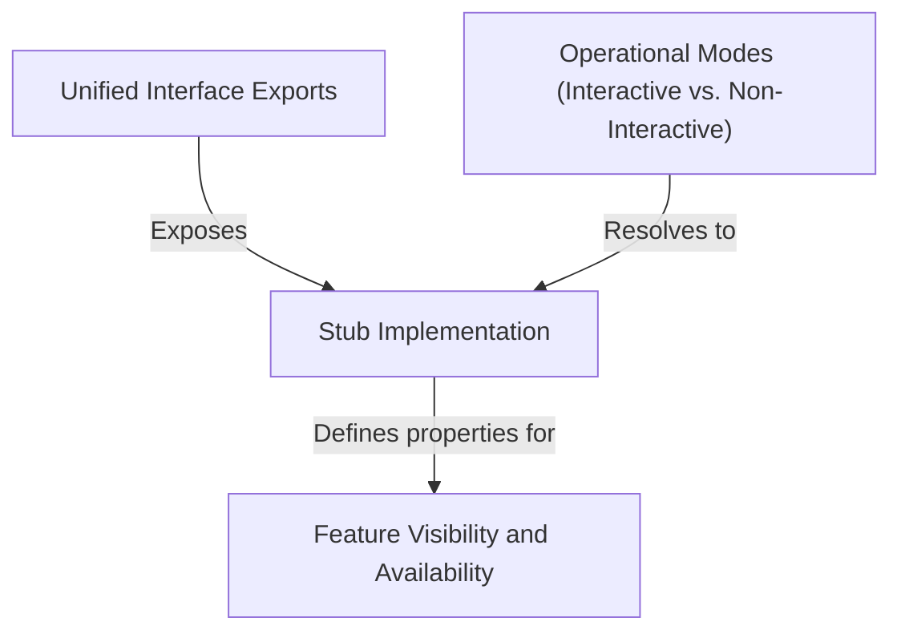

# Tutorial: reset-limits

The `reset-limits` project currently acts as a **placeholder** or safety mechanism within the application. Instead of performing actual logic, it provides a *stub implementation* that tells the system the feature is currently **disabled** and **hidden**, ensuring the code compiles and runs smoothly without triggering unfinished or restricted operations.

## Chapters

1. [Unified Interface Exports](01_unified_interface_exports.md)
2. [Feature Visibility and Availability](02_feature_visibility_and_availability.md)
3. [Stub Implementation](03_stub_implementation.md)
4. [Operational Modes (Interactive vs. Non-Interactive)](04_operational_modes__interactive_vs__non_interactive_.md)

---

Generated by [Code IQ](https://github.com/adityasoni99/Code-IQ)