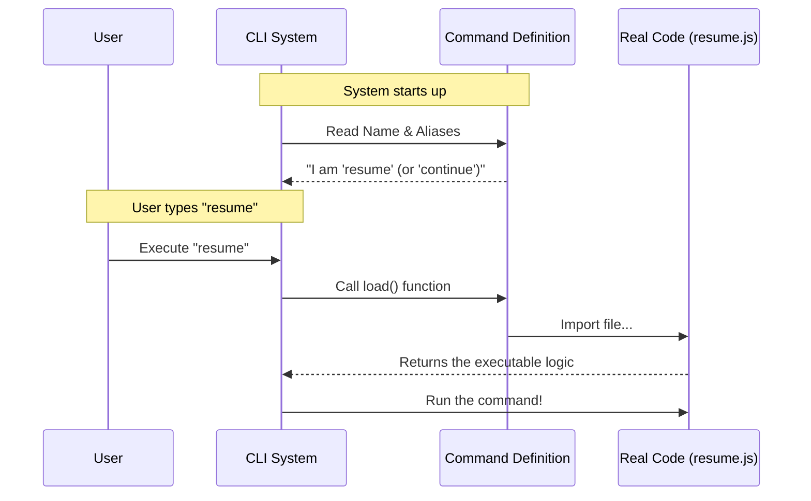

# Chapter 1: Command Definition

Welcome to the **Resume** project! In this project, we are building a tool to help you pick up right where you left off in a conversation with an AI.

Before our tool can actually *do* anything, we need to introduce it to the system. This brings us to our first core concept: the **Command Definition**.

## The Motivation: The Restaurant Menu

Imagine walking into a restaurant. Before you can eat, you need to look at a menu. The menu tells you:
1.  **The Name:** "Spaghetti Carbonara"
2.  **The Description:** "Pasta with eggs, cheese, and bacon."
3.  **The Shortcuts:** "Item #42"

Crucially, the menu is just text. The chef doesn't start cooking the spaghetti the moment you walk in the door. They only start cooking (loading the heavy ingredients) when you actually order it.

In our Command Line Interface (CLI), the **Command Definition** is exactly like that menu item. It tells the terminal:
*   "I exist."
*   "My name is `resume`."
*   "Here is what I do."
*   "Don't load my heavy programming code until the user actually types my name."

## Use Case: Letting the CLI Know We Exist

Our goal in this chapter is simple: We want to define a lightweight object that registers the `resume` command so users can see it when they ask for help, and run it when they are ready.

### Step 1: Naming the Command

First, we define the basic identity. We tell the system that this command is named `resume` and give it a helpful description.

```typescript
// --- File: index.ts ---
import type { Command } from '../../commands.js'

const resume: Command = {
  // The 'local-jsx' type means we will use a text-based UI later
  type: 'local-jsx', 
  name: 'resume',
  description: 'Resume a previous conversation',
```

**What happens here:**
*   `name`: This is what the user types in the terminal (e.g., `> my-tool resume`).
*   `description`: This text appears if the user types `> my-tool --help`.

### Step 2: Aliases and Hints

Sometimes users prefer shortcuts, or they need to know what arguments to pass. We add aliases and hints to make the command friendlier.

```typescript
  // Users can type 'continue' instead of 'resume'
  aliases: ['continue'],
  
  // Helps the user know they can pass an ID or text
  argumentHint: '[conversation id or search term]',
```

**What happens here:**
*   `aliases`: If the user types `continue`, the system knows to run this `resume` command.
*   `argumentHint`: This is a visual cue displayed in the terminal to show users they can provide extra details immediately.

### Step 3: Lazy Loading (The "Kitchen" Logic)

This is the most important part for performance. We use a function to load the actual logic only when needed.

```typescript
  // "Kitchen logic": Only import the heavy code when ordered
  load: () => import('./resume.js'),
}

export default resume
```

**What happens here:**
*   `load`: This function uses a dynamic `import`. It points to `./resume.js`.
*   The code in `./resume.js` contains the heavy logic for finding and restarting conversations. We don't read that file yet! We wait until the user presses Enter.

## Under the Hood: How It Works

To visualize how the CLI uses this definition, let's look at what happens when the program starts.

1.  **Registration:** The CLI starts up and reads your **Command Definition** (the menu).
2.  **Waiting:** It waits for user input. It uses very little memory because the "heavy" code isn't loaded yet.
3.  **Activation:** The user types `resume`.
4.  **Loading:** The CLI sees a match, calls your `load()` function, and finally grabs the real code.

Here is the sequence of events:



### Deep Dive: The `load` Property

Let's look closer at that last piece of code, as it connects this chapter to the rest of the application.

```typescript
  load: () => import('./resume.js'),
```

This single line connects the **Command Definition** (Chapter 1) to the **Command Execution Flow** (Chapter 2).

*   **Before this runs:** The CLI only knows *about* the command.
*   **After this runs:** The CLI has access to the `run` function exported by `resume.js`.

By separating the **Definition** (metadata) from the **Implementation** (logic), our CLI starts up instantly, no matter how complex the `resume` feature becomes.

## Summary

In this chapter, we created the "Menu Item" for our command. We learned:
1.  How to define the **identity** (name and description) of the command.
2.  How to add **usability** features like aliases and argument hints.
3.  How to use **lazy loading** so our code is efficient and fast.

Now that our command is defined and registered, the CLI knows *what* to call. But what happens inside that imported file when the command actually runs?

Let's find out in the next chapter: [Command Execution Flow](02_command_execution_flow.md).

---

Generated by [Code IQ](https://github.com/adityasoni99/Code-IQ)