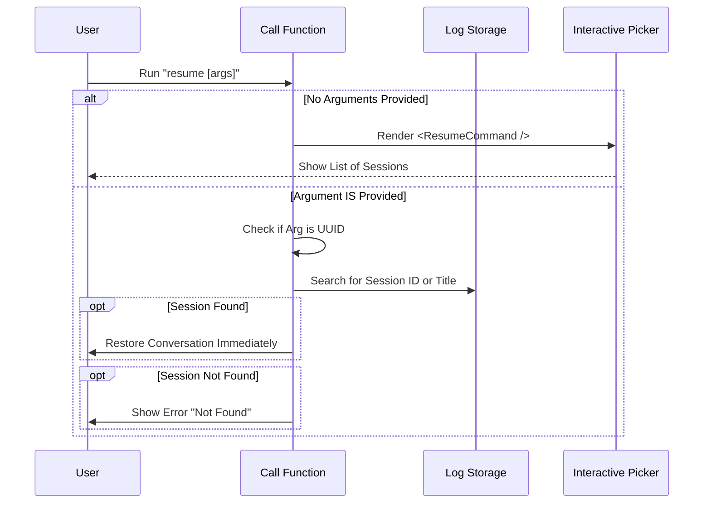

# Chapter 2: Command Execution Flow

In the previous chapter, [Command Definition](01_command_definition.md), we created the "menu item" for our tool. We told the system that the `resume` command exists.

Now, users can finally click that button (or type the command). But what happens next? 

This brings us to the **Command Execution Flow**. This is the brain of our operation. It decides whether to show a list of options or jump straight into a specific conversation.

## The Motivation: The Hotel Receptionist

Think of the `call` function as a **Hotel Receptionist**. When a guest (the user) walks in, one of two things happens:

1.  **The Specific Request:** The guest says, "I have a reservation under ID #1234." The receptionist looks it up and immediately sends them to their room.
2.  **The General Walk-in:** The guest says nothing or asks, "What rooms are available?" The receptionist shows them a brochure (a list) so they can pick one.

Without this logic, our tool wouldn't know if the user wants to *search* for something specific or *browse* everything.

## The `call` Function

In our code, this "Receptionist" is a function named `call`. It receives the arguments the user typed after the command name.

Let's break down how this function handles traffic.

### Case 1: The "Just Browsing" User

If the user types just `> resume`, they provided no arguments. They want to see a list of recent conversations.

```typescript
// --- File: resume.tsx ---

export const call: LocalJSXCommandCall = async (onDone, context, args) => {
  const arg = args?.trim();

  // No argument provided? Show the interactive picker!
  if (!arg) {
    // We render a UI component called ResumeCommand
    return <ResumeCommand key={Date.now()} onDone={onDone} onResume={onResume} />;
  }
```

**What is happening?**
1.  We check `!arg` (is the argument empty?).
2.  If it is empty, we return `<ResumeCommand />`. This acts as our "Brochure." It launches the visual interface (which we will build in [Interactive Session UI](03_interactive_session_ui.md)).
3.  The program stops here and waits for the user to interact with that UI.

### Case 2: The "Specific Request" (ID Check)

If the user types `> resume 8f3a2b`, they are looking for a specific session ID. We need to check if that ID exists.

```typescript
  // ... inside the call function ...

  // Check if the user typed a valid UUID (unique ID)
  const maybeSessionId = validateUuid(arg);

  if (maybeSessionId) {
    // Look through our logs to find a match
    const matchingLogs = logs.filter(l => getSessionIdFromLog(l) === maybeSessionId);
    
    // If found, start the specific session immediately
    if (matchingLogs.length > 0) {
       void onResume(maybeSessionId, matchingLogs[0], 'slash_command_session_id');
       return null; // Exit, we are done!
    }
  }
```

**What is happening?**
1.  We use `validateUuid` to see if the text looks like an ID.
2.  We filter our list of logs (we'll learn how logs load in [Session Data Management](04_session_data_management.md)).
3.  If we find a match, we call `onResume`. This sends the user straight to their "room" (the conversation) without showing the UI picker.

### Case 3: The "Title Search" (Fuzzy Match)

Sometimes users don't remember the ID, but they remember the title, e.g., `> resume "Project Alpha"`.

```typescript
  // ... if it wasn't a UUID ...

  // Try to find a session with this exact custom title
  const titleMatches = await searchSessionsByCustomTitle(arg, { exact: true });

  if (titleMatches.length === 1) {
    // We found exactly one match! Resume it.
    const log = titleMatches[0];
    const sessionId = getSessionIdFromLog(log);
    
    void onResume(sessionId, log, 'slash_command_title');
    return null;
  }
```

**What is happening?**
1.  We assume the argument is a Title.
2.  We search the database for that title.
3.  If we find exactly one match, we auto-resume it.
4.  If we find multiple matches (or none), we would show an error message asking the user to be more specific.

## Visualizing the Flow

Here is the sequence of events when the `call` function runs. Notice how the decision acts like a fork in the road.



## Internal Implementation: The `onResume` Helper

You might have noticed a function called `onResume` being used in the code snippets above. This is a helper defined inside `call` that handles the actual work of restarting the AI context.

It wraps the complex logic so our main flow stays clean.

```typescript
  // Defined at the top of the call function
  const onResume = async (sessionId: UUID, log: LogOption, entrypoint: string) => {
    try {
      // Access the core application context to resume
      await context.resume?.(sessionId, log, entrypoint);
      
      // Tell the CLI we finished successfully
      onDone(undefined, { display: 'skip' });
    } catch (error) {
      onDone(`Failed to resume: ${error.message}`);
    }
  };
```

**Why do we do this?**
*   **Error Handling:** It wraps the action in a `try/catch` block. If loading the session fails, it doesn't crash the whole CLI; it just prints a nice error message.
*   **Context:** It uses `context.resume`. This comes from [Cross-Project Context Handling](05_cross_project_context_handling.md), which allows our command to talk to the core application system.

## Summary

In this chapter, we built the **Traffic Controller**. We learned:

1.  How to detect if the user wants to **Browse** (no arguments) or **Search** (arguments provided).
2.  How to validate inputs (checking for UUIDs vs Titles).
3.  How to seamlessly redirect the user to the correct logic.

If the user provided no arguments, we decided to show them the **Interactive Picker**. But what does that look like? How do we build a UI inside a terminal?

Let's build the visual interface in the next chapter: [Interactive Session UI](03_interactive_session_ui.md).

---

Generated by [Code IQ](https://github.com/adityasoni99/Code-IQ)