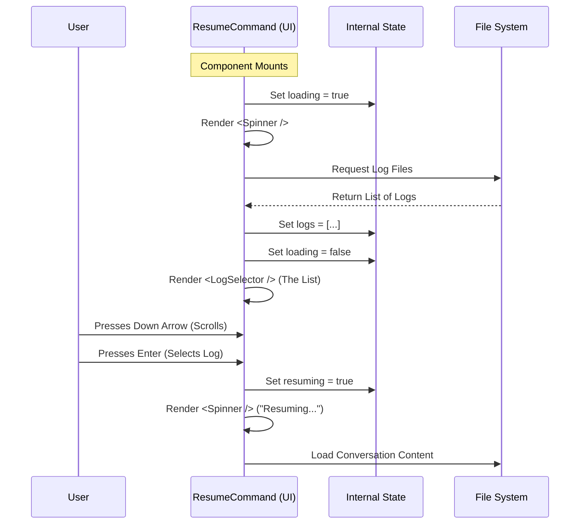

# Chapter 3: Interactive Session UI

In the previous chapter, [Command Execution Flow](02_command_execution_flow.md), we built the logic that decides *what* to do. We established that if the user runs `resume` without any arguments, we should show them an interactive list.

Now, we need to build that list.

This brings us to the **Interactive Session UI**. This is the visual interface that lives inside your terminal.

## The Motivation: The Digital Jukebox

Imagine a jukebox in a diner.
1.  **Direct Code:** You can type "A5" to play a specific song immediately. (We covered this in the previous chapter).
2.  **The Display Screen:** If you don't know the code, you look at the screen. You flip through the pages, see the song titles, and press a button to select one.

The `ResumeCommand` component is that display screen. It turns a raw database of text logs into a scrollable, clickable menu.

## Core Concept: React in the Terminal

We are building this interface using **React**. If you are used to building websites, this will feel very familiar. The only difference is that instead of rendering HTML `<div>` tags, we render text boxes directly into the command line (using a library called `Ink`).

Our component acts like a state machine with three distinct phases:

1.  **Loading:** Fetching data from the disk.
2.  **Browsing:** The user is scrolling through the list.
3.  **Resuming:** The user made a choice, and we are loading the AI.

### Step 1: Managing State

First, we need to define the memory of our component. We need to store the logs we find, and whether we are currently busy loading them.

```typescript
// --- File: resume.tsx ---
function ResumeCommand({ onDone, onResume }) {
  // 1. Store the list of conversations found
  const [logs, setLogs] = React.useState([]);

  // 2. Track if we are currently reading files
  const [loading, setLoading] = React.useState(true);

  // 3. Track if the user has picked something and we are starting up
  const [resuming, setResuming] = React.useState(false);
```

**What is happening?**
*   `logs`: An empty array that will eventually hold our conversation history.
*   `loading`: Starts as `true` because the moment this component appears, we want to start looking for files.

### Step 2: The "Loading" View

React components render based on their state. If `loading` is true, we don't want to show an empty list. We want to show a spinner so the user knows something is happening.

```typescript
  // ... inside ResumeCommand ...

  if (loading) {
    return (
      <Box>
        <Spinner />
        <Text> Loading conversations…</Text>
      </Box>
    );
  }
```

**What is happening?**
*   We check the state.
*   We return a `<Box>` (like a `div`) containing a `<Spinner>` animation and some text.
*   This is what the user sees for the first few milliseconds.

### Step 3: Fetching the Data

We use a `useEffect` hook to trigger the data loading exactly once when the component mounts (appears on screen).

```typescript
  // ... inside ResumeCommand ...

  React.useEffect(() => {
    async function init() {
      // Get list of folders (worktrees) and load logs
      const paths = await getWorktreePaths(getOriginalCwd());
      
      // We will cover 'loadLogs' deeply in Chapter 4
      void loadLogs(false, paths); 
    }
    void init();
  }, []);
```

**What is happening?**
*   `getWorktreePaths`: Finds where the project files are.
*   `loadLogs`: This helper function (which we discuss in [Session Data Management](04_session_data_management.md)) reads the files, updates the `logs` state variable, and sets `loading` to `false`.

### Step 4: The Interactive List

Once `loading` becomes `false`, the component re-renders. Now we show the main event: the **LogSelector**.

```typescript
  // ... inside ResumeCommand ...

  return (
    <LogSelector
      logs={logs}
      onSelect={handleSelect}
      onCancel={handleCancel}
      // We calculate height so it fits in the terminal
      maxHeight={rows - 2} 
    />
  );
```

**What is happening?**
*   `<LogSelector />`: This is a child component that handles the complex logic of drawing the list, highlighting the selected row, and listening for arrow keys (Up/Down).
*   `onSelect`: We pass a function describing what to do when the user presses Enter.

### Step 5: Handling the Selection

When the user presses Enter on a row, the `LogSelector` calls our `handleSelect` function. This is where we hand control back to the core system.

```typescript
  async function handleSelect(log) {
    const sessionId = validateUuid(getSessionIdFromLog(log));

    // Update UI state to show we are working
    setResuming(true);

    // Call the resume function passed from the parent
    // The entrypoint string helps with analytics
    void onResume(sessionId, log, 'slash_command_picker');
  }
```

**What is happening?**
*   `validateUuid`: Ensures the selected log has a valid ID.
*   `setResuming(true)`: This triggers a re-render. The List disappears, and a "Resuming..." spinner appears.
*   `onResume`: This loads the actual conversation context.

## Visualizing the UI Lifecycle

Let's look at the lifecycle of this component from the moment it appears to the moment the user selects a conversation.



## Advanced Logic: Cross-Project Resuming

There is one special edge case handled by the UI: **What if the user selects a conversation that belongs to a different project?**

If you have multiple projects open, `resume` might find logs from a different folder. We shouldn't just run them blindly, as that might confuse the AI about which files it can edit.

```typescript
    // ... inside handleSelect ...
    
    // Check if the log is from a different folder
    const check = checkCrossProjectResume(fullLog, showAllProjects, paths);

    if (check.isCrossProject) {
        // Don't resume automatically!
        // Copy the command to run in the OTHER folder
        await setClipboard(check.command);
        
        // Show a message to the user
        onDone(`Run this command in the other folder: ${check.command}`);
        return;
    }
```

This logic ensures safety. We'll explore the details of how contexts are isolated in [Cross-Project Context Handling](05_cross_project_context_handling.md).

## Summary

In this chapter, we built the **Interactive Interface**. We learned:

1.  How to use **State** to toggle between loading, browsing, and resuming screens.
2.  How to use **Effects** to fetch data when the component loads.
3.  How to handle user **Selection** events to trigger the resume action.

We currently have a beautiful UI, but where does that list of logs actually come from? How do we read them efficiently without freezing the terminal?

Let's dive into the data layer in the next chapter: [Session Data Management](04_session_data_management.md).

---

Generated by [Code IQ](https://github.com/adityasoni99/Code-IQ)