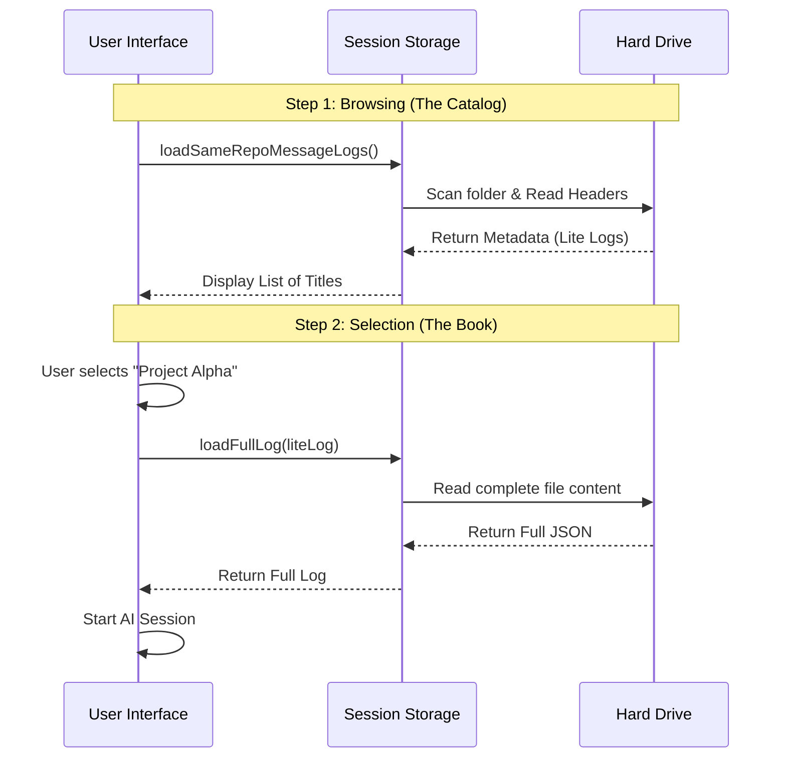

# Chapter 4: Session Data Management

In the previous chapter, [Interactive Session UI](03_interactive_session_ui.md), we built a beautiful interface to display a list of conversations. However, we left one major question unanswered: **Where does the data come from?**

This brings us to **Session Data Management**. This layer is responsible for reading files from your hard drive and turning them into objects our code can understand.

## The Motivation: The Librarian

Imagine you are a librarian in a massive archive containing thousands of ancient manuscripts (your conversation logs).

If a visitor asks, "What books do you have?", you **do not** run into the archives, grab every single book, wheel them all out in a cart, and pile them on the desk. That would be slow, heavy, and impossible to manage.

Instead, you look at the **Catalog**. The catalog cards contain just the metadata:
1.  **Title:** "Project Alpha"
2.  **Date:** "2023-10-27"
3.  **ID:** "12345"

You only go fetch the actual heavy manuscript (the full text) when the visitor points to a card and says, "I want to read *that* one."

In our project, we use this exact strategy to keep the command fast.

## Concept 1: The "Lite" Log (The Catalog Card)

When the `resume` command first starts, we don't read the full history of every conversation. We only read the headers. We call these **Lite Logs**.

The function responsible for this is `loadSameRepoMessageLogs`.

### Using the Function

This function takes a list of folder paths and scans them for conversation files.

```typescript
// --- File: resume.tsx ---
import { loadSameRepoMessageLogs } from '../../utils/sessionStorage.js';

// ... inside the component ...
const loadLogs = async (paths: string[]) => {
  // 1. Fetch the "Catalog Cards" (Lite Logs)
  const allLogs = await loadSameRepoMessageLogs(paths);
  
  // 2. Update the UI list
  setLogs(allLogs);
};
```

**What happens here:**
*   The function quickly scans the `.session` directory.
*   It reads only the first few lines of each file to extract the ID, Title, and Date.
*   It returns a lightweight list that renders instantly in our UI.

## Concept 2: Hydration (Fetching the Book)

Once the user selects a conversation from the list, we need the full message history so the AI knows what was said previously. This process is called **Hydration**.

We use a function called `loadFullLog`.

### The Hydration Logic

In our UI code, we check if the log is "Lite" before we try to resume it.

```typescript
// --- File: resume.tsx ---
async function handleSelect(log: LogOption) {
  // 1. Check if we only have the metadata
  const isLite = isLiteLog(log);

  // 2. If it is Lite, go to disk and read the full content
  const fullLog = isLite ? await loadFullLog(log) : log;

  // 3. Resume the session with the full data
  void onResume(sessionId, fullLog, 'slash_command_picker');
}
```

**Why is this cool?**
*   **Speed:** The initial list loads in milliseconds.
*   **Memory:** We don't crash your computer by loading 500MB of text into memory just to show a list.
*   **On-Demand:** We pay the "cost" of reading the full file only when necessary.

## Concept 3: The Fallback (The Lost & Found)

Sometimes, a user might provide a specific Session ID via the command line (e.g., `resume 8f3a2b`) that isn't in our "Catalog" scan. This might happen if the file is in a weird location or was just moved.

For this, we use `getLastSessionLog`. It attempts a direct lookup.

```typescript
// --- File: resume.tsx ---

// If our main scan didn't find the ID...
const directLog = await getLastSessionLog(maybeSessionId);

if (directLog) {
  // We found it directly! Start the session.
  void onResume(maybeSessionId, directLog, 'slash_command_session_id');
}
```

This acts like a fail-safe. If the librarian can't find the card in the catalog, they go check the "Returns" pile just in case.

## Under the Hood: How Data Flows

Let's visualize the separation between the **Metadata Layer** and the **Content Layer**.



### Implementation Details

Inside `utils/sessionStorage.ts`, the code uses the Node.js file system (`fs`) to perform these operations.

Here is a simplified view of how `loadFullLog` works internally:

```typescript
// --- File: utils/sessionStorage.ts ---
import { readFile } from 'fs/promises';

export async function loadFullLog(liteLog: LogOption) {
  // 1. We know where the file is because the Lite log has the path
  const filePath = liteLog.path;

  // 2. Read the actual text content from disk
  const content = await readFile(filePath, 'utf-8');

  // 3. Parse the text (JSON) into a JavaScript object
  const fullData = JSON.parse(content);

  // 4. Return the complete object
  return fullData;
}
```

By keeping these functions separate from the UI code, we make the application easier to test and maintain. The UI doesn't care *how* files are read; it just asks the "Librarian" for data.

## Summary

In this chapter, we learned how to manage data efficiently using the **Librarian Strategy**:

1.  **Lite Logs (`loadSameRepoMessageLogs`):** Quickly fetch metadata for the list view.
2.  **Hydration (`loadFullLog`):** Load the heavy content only when the user makes a choice.
3.  **Direct Lookup (`getLastSessionLog`):** A fallback method for specific ID searches.

Now we can find sessions and load their data. But there is one final complexity: **What if the session exists, but it belongs to a different project?**

If you resume a session from a different folder, the AI might get confused about which files it can edit. We need to handle this safely.

Let's explore this in the final chapter: [Cross-Project Context Handling](05_cross_project_context_handling.md).

---

Generated by [Code IQ](https://github.com/adityasoni99/Code-IQ)