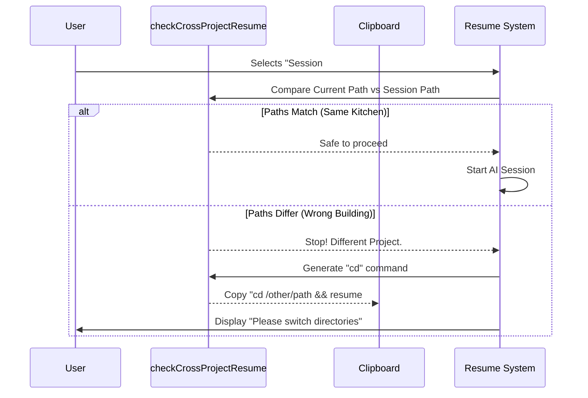

# Chapter 5: Cross-Project Context Handling

Welcome to the final chapter of the **Resume** tutorial!

In the previous chapter, [Session Data Management](04_session_data_management.md), we learned how to efficiently fetch conversation logs from the disk. We now have a list of sessions, and we can load their data.

However, there is one critical safety risk we haven't addressed yet.

## The Motivation: The "Wrong Kitchen" Problem

Imagine you are a chef. You have a recipe (the **Session Log**) for a specific apple pie. This recipe tells you to "open the fridge and grab the apples."

If you try to cook this recipe while standing in an **Auto Repair Shop**, you are going to have a bad time. You will reach for apples and grab a wrench instead.

In our CLI tool, the "Room" is your **Current Working Directory**.
*   The AI relies on files in your current folder.
*   If you resume a conversation about "Project A" while your terminal is inside "Project B", the AI might try to edit files that don't exist, or worse, overwrite the wrong files.

We need a **Cross-Project Context Handler**. This acts like a GPS that says, *"Wait! You are in the wrong building. Please go to the Kitchen before starting this recipe."*

## The Logic: `checkCrossProjectResume`

To solve this, we use a utility function called `checkCrossProjectResume`. It compares two things:
1.  **Where you are:** Your current terminal path.
2.  **Where the session happened:** The path stored inside the log file.

### Step 1: Performing the Check

Inside our main component (`resume.tsx`), right after the user selects a conversation, we run this check.

```typescript
// --- File: resume.tsx ---
import { checkCrossProjectResume } from '../../utils/crossProjectResume.js';

// ... inside handleSelect ...
const crossProjectCheck = checkCrossProjectResume(
  fullLog,        // The session the user wants
  showAllProjects,// Are we looking at other folders?
  worktreePaths   // Valid paths for the current project
);
```

**What happens here:**
*   `crossProjectCheck`: This object returns a "Verdict". It tells us if we are safe to proceed (`isCrossProject: false`) or if we need to switch folders (`isCrossProject: true`).

### Step 2: Handling a Mismatch

If the function determines we are in the wrong place, we **stop** the process. We do not load the AI. Instead, we help the user switch directories.

```typescript
// ... inside handleSelect ...

if (crossProjectCheck.isCrossProject) {
  // 1. Copy the "fix" command to the user's clipboard
  await setClipboard(crossProjectCheck.command);

  // 2. Show a helpful message
  onDone(`
    This conversation is from a different directory.
    To resume, run:
      ${crossProjectCheck.command}
  `);
  return; // STOP! Do not resume here.
}
```

**What happens here:**
*   `crossProjectCheck.command`: This is a string automatically generated for the user, for example: `cd /Users/me/projects/other-app && resume 8f3a2b`.
*   We copy it to the clipboard automatically so the user can just paste and run it.

## Edge Case: Git Worktrees

There is one exception to the rule. Advanced developers often use **Git Worktrees**. This allows them to have multiple folders (e.g., `main-folder` and `feature-branch-folder`) that share the same history.

If the user is in `feature-branch-folder` but tries to resume a session from `main-folder`, that is usually okay! They share the same "ingredients."

Our logic handles this automatically:

```typescript
  if (crossProjectCheck.isCrossProject) {
    // If it's a different folder, BUT part of the same git repo...
    if (crossProjectCheck.isSameRepoWorktree) {
      // Allow it!
      setResuming(true);
      void onResume(sessionId, fullLog, 'slash_command_picker');
      return;
    }
    // ... otherwise, block it as shown in Step 2 ...
  }
```

## Visualizing the Logic

Let's visualize the decision-making process of this "Bouncer" logic.



## Under the Hood

How does `checkCrossProjectResume` actually work internally? It's a pure logic function. It doesn't read files; it just manipulates strings.

Here is a simplified version of the internal logic:

```typescript
// --- Simplified Internal Logic ---
export function checkCrossProjectResume(log, paths) {
  // 1. Get the folder where the session was created
  const sessionDir = log.repoPath; 
  
  // 2. Check if that folder is in our list of valid current paths
  const isSafe = paths.includes(sessionDir);

  if (isSafe) {
    return { isCrossProject: false };
  }

  // 3. If unsafe, generate the fix
  const sessionId = getSessionIdFromLog(log);
  return {
    isCrossProject: true,
    command: `cd ${sessionDir} && resume ${sessionId}`
  };
}
```

By abstracting this logic away from the UI, we ensure that our safety checks are consistent and easy to test.

## Conclusion

Congratulations! You have completed the **Resume** project tutorial. 

Let's recap the journey:
1.  **[Command Definition](01_command_definition.md):** We registered the command so the CLI knows it exists.
2.  **[Command Execution Flow](02_command_execution_flow.md):** We created the traffic controller to handle arguments.
3.  **[Interactive Session UI](03_interactive_session_ui.md):** We built a React-based interface for the terminal.
4.  **[Session Data Management](04_session_data_management.md):** We implemented efficient data loading and hydration.
5.  **Cross-Project Context Handling:** We added safety guards to ensure the AI runs in the correct environment.

You now have a robust, user-friendly, and safe tool for resuming AI conversations. Happy coding!

---

Generated by [Code IQ](https://github.com/adityasoni99/Code-IQ)