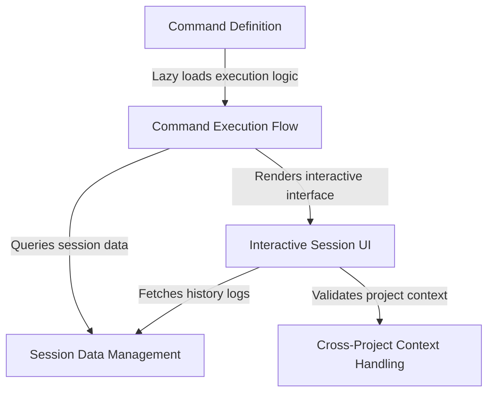

# Tutorial: resume

This project implements a **resume** command allowing users to continue previous CLI sessions. It features a "dual-mode" workflow: users can either provide a specific *session ID* or *search term* to resume immediately, or launch an **interactive UI** to browse and select from a history of conversation logs. The system also includes safety checks to ensure the **project context** matches the session before resuming.

## Chapters

1. [Command Definition](01_command_definition.md)
2. [Command Execution Flow](02_command_execution_flow.md)
3. [Interactive Session UI](03_interactive_session_ui.md)
4. [Session Data Management](04_session_data_management.md)
5. [Cross-Project Context Handling](05_cross_project_context_handling.md)

---

Generated by [Code IQ](https://github.com/adityasoni99/Code-IQ)