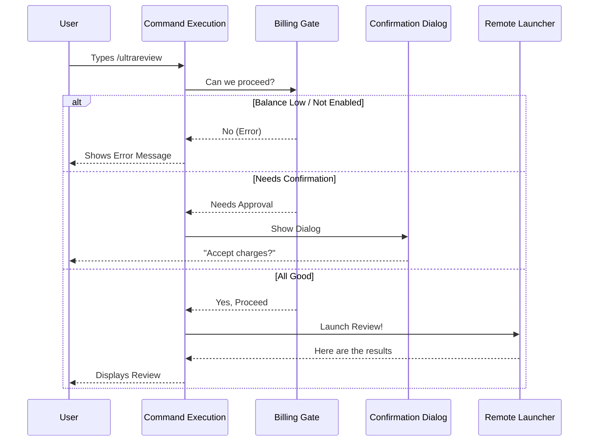

# Chapter 1: Command Execution Flow

Welcome to the **Command Execution Flow**! 

If you are just joining us, this is the very first chapter of the `review` project tutorial. Here, we will explore how the application decides what to do when a user types a command.

## The "Front Desk Manager" Analogy

Imagine you walk into a high-end office building to request a specific service. You don't just walk straight into the back office and start working. You stop at the **Front Desk**.

The **Command Execution Flow** is that Front Desk Manager. 

When you type `/ultrareview`, this manager springs into action. It doesn't perform the complex code review itself. Instead, it coordinates the process:
1.  **Check with Finance:** Do you have enough credits? ([Billing Authorization Gate](04_billing_authorization_gate.md))
2.  **Get a Signature:** Do you need to approve an extra charge? ([Interactive Dialog System](03_interactive_dialog_system.md))
3.  **Dispatch Work:** Send the task to the back office to get done. ([Remote Session Launcher](02_remote_session_launcher.md))

## How It Works: The Big Picture

Before looking at the code, let's visualize the flow. This system acts as a pipeline. If any step fails (like low balance), the pipeline stops and informs the user.



## Code Walkthrough

Let's look at `ultrareviewCommand.tsx`. We will break the `call` function (our Front Desk Manager) into small pieces to see how it handles traffic.

### Step 1: Checking the Gate

The first thing the command does is check if the user is allowed to run the review. It asks the **Billing Authorization Gate** for the status.

```typescript
export const call: LocalJSXCommandCall = async (onDone, context, args) => {
  // 1. Ask the Billing Gate for the current status
  const gate = await checkOverageGate();

  // ... decisions happen next ...
```

*   `checkOverageGate()`: This is our background check. It calculates balances and permissions. You can read more about this in [Billing Authorization Gate](04_billing_authorization_gate.md).

### Step 2: Handling Rejection

If the gate says "Not Enabled" or "Low Balance," the Manager stops immediately. It sends a system message to the user explaining the problem.

```typescript
  // 2. If the feature isn't enabled, stop and tell the user.
  if (gate.kind === 'not-enabled') {
    onDone('Free ultrareviews used. Enable Extra Usage...', {
      display: 'system'
    });
    return null;
  }
```

*   `onDone`: This is how we send a message back to the chat.
*   `return null`: This ends the command immediately.

### Step 3: Asking for Permission (The Dialog)

Sometimes, the user has funds, but we need their explicit permission to spend them. In this case, instead of sending text, we return an **Interactive Dialog**.

```typescript
  // 3. If confirmation is needed, show the Dialog UI.
  if (gate.kind === 'needs-confirm') {
    return (
      <UltrareviewOverageDialog 
        onProceed={async (signal) => { /* Logic to launch */ }} 
        onCancel={() => onDone('Ultrareview cancelled.', { display: 'system' })} 
      />
    );
  }
```

*   `<UltrareviewOverageDialog />`: This is a React component that renders buttons in the chat. We will build this in [Interactive Dialog System](03_interactive_dialog_system.md).

### Step 4: Dispatching the Work

If the gate returns `proceed` (or the user clicks "Proceed" in the dialog), we finally run the logic.

```typescript
  // 4. Everything is good! Launch the remote review.
  // gate.kind === 'proceed'
  await launchAndDone(args, context, onDone, gate.billingNote);
  return null;
};
```

### The Worker Function: `launchAndDone`

You might have noticed `launchAndDone` in the previous step. This helper function is responsible for actually triggering the remote session and formatting the output.

```typescript
async function launchAndDone(args, context, onDone, billingNote, signal) {
  // Trigger the heavy lifting
  const result = await launchRemoteReview(args, context, billingNote);

  if (result) {
    // If successful, print the result to the chat
    onDone(contentBlocksToString(result), { shouldQuery: true });
  } else {
    // If it failed (e.g., not a GitHub repo), show an error
    onDone('Ultrareview failed to launch...', { display: 'system' });
  }
}
```

*   `launchRemoteReview`: This is the function that connects to the backend to perform the actual code review.

## Summary

In this chapter, we learned about the **Command Execution Flow**. It acts as the orchestrator that connects the user's input to the complex logic behind the scenes. It ensures that:
1.  Users are billed correctly.
2.  Permissions are granted.
3.  Errors are handled gracefully before any heavy work begins.

Now that our "Front Desk Manager" has approved the request, where does the work actually go? It goes to the **Remote Session Launcher**.

[Next Chapter: Remote Session Launcher](02_remote_session_launcher.md)

---

Generated by [Code IQ](https://github.com/adityasoni99/Code-IQ)