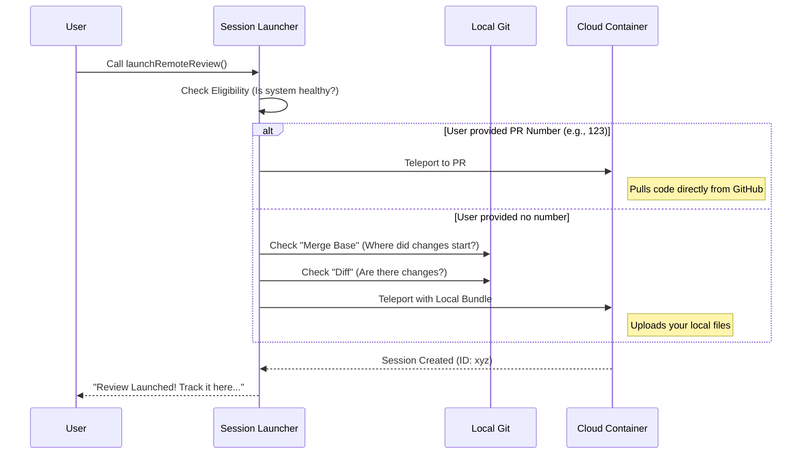

# Chapter 2: Remote Session Launcher

Welcome back! In the previous chapter, [Command Execution Flow](01_command_execution_flow.md), we met the "Front Desk Manager" who checks your permissions and billing status.

Now that the Front Desk has given the green light, we need to actually **do the work**.

This brings us to the **Remote Session Launcher**.

## The "Logistics Coordinator" Analogy

Running a deep code review requires a clean, powerful environment. We don't want to run it on your local machine because:
1.  Your machine might be slow.
2.  You might have messy configuration files that confuse the reviewer.
3.  We need a standardized "clean room" for inspection.

Think of the **Remote Session Launcher** as a **Logistics Coordinator**.

When you order a review, this coordinator figures out:
1.  **What are we shipping?** (A specific Pull Request? Or the code currently on your laptop?)
2.  **How do we package it?** (Do we download it from GitHub, or bundle up your local files?)
3.  **Where does it go?** (It creates a secure container in the cloud—the "Teleport" session).

## The Workflow

Before looking at code, let's see the decision process. The Launcher behaves differently depending on whether you provided a Pull Request number (e.g., `/ultrareview 123`) or just the command (e.g., `/ultrareview`).



## Code Walkthrough

The logic lives in `reviewRemote.ts`. The main function is `launchRemoteReview`. Let's break it down into small, digestible parts.

### Step 1: Pre-flight Checks

Before packing anything, we check if the remote agent system is actually available.

```typescript
// reviewRemote.ts

export async function launchRemoteReview(args, context, billingNote) {
  // 1. Ask the system if we can run a remote agent right now
  const eligibility = await checkRemoteAgentEligibility();

  // If not eligible, return a list of errors to the user
  if (!eligibility.eligible) {
    return [{ 
      type: 'text', 
      text: 'Ultrareview cannot launch: ' + formatErrors(eligibility) 
    }];
  }
```

*   **What this does:** It ensures the backend services are up and running. If the "airport" is closed, we don't bother packing the luggage.

### Step 2: Setting the Environment

The reviewer (the "BugHunter") needs to know the rules of the engagement. We set up environment variables that control how long it spends looking for bugs.

```typescript
  // 2. Set up the rules for the remote agent
  const commonEnvVars = {
    BUGHUNTER_DRY_RUN: '1', // Don't actually merge anything
    BUGHUNTER_MAX_DURATION: '25', // Spend max 25 minutes
    BUGHUNTER_AGENT_TIMEOUT: '600', // Timeout if agent gets stuck
  };
```

*   **Note:** In the real code, these values are fetched dynamically to allow for tuning, but defaults are used if that fails.

### Step 3: Determining the Mode

This is the most critical part of the Launcher. It looks at your input (`args`) to decide what to do.

#### Scenario A: The PR Mode

If `args` is a number (e.g., "42"), we assume it is a Pull Request.

```typescript
  const prNumber = args.trim();
  const isPrNumber = /^\d+$/.test(prNumber); // Is it a number?

  if (isPrNumber) {
    // We tell the cloud to pull this specific PR from GitHub
    session = await teleportToRemote({
      description: `ultrareview: PR #${prNumber}`,
      branchName: `refs/pull/${prNumber}/head`, // The PR branch
      environmentVariables: {
        BUGHUNTER_PR_NUMBER: prNumber,
        ...commonEnvVars,
      },
    });
  }
```

*   **Teleport:** This function spins up the remote server.
*   **Efficiency:** This is fast because the cloud server downloads the code directly from GitHub. It doesn't use your local bandwidth.

#### Scenario B: The Local Branch Mode

If you didn't provide a number, we assume you want to review the code currently sitting on your computer. This requires a bit more math.

```typescript
  else {
    // 1. Find the "Fork Point" (Merge Base) relative to main
    const { stdout } = await execGit(['merge-base', 'main', 'HEAD']);
    const mergeBaseSha = stdout.trim();

    // 2. Safety check: Are there actual changes?
    const { code } = await execGit(['diff', '--shortstat', mergeBaseSha]);
    
    if (code === 0 /* no changes */) {
      return [{ type: 'text', text: 'No changes found to review.' }];
    }
    
    // ... continue to launch ...
```

*   **Merge Base:** We need to tell the reviewer *only* to look at your new changes, not the whole history of the project. The "Merge Base" is the exact point where your branch separated from `main`.

Now we launch the session using a special flag: `useBundle`.

```typescript
    // 3. Launch with "Bundle" mode
    session = await teleportToRemote({
      useBundle: true, // <--- This packs up your local files!
      environmentVariables: {
        BUGHUNTER_BASE_BRANCH: mergeBaseSha, // Tell agent where to start comparison
        ...commonEnvVars,
      },
    });
  }
```

*   **useBundle:** This takes your local uncommitted code, bundles it up, and uploads it to the remote container.

### Step 4: Handing Off

Once the session is created (`session` is not null), the Launcher's job is almost done. It registers the task so the system knows to watch it.

```typescript
  if (!session) return null; // Something went wrong launching

  // Register the task so we receive notifications when it finishes
  registerRemoteAgentTask({
    remoteTaskType: 'ultrareview',
    session,
    context,
  });

  // Tell the user the good news
  const sessionUrl = getRemoteTaskSessionUrl(session.id);
  return [{
    type: 'text',
    text: `Ultrareview launched! Track it here: ${sessionUrl}`
  }];
}
```

## Summary

The **Remote Session Launcher** is the bridge between your request and the cloud. It handles the complexity of:
1.  **Validation:** Checking if the system is ready.
2.  **Routing:** Deciding between a GitHub PR download or a local file upload.
3.  **Provisioning:** Spinning up the container via `teleportToRemote`.

However, before this Launcher was even allowed to run, we might have needed the user to click "Accept" on a billing dialog. How was that UI built?

In the next chapter, we will look at how we build those interactive buttons in the chat.

[Next Chapter: Interactive Dialog System](03_interactive_dialog_system.md)

---

Generated by [Code IQ](https://github.com/adityasoni99/Code-IQ)