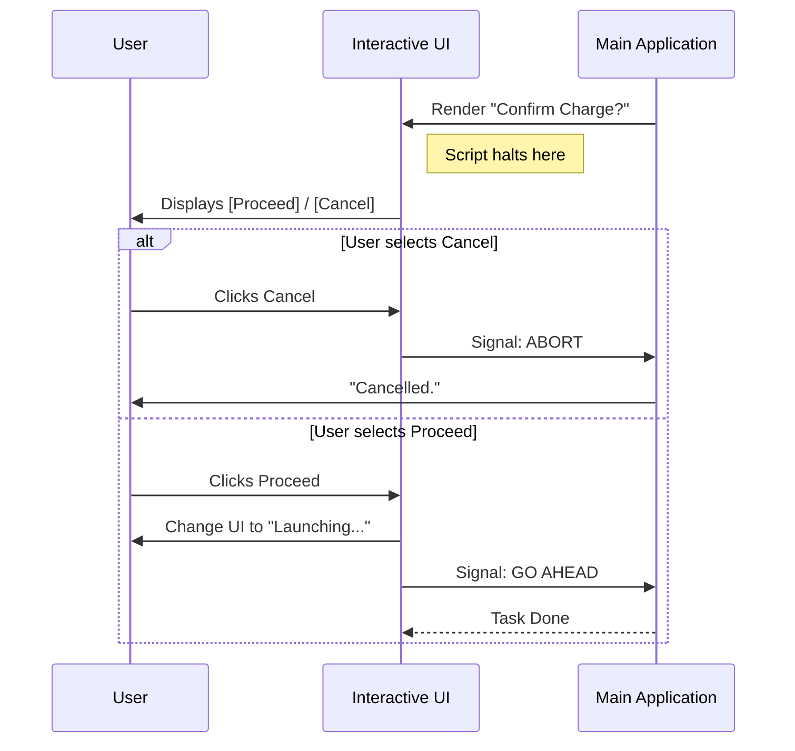

# Chapter 3: Interactive Dialog System

Welcome to Chapter 3!

In the previous chapter, the [Remote Session Launcher](02_remote_session_launcher.md), we learned how to package up code and ship it to a cloud environment.

However, spinning up powerful cloud servers isn't always free. Before we launch that rocket, we sometimes need to stop and ask the user a very important question: **"This costs extra. Are you sure you want to proceed?"**

This brings us to the **Interactive Dialog System**.

## The "Digital Signature Pad" Analogy

Imagine you are at a coffee shop buying a fancy latte. You tap your card. Before the transaction goes through, the screen flips around to you. It asks: *"Would you like a receipt?"* or *"Confirm amount?"*

You can't get your coffee until you tap "Yes" or "No."

The **Interactive Dialog System** is that screen.
1.  It **halts** the automated script.
2.  It **draws** a UI (buttons and text) right inside your terminal.
3.  It **waits** for you to use your arrow keys and `Enter` to make a choice.

## The Problem: Async Confirmations

Usually, command-line tools just run from top to bottom. But here, we have a "pause" button.

We need a way to:
1.  Show a "Billing Warning" if the user has used up their free credits (checked by the [Billing Authorization Gate](04_billing_authorization_gate.md)).
2.  Wait for the user to decide.
3.  If they say **Cancel**, we stop everything.
4.  If they say **Proceed**, we run the logic defined in the [Command Execution Flow](01_command_execution_flow.md).

## How It Works: The Flow

Here is how the user interacts with this dialog system in the terminal.



## Code Walkthrough

We implement this using **React** (specifically a library called `Ink` that renders React to the terminal). Let's look at `UltrareviewOverageDialog.tsx`.

### Part 1: The Setup (Props)

First, we define what this component needs to work. It needs two functions: one for when the user agrees, and one for when they cancel.

```typescript
type Props = {
  // Logic to run if user says YES (accepts charges)
  onProceed: (signal: AbortSignal) => Promise<void>;
  
  // Logic to run if user says NO
  onCancel: () => void;
};
```

*   **`onProceed`**: The heavy lifting function (launching the review).
*   **`onCancel`**: The cleanup function (printing "Cancelled" and exiting).

### Part 2: Managing State

The dialog isn't static. Once you click "Proceed", we don't want the user to click it again. We want the UI to update to say "Launching...". We use React state for this.

```typescript
export function UltrareviewOverageDialog({ onProceed, onCancel }: Props) {
  // Track if we are currently launching the task
  const [isLaunching, setIsLaunching] = useState(false);
  
  // A safety cord to stop the process if needed
  const abortControllerRef = useRef(new AbortController());
  
  // ... logic continues ...
```

*   **`isLaunching`**: If `true`, we hide the buttons and show a loading message.

### Part 3: Handling the Decision

Here is the brain of the dialog. It handles the user's selection from the menu.

```typescript
  const handleSelect = useCallback((value: string) => {
    if (value === 'proceed') {
      // 1. Change UI to loading state
      setIsLaunching(true);
      
      // 2. Run the heavy task (launch review)
      // We pass a 'signal' so we can cancel it mid-flight if needed
      onProceed(abortControllerRef.current.signal)
        .catch(() => setIsLaunching(false)); // Reset if it fails
    } else {
      onCancel(); // User chose "Cancel"
    }
  }, [onProceed, onCancel]);
```

### Part 4: The Visuals (Rendering)

Finally, we draw the component. Notice how we swap between the `<Select>` menu and the `<Text>Launching...</Text>` based on our state.

```typescript
  return (
    <Dialog title="Ultrareview billing" onCancel={handleCancel} color="background">
      <Box flexDirection="column" gap={1}>
        <Text>
          Your free reviews are used. This will incur a charge.
        </Text>
        
        {/* Conditional Rendering: Loading vs Buttons */}
        {isLaunching ? (
          <Text color="background">Launching…</Text>
        ) : (
          <Select 
            options={[
              { label: "Proceed with billing", value: "proceed" },
              { label: "Cancel", value: "cancel" }
            ]} 
            onChange={handleSelect} 
            onCancel={handleCancel} 
          />
        )}
      </Box>
    </Dialog>
  );
}
```

*   **`<Dialog>`**: draws a nice border around our content.
*   **`<Select>`**: handles the arrow keys and Enter key logic for us.

## How to Use It

In [Chapter 1: Command Execution Flow](01_command_execution_flow.md), we saw how this component is called. It looks something like this:

```typescript
// Inside the main command flow
if (gate.kind === 'needs-confirm') {
  // We return the UI component directly!
  return (
    <UltrareviewOverageDialog 
      onProceed={async (signal) => { 
         // This is where we call the code from Chapter 2
         await launchRemoteReview(...); 
      }} 
      onCancel={() => console.log("User cancelled")} 
    />
  );
}
```

**What happens:**
1.  The system sees you returned a React component.
2.  It pauses the script execution.
3.  It renders the `UltrareviewOverageDialog` to the user.
4.  It waits until the Dialog calls `onDone` (internally) or finishes the `onProceed` promise.

## Summary

The **Interactive Dialog System** is our safe guard. It allows us to interrupt a text-based command with a rich, interactive UI to capture critical user decisions—specifically regarding billing overages.

It creates a seamless experience where the user feels in control, preventing accidental charges while keeping everything inside the terminal window.

But wait, how did the system know we needed to show this dialog in the first place? How did it know we were out of free credits?

That decision is made by the **Billing Authorization Gate**.

[Next Chapter: Billing Authorization Gate](04_billing_authorization_gate.md)

---

Generated by [Code IQ](https://github.com/adityasoni99/Code-IQ)