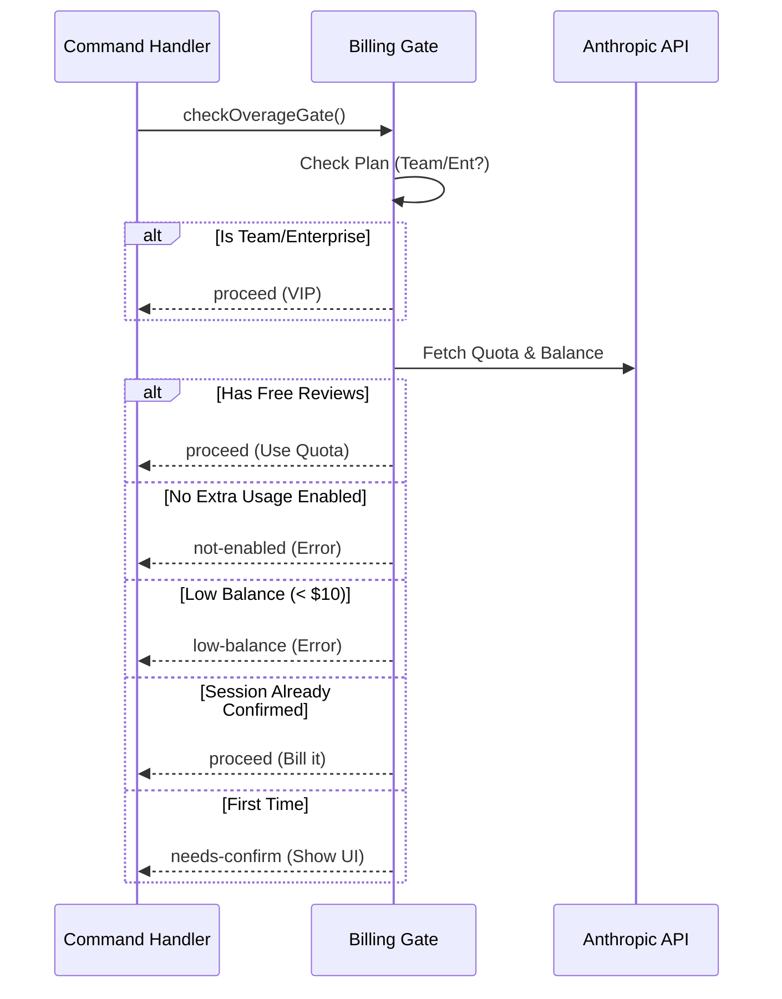

# Chapter 4: Billing Authorization Gate

Welcome to Chapter 4!

In the previous chapter, the [Interactive Dialog System](03_interactive_dialog_system.md), we built a beautiful UI that asks the user: *"This costs extra. Do you want to proceed?"*

But wait—how did the application know it needed to ask that? How did it know the user wasn't a VIP who gets everything for free? Or that the user wasn't completely out of funds?

We need a brain behind the UI. We need the **Billing Authorization Gate**.

## The "Toll Booth" Analogy

Think of the Billing Authorization Gate as a **Toll Booth** on the highway to the "Remote Review" city. Every time a user types `/ultrareview`, they drive up to this booth.

The attendant inside (our logic) checks their credentials:
1.  **The VIP Pass:** Is this a Team or Enterprise user? (Gate opens immediately).
2.  **The Punch Card:** Does the user have free reviews left this month? (Gate opens, punches card).
3.  **The Cash Lane:** No free reviews? Do they have "Extra Usage" enabled and enough credit?
    *   *If yes:* We might ask for a signature (Confirmation Dialog).
    *   *If no:* The gate stays closed (Error).

## Why Do We Need This?

Cloud resources cost money. We need a centralized place to manage permissions so that:
1.  We don't accidentally charge users who expected a free review.
2.  We don't let users run expensive tasks if they have a $0 balance.
3.  We don't annoy users by asking for confirmation every single time if they have already agreed.

## How to Use It

The [Command Execution Flow](01_command_execution_flow.md) (Chapter 1) calls this gate before doing anything else. It expects a simple "Verdict."

The verdict comes in the form of an object called `OverageGate`.

### The Verdict Types

The gate returns one of these four decisions:

1.  `proceed`: Open the gate! (Includes a note like "Free review used").
2.  `not-enabled`: Blocked. User hasn't turned on billing.
3.  `low-balance`: Blocked. User is broke.
4.  `needs-confirm`: User can pay, but we need to ask permission first.

### Calling the Gate

Here is how we use it in the main command file.

```typescript
// Inside ultrareviewCommand.tsx

// 1. Ask the gate for a decision
const gate = await checkOverageGate();

// 2. Act on the decision
if (gate.kind === 'proceed') {
  // Run the review immediately!
} else if (gate.kind === 'needs-confirm') {
  // Show the Dialog from Chapter 3
}
```

## Internal Implementation

Let's look under the hood of `checkOverageGate` in `reviewRemote.ts`.

### The Decision Flow

Before reading code, let's visualize the logic flow.



### Code Walkthrough

Now, let's look at the actual code logic. We will break the `checkOverageGate` function into small steps.

#### Step 1: Checking for VIPs

First, we check if the user is on a corporate plan. They usually have unlimited access or centralized billing, so we don't bug them with individual credit checks.

```typescript
export async function checkOverageGate(): Promise<OverageGate> {
  // 1. Team and Enterprise plans skip the line
  if (isTeamSubscriber() || isEnterpriseSubscriber()) {
    return { kind: 'proceed', billingNote: '' };
  }
  
  // ... continued below ...
```

#### Step 2: Checking the "Punch Card"

If they aren't VIPs, we check their personal quota. We ask the API: "How many free reviews does this user have left?"

```typescript
  // 2. Fetch quota and usage data
  const [quota, utilization] = await Promise.all([
    fetchUltrareviewQuota(),
    fetchUtilization()
  ]);

  // 3. If they have freebies, use them!
  if (quota && quota.reviews_remaining > 0) {
    return {
      kind: 'proceed',
      billingNote: ` Free review used (${quota.reviews_remaining} left).`,
    };
  }
```

*   **Note:** If this returns `proceed`, the gate opens, and the user never sees a billing dialog.

#### Step 3: Checking the Wallet

If they are out of free reviews, we enter "Pay As You Go" territory. First, is their wallet even open?

```typescript
  // 4. Check if "Extra Usage" is turned on
  const extraUsage = utilization?.extra_usage;
  
  if (!extraUsage?.is_enabled) {
    // Gate closed: User hasn't enabled billing
    return { kind: 'not-enabled' };
  }
```

Next, do they have enough money? We require a safety buffer (e.g., $10) to ensure the review doesn't fail mid-way due to lack of funds.

```typescript
  // 5. Calculate available funds
  const limit = extraUsage.monthly_limit ?? Infinity;
  const available = limit - (extraUsage.used_credits ?? 0);

  if (available < 10) {
    // Gate closed: Not enough funds
    return { kind: 'low-balance', available };
  }
```

#### Step 4: The "Hand Stamp" (Session Confirmation)

Finally, the user has money and wants to proceed. Do we ask them for confirmation?

We don't want to ask every single time (that's annoying). We use a **Session Flag**. Think of it like a stamp on your hand at a club. If you've paid the cover charge once this session, you can walk in and out freely.

```typescript
  // 6. Have they already said "Yes" this session?
  if (!sessionOverageConfirmed) {
    // No stamp yet -> Trigger the Dialog
    return { kind: 'needs-confirm' };
  }

  // 7. Stamp found -> Charge them and proceed
  return {
    kind: 'proceed',
    billingNote: ' This review bills as Extra Usage.',
  };
}
```

### Remembering the Decision

How do we "stamp" the hand? We have a simple variable and a helper function in `reviewRemote.ts`:

```typescript
// A variable that lives as long as the window is open
let sessionOverageConfirmed = false;

// Call this when the user clicks "Proceed" in the Dialog
export function confirmOverage(): void {
  sessionOverageConfirmed = true;
}
```

The [Interactive Dialog System](03_interactive_dialog_system.md) calls `confirmOverage()` right after the user clicks the "Proceed" button.

## Summary

The **Billing Authorization Gate** is the financial guardian of our feature.
1.  It protects the user from unexpected charges.
2.  It protects the system from running tasks for users who can't pay.
3.  It manages the logic flow between "Free," "Paid," and "Blocked."

By separating this logic from the UI, we keep our code clean. The UI just renders what the Gate tells it to.

Now that we have payment sorted, and the review is running, there is one last thing to consider. Should *every* user even see the option to run this command?

[Next Chapter: Feature Visibility Control](05_feature_visibility_control.md)

---

Generated by [Code IQ](https://github.com/adityasoni99/Code-IQ)