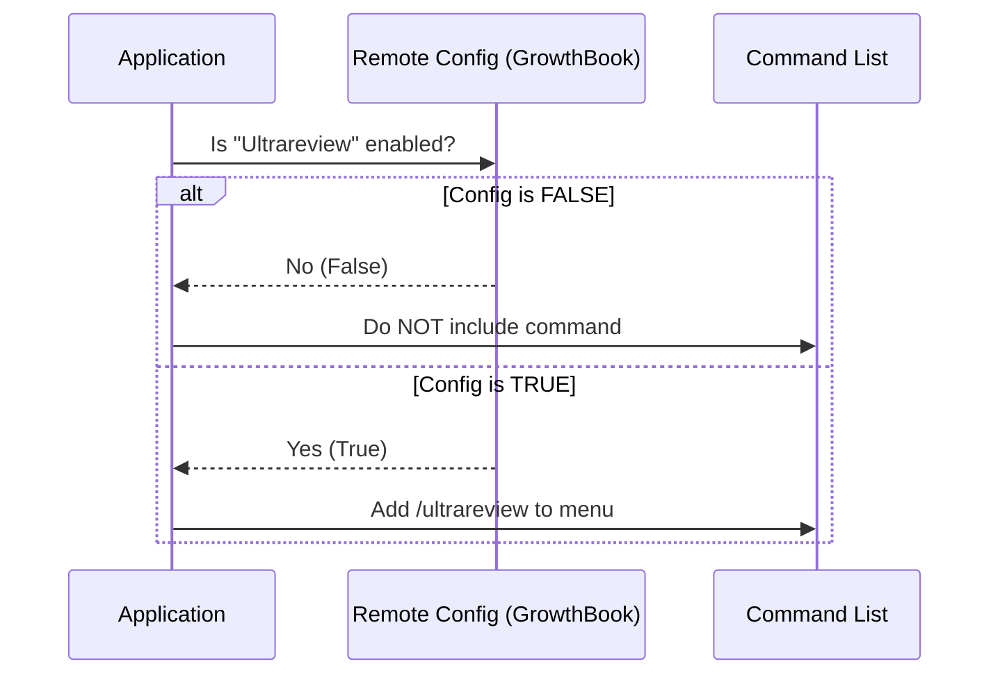

# Chapter 5: Feature Visibility Control

Welcome to the final chapter of our tutorial series!

In the previous chapter, [Billing Authorization Gate](04_billing_authorization_gate.md), we learned how to check if a user has enough credits to run a review. We acted like a toll booth: the road existed, but you had to pay to use it.

But what if the road isn't finished yet? What if we are still building the feature and only want developers to see it? Or what if we want to turn it off instantly during a system outage?

We need a way to hide the feature entirely. This brings us to **Feature Visibility Control**.

## The "Secret Menu" Analogy

Imagine you go to a fast-food restaurant. You look at the menu board. You order a burger.

Now, imagine the restaurant is testing a new "Ultra Burger." They don't want to print it on the main menu yet because they might run out of ingredients, or the recipe isn't perfect.
*   For most people, the "Ultra Burger" doesn't exist. They can't order it because they don't see it.
*   For a select group (testers), the manager flips a switch, and the item magically appears on the digital board.

**Feature Visibility Control** is that switch.

## Why Do We Need This?

In software development, we often merge code before it is 100% ready for the public. We use **Feature Flags** (remote switches) to control who sees what.

1.  **Safety:** If a bug is found, we can turn the feature off instantly without asking users to update their app.
2.  **Gradual Rollout:** We can enable the feature for 10% of users to see how it performs before opening the floodgates.
3.  **A/B Testing:** We can show the feature to Group A but not Group B to see which group is happier.

## How It Works: The Flow

Before the user can even type `/ultrareview` (as described in [Command Execution Flow](01_command_execution_flow.md)), the application has to decide: *"Should I even put this command in the list?"*

It checks a remote configuration system called **GrowthBook**.



## Internal Implementation

The logic for this is very simple but powerful. It lives in a file called `ultrareviewEnabled.ts`.

Let's break down how we check the visibility status.

### Step 1: Connecting to the "Brain"

We use a helper function to talk to our remote configuration system. We don't want to make a slow network request every single time, so we use a "Cached" value.

```typescript
// ultrareviewEnabled.ts
import { getFeatureValue_CACHED_MAY_BE_STALE } from '../../services/analytics/growthbook.js';
```

*   `_CACHED_MAY_BE_STALE`: This long name tells us that the value might be a few minutes old. That is okay! Speed is more important than being up-to-the-second precise for UI visibility.

### Step 2: checking the Flag

We define a function `isUltrareviewEnabled`. This is the function that the main application calls when building the command menu.

```typescript
export function isUltrareviewEnabled(): boolean {
  // 1. Fetch the specific configuration object
  const cfg = getFeatureValue_CACHED_MAY_BE_STALE<Record<string, unknown> | null>(
    'tengu_review_bughunter_config', 
    null
  );
  
  // ... continued below ...
```

*   `'tengu_review_bughunter_config'`: This is the unique ID (key) of our feature flag in the cloud dashboard.
*   `null`: This is the default value if we can't connect to the server. By default, the feature is hidden (safe mode).

### Step 3: The Final Decision

Finally, we look inside that configuration object to see if the `enabled` property is true.

```typescript
  // 2. Return true ONLY if explicitly enabled
  return cfg?.enabled === true;
}
```

*   `cfg?.enabled`: The `?` means "if `cfg` exists, check `enabled`."
*   If the flag is missing, or set to false, the function returns `false`. The command disappears from the user's view.

## Integration with the System

This check happens at the very top level of the application.

1.  **App Starts:** The app loads.
2.  **Feature Check:** It calls `isUltrareviewEnabled()`.
3.  **Registration:**
    *   If `true`: The command system registers `/ultrareview`. The flow described in [Command Execution Flow](01_command_execution_flow.md) is now possible.
    *   If `false`: The command is ignored. If a user types it, the system says "Command not found."

## Summary of the Project

Congratulations! You have completed the **Review Project Tutorial**.

Let's recap the journey of a single command:

1.  **Chapter 5 (Here):** First, we check if the feature is even turned on using **Feature Visibility Control**.
2.  **Chapter 1 ([Command Execution Flow](01_command_execution_flow.md)):** If visible, the user runs it. The "Front Desk" coordinates the process.
3.  **Chapter 4 ([Billing Authorization Gate](04_billing_authorization_gate.md)):** We check if the user has credits or funds.
4.  **Chapter 3 ([Interactive Dialog System](03_interactive_dialog_system.md)):** If there is a cost, we ask the user for permission via a UI.
5.  **Chapter 2 ([Remote Session Launcher](02_remote_session_launcher.md)):** Finally, we pack up the code and ship it to the cloud to perform the review.

You now understand the full lifecycle of the `ultrareview` command, from a hidden flag in the cloud to a completed code review in your terminal.

Happy Coding!

---

Generated by [Code IQ](https://github.com/adityasoni99/Code-IQ)