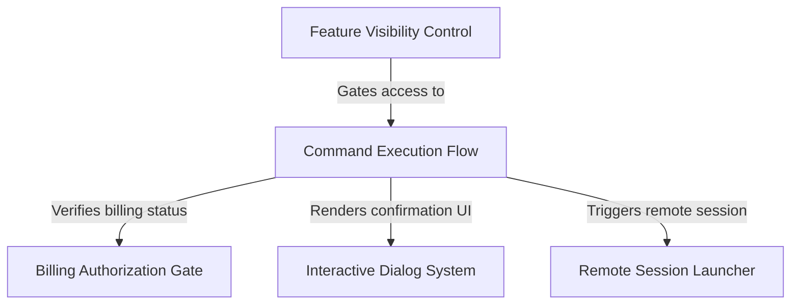

# Tutorial: review

This project implements an **automated code review** tool that runs in the cloud. It features a **Remote Session Launcher** to "teleport" the local codebase to a remote environment for analysis. The system includes a strict **Billing Authorization Gate** to manage quotas and costs, using an **Interactive Dialog System** to confirm overage charges with the user directly in the terminal before execution.

## Chapters

1. [Command Execution Flow](01_command_execution_flow.md)
2. [Remote Session Launcher](02_remote_session_launcher.md)
3. [Interactive Dialog System](03_interactive_dialog_system.md)
4. [Billing Authorization Gate](04_billing_authorization_gate.md)
5. [Feature Visibility Control](05_feature_visibility_control.md)

---

Generated by [Code IQ](https://github.com/adityasoni99/Code-IQ)