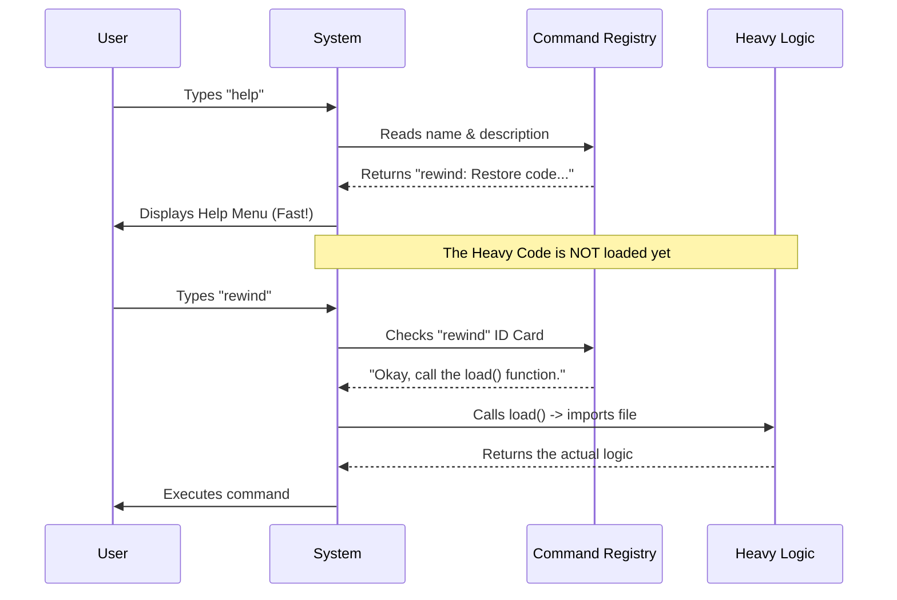

# Chapter 1: Command Registry & Configuration

Welcome to the **Rewind** project! In this first chapter, we are going to look at how we introduce a new feature to the system without bogging it down.

## 1. The Motivation: The Restaurant Menu

Imagine you walk into a restaurant. You sit down and open the menu. You see the name of a dish, a short description of what’s in it, and the price.

Crucially, **the food isn't on the table yet**. The chef hasn't started cooking it. The menu is just a lightweight list of *what is available*.

In software, we have the same problem. We want our program to start up fast and list all available commands (like `rewind`, `save`, `help`) without actually loading the heavy code required to run them.

**The Use Case:**
We want to tell the system: *"Hey, I have a command called 'rewind'. Here is its description. If the user asks for it, here is where you find the code."*

## 2. Key Concepts

To solve this, we create a **Command Registry** entry (a configuration file). This acts as the "ID Card" for our command.

It consists of two main parts:
1.  **Metadata:** Information *about* the command (Name, Description, Aliases).
2.  **The Loader:** A specific instruction on how to find the heavy code later.

## 3. Building the Configuration

Let's look at how we define the `rewind` command in our `index.ts` file. We will build this object step-by-step.

### Step 1: The Metadata (The Menu Entry)
First, we define how the user sees the command. This allows the system to generate a help screen instantly.

```typescript
const rewind = {
  // What the command does (for the help menu)
  description: `Restore the code and/or conversation to a previous point`,
  
  // The primary command word
  name: 'rewind',
  
  // Other names that trigger this command
  aliases: ['checkpoint'],
```
*Explanation:* If a user types `rewind` or `checkpoint`, the system knows they mean this command. It also knows what description to show if the user types `help`.

### Step 2: System Capabilities
Next, we tell the system how this command behaves. Does it run on your computer? Does it need a human to answer questions?

```typescript
  // Hints for arguments (empty here as we don't strictly need one)
  argumentHint: '',
  
  // 'local' means it runs on your machine, not a remote server
  type: 'local',
  
  // false means a human must be present (it might ask for confirmation)
  supportsNonInteractive: false,
```
*Explanation:* This acts like dietary information on a menu (e.g., "Contains Nuts"). It helps the system decide if it's safe to run this command in certain situations (like an automated script).

### Step 3: The Loader (The "Order" Button)
Finally, we define the most critical part. This is the link to the actual heavy implementation.

```typescript
  // The Magic Trick: This function runs ONLY when needed
  load: () => import('./rewind.js'),

} satisfies Command

export default rewind
```
*Explanation:* Notice the `() => import(...)`. We are NOT importing the code at the top of the file. We are giving the system a **function** that imports the code. The system will only call this function if the user actually types `rewind`.

> **Note:** This technique is explored further in [Lazy Module Loading](05_lazy_module_loading.md).

## 4. Under the Hood

How does the system use this file? It acts as a gatekeeper.

### The Flow
1.  The system starts and reads this **Registry** file (which is very small).
2.  It adds `rewind` to its internal list of known words.
3.  The heavy code (`rewind.js`) sits on the hard drive, untouched.

Here is a diagram showing what happens when a user interacts with the system:



## 5. Summary

In this chapter, we learned that a **Command Registry** is like a restaurant menu. It separates the **definition** of a command from its **execution**.

*   **We defined:** Name, Alias, and Description.
*   **We configured:** Type and Capability flags.
*   **We deferred:** The actual loading of code using a `load` function.

This ensures our application stays fast and lightweight!

---

**What's Next?**
Now that the system knows *what* the command is, it needs to provide the command with information (like the current files, conversation history, etc.) to do its job.

Next, we will learn about the **Tool Context Interface**, which is how we pass tools and data to our command.

[Next Chapter: Tool Context Interface](02_tool_context_interface.md)

---

Generated by [Code IQ](https://github.com/adityasoni99/Code-IQ)