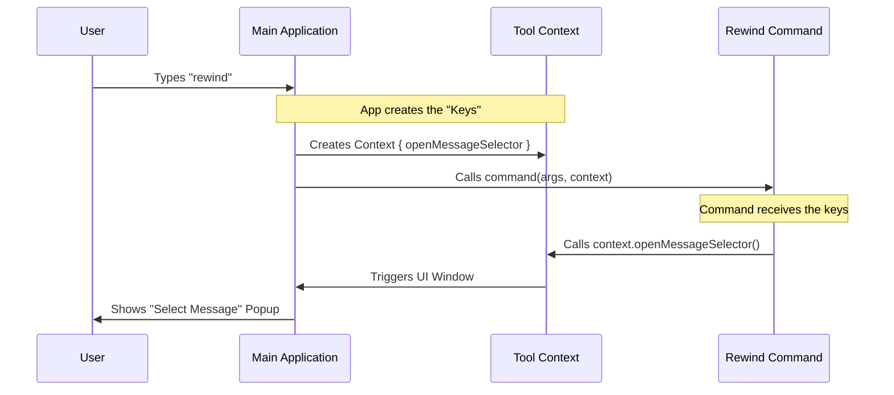

# Chapter 2: Tool Context Interface

Welcome back! In [Command Registry & Configuration](01_command_registry___configuration.md), we created the "Menu Entry" for our `rewind` command. The system now knows the command exists.

But knowing a command exists is different from running it.

## 1. The Motivation: The Maintenance Worker's Key

Imagine you hire a maintenance worker to fix a specific pipe in your office building. Usually, they stay in the basement (the "sandbox"). They do their job in isolation so they don't accidentally break anything in the main lobby.

However, the `rewind` command is special. It needs to show a popup window to the user so they can select which message to rewind to. To do this, it needs to reach *outside* its isolated basement and interact with the main building.

**The Use Case:**
We need to give our isolated `rewind` code a way to press a button on the main application's UI to show a "Message Selector" screen.

## 2. Key Concept: The Tool Context

To solve this, we use the **Tool Context Interface** (specifically called `ToolUseContext`).

Think of the `context` as a **Universal Key Ring** or a **Control Panel** that the main system hands to the command right before it starts working.

*   **Without Context:** The command is blind and isolated.
*   **With Context:** The command holds a set of keys (functions) that allow it to manipulate the main application, access files, or control the UI.

In our specific case, the context holds a key called `openMessageSelector`.

## 3. Using the Context

Let's look at the actual code in `rewind.ts`. When the system runs our command, it passes two things: arguments (what the user typed) and the `context`.

### Step 1: Receiving the Keys
First, we need to accept the context in our function definition.

```typescript
import type { ToolUseContext } from '../../Tool.js'

// The 'context' argument is our toolbox
export async function call(
  _args: string,
  context: ToolUseContext, 
): Promise<LocalCommandResult> {
```
*Explanation:* We define the `call` function. Notice the second argument: `context`. This is the variable that holds our "Universal Keys."

### Step 2: Using the Key
Now that we are holding the context, we check if the specific tool we need exists, and then we use it.

```typescript
  // Check if the 'universal key' exists
  if (context.openMessageSelector) {
    
    // Use the key to open the main UI window
    context.openMessageSelector()
  }
```
*Explanation:* The `rewind` command doesn't know *how* to draw the window. It just knows that if it calls `context.openMessageSelector()`, the main application will do the heavy lifting and show the UI to the user.

### Step 3: Finishing Up
After we open the selector, our command is effectively done with its immediate task.

```typescript
  // Tell the system we are done and to 'skip' adding text to chat
  return { type: 'skip' }
}
```
*Explanation:* We return a result telling the system that the command finished successfully. We will cover this return format in [Local Command Result](04_local_command_result.md).

## 4. Under the Hood

How does the `context` actually get to the command? It is "injected" by the main system.

### The Flow
1.  The User types `rewind`.
2.  The Main Application prepares a `context` object containing all the tools and helper functions the app supports.
3.  The Main Application passes this object to the `rewind` command.

Here is a diagram illustrating this hand-off:



### Internal Implementation
Behind the scenes, the code that calls our command looks something like this (simplified):

```typescript
// This exists in the main system core (not in rewind.ts)
const context: ToolUseContext = {
    // We define the function here
    openMessageSelector: () => {
        uiLayer.showCheckpoints(); // Real UI logic
    }
};

// We pass this object to the command
await rewindCommand.call(args, context);
```
*Explanation:* The `openMessageSelector` function is defined in the main system where it has full access to the UI. It is then wrapped inside the `context` object and shipped off to the `rewind` command. This creates a bridge between the isolated command and the core system.

## 5. Summary

In this chapter, we learned that commands don't run in a vacuum. They are given a **Tool Context Interface** which acts as a bridge to the outside world.

*   **The Context** is like a set of keys passed to the command.
*   **The Command** uses these keys (like `openMessageSelector`) to trigger actions in the main application.
*   This keeps our command code simple; it doesn't need to know how to draw a UI, it just asks the context to do it.

---

**What's Next?**
We have defined the command (Chapter 1) and given it the tools it needs (Chapter 2). But who actually calls the `call` function? How is that coordinated?

Next, we will look at the **Command Execution Handler**, the engine that drives this entire process.

[Next Chapter: Command Execution Handler](03_command_execution_handler.md)

---

Generated by [Code IQ](https://github.com/adityasoni99/Code-IQ)