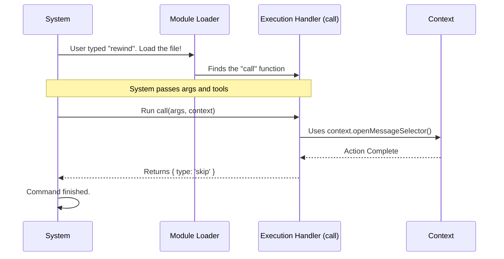

# Chapter 3: Command Execution Handler

Welcome to Chapter 3! In the previous chapter, [Tool Context Interface](02_tool_context_interface.md), we gave our command a set of "keys" (the context) to interact with the main application.

Now, we have the keys, and we have the menu entry ([Command Registry & Configuration](01_command_registry___configuration.md)). But we are missing the most important part: **The Chef**.

## 1. The Motivation: The Recipe

Imagine you are in a kitchen.
*   **The Registry** is the name of the dish on the order ticket.
*   **The Context** is the set of knives and pans available.

But nothing happens until the Chef steps up and follows a specific **Recipe**.

The **Command Execution Handler** is that recipe. It is a specific function that accepts ingredients (arguments) and tools (context), performs the cooking (logic), and serves the dish (result).

**The Use Case:**
We need to write the specific block of code that says: *"Take the user's request and actually open the rewind popup window."*

## 2. Key Concepts

The Execution Handler is strictly defined by a specific function structure. The system expects every command file (like `rewind.ts`) to export a specific function named `call`.

This function has three main jobs:
1.  **Accept Inputs:** Take arguments (what the user typed) and Context (tools).
2.  **Execute Logic:** Do the actual work (math, API calls, UI updates).
3.  **Return a Result:** Tell the system what happened.

## 3. Building the Handler

Let's write the "Recipe" for our `rewind` command in `rewind.ts`. We will build the `call` function step-by-step.

### Step 1: The Function Signature
The system looks for a function named `call`. It must be `async` because commands might take time (like fetching data from the internet).

```typescript
import type { LocalCommandResult } from '../../commands.js'
import type { ToolUseContext } from '../../Tool.js'

// We MUST export a function named 'call'
export async function call(
  _args: string,
  context: ToolUseContext,
): Promise<LocalCommandResult> {
```
*Explanation:*
*   `_args`: This holds text the user typed after the command (e.g., in `rewind 5`, the args would be "5"). We use an underscore (`_`) because `rewind` doesn't strictly need arguments, so we are ignoring them.
*   `context`: This is the toolbox we learned about in Chapter 2.
*   `Promise`: This means the function will finish in the future (it's asynchronous).

### Step 2: The Logic (The Cooking)
Now inside the function, we use our tools to do the work.

```typescript
  // Check if we have the specific tool we need
  if (context.openMessageSelector) {
    
    // Perform the action!
    context.openMessageSelector()
  }
```
*Explanation:* This is the heart of the handler. It isolates the behavior. This specific file knows *when* to call `openMessageSelector`, but it doesn't need to know *how* the selector is drawn on the screen. It just pushes the button.

### Step 3: The Result (Serving the Dish)
Once the logic is finished, we must return a result object so the system knows what to do next.

```typescript
  // Return a standardized result object
  return { type: 'skip' }
}
```
*Explanation:* We return `{ type: 'skip' }`. This tells the chat system: *"I have finished successfully, but please SKIP adding any text response to the chat history."*

> **Note:** We will explore the different types of return values in detail in [Local Command Result](04_local_command_result.md).

## 4. Under the Hood

How does the application actually find and run this function?

### The Flow
When you type `rewind` in the terminal, the system doesn't magically know what code to run. It follows a strict process to locate the `call` function.

1.  **Registry Lookup:** Finds where the `rewind.js` file is.
2.  **Import:** Loads the file into memory.
3.  **Execution:** It looks for the exported `call` property and runs it with the current data.

Here is the sequence of events:



### Internal Implementation
If we looked at the "Core" code that runs your command, it would look something like this simplified snippet:

```typescript
// 1. Load the module defined in the Registry
const commandModule = await commandEntry.load();

// 2. Prepare the context (from Chapter 2)
const context = createToolContext();

// 3. The "Magic Moment": Execute the handler
// The system trusts that commandModule has a 'call' function
const result = await commandModule.call(args, context);

// 4. Handle the result
handleResult(result);
```
*Explanation:* The system is designed to treat all commands exactly the same. Whether it is `rewind`, `save`, or `help`, the system just loads the file and blindly executes the `call` function. This makes it very easy to add new commands—you just need to provide a valid `call` function!

## 5. Summary

In this chapter, we learned that the **Command Execution Handler** is the engine room of our feature.

*   It is a function named `call`.
*   It takes **Arguments** and a **Context** as input.
*   It executes the specific logic (like opening a popup).
*   It returns a **Result** to the system.

We have successfully opened the popup window! But what happens when we return that `{ type: 'skip' }` object? What other options do we have? Can we send text back to the user?

Next, we will learn exactly how to talk back to the system using the **Local Command Result**.

[Next Chapter: Local Command Result](04_local_command_result.md)

---

Generated by [Code IQ](https://github.com/adityasoni99/Code-IQ)