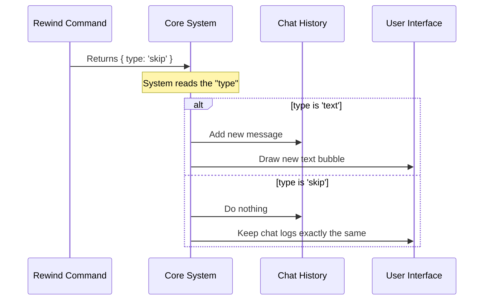

# Chapter 4: Local Command Result

Welcome to Chapter 4! In the previous chapter, [Command Execution Handler](03_command_execution_handler.md), we built the engine that performs the actual work (like opening a popup window).

We have executed the logic, but there is one final step in the function: the `return` statement. This chapter focuses on the **Local Command Result**—the official report your command hands back to the system when it's finished.

## 1. The Motivation: The "Mission Report"

Imagine you are a commander sending a spy on a mission. When the spy returns, they hand you a **Mission Report**.
*   **Report A:** "I found the secret documents. Here they are." (You file this in the cabinet).
*   **Report B:** "I planted the tracking device. Don't write anything down; just know it's done." (You nod and do nothing).

In our chat application, the "Cabinet" is the **Conversation History** (the chat logs visible on the screen).

**The Use Case:**
When the user runs `rewind`, the system opens a visual interface. Once that interface is open, the command is done. We **do not** want the system to print a message like *"Command Rewind Executed Successfully"* into the chat. That would clutter the user's view.

We want "Report B": Do the work, but don't leave a trace in the chat logs. We call this "Ghost Mode."

## 2. Key Concepts

The **Local Command Result** is simply a JavaScript object that tells the main system how to update the User Interface (UI) after a command finishes.

It relies on a specific property called `type`.

### The 'Skip' Result
This is our focus for the `rewind` command.

```typescript
{ type: 'skip' }
```

When the system sees `type: 'skip'`, it understands: *"The command finished successfully. Do NOT add a new message bubble to the chat history."*

## 3. Implementing the Result

Let's look at the end of our `rewind.ts` file again. We are inside the `call` function.

### Returning the "Ghost Mode" Signal
After we ask the context to open the message selector, we return our object.

```typescript
// Inside rewind.ts

export async function call(_args, context) {
  // ... logic performed above ...

  // The Mission Report:
  return { type: 'skip' }
}
```
*Explanation:*
*   The function creates a simple object `{ type: 'skip' }`.
*   It passes this object back to whoever called the function.
*   The `rewind` command is now complete.

### Contrast: What if we wanted text?
To help you understand why `skip` is special, here is what a normal text result looks like (we are **not** using this for rewind, but it's good to know):

```typescript
// A normal command might return this:
return { 
  type: 'text', 
  content: 'The current time is 12:00 PM' 
}
```
*Explanation:* If we returned this, the system would create a new chat bubble saying "The current time is 12:00 PM". Because we use `skip` for `rewind`, no bubble appears.

## 4. Under the Hood

What does the system actually do with this little object? It acts as a traffic controller for the UI.

### The Flow
1.  The `rewind` logic runs.
2.  The `rewind` function returns `{ type: 'skip' }`.
3.  The Main System receives this object.
4.  The System checks the `type`.
5.  Because it is `skip`, the System updates the internal state but **skips** the step where it re-renders the chat list.

Here is a diagram of the decision process:



### Internal Implementation
Let's look at a simplified version of the code inside the main application that handles this. This code "consumes" the result we just returned.

```typescript
// Inside the Core System (Simplified)

// 1. Run the command and get the result
const result = await command.call(args, context);

// 2. Decide what to do based on the 'type'
if (result.type === 'text') {
  // Add to history (Visible to user)
  chatHistory.push(result.content);
} 
else if (result.type === 'skip') {
  // Do NOTHING to the history
  // The command likely performed a side-effect (like UI popup)
  return; 
}
```
*Explanation:*
*   The system uses an `if/else` block (or a switch statement) to handle the `result.type`.
*   If `type === 'skip'`, the function simply returns. The `chatHistory.push` line is never reached.
*   This ensures that functional commands like `rewind` (or `save`, or `clear`) feel essentially "invisible" in the text log.

## 5. Summary

In this chapter, we learned about the **Local Command Result**. This is the final handshake between a command and the system.

*   **The Concept:** It is a "Mission Report" returned after execution.
*   **The Object:** `{ type: 'skip' }`.
*   **The Effect:** It allows the `rewind` command to perform actions (like opening a popup) without polluting the conversation history with unnecessary text.

We have now built the full lifecycle of a command:
1.  Defined it in the **Registry**.
2.  Given it tools via **Context**.
3.  Executed logic in the **Handler**.
4.  Reported back via the **Result**.

However, there is one final optimization. Right now, our system works, but if we had 100 commands, we don't want to load the code for all of them every time we start the app.

Next, we will learn how to make our application incredibly fast using **Lazy Module Loading**.

[Next Chapter: Lazy Module Loading](05_lazy_module_loading.md)

---

Generated by [Code IQ](https://github.com/adityasoni99/Code-IQ)