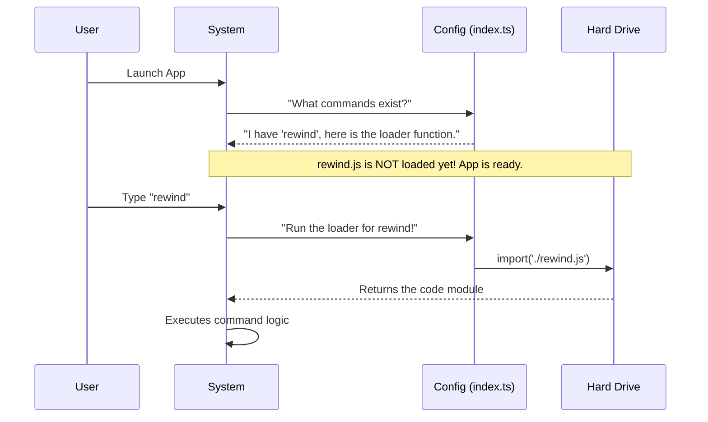

# Chapter 5: Lazy Module Loading

Welcome to the final chapter of our specific command tutorial!

In the previous chapters, we defined the command in the registry ([Command Registry & Configuration](01_command_registry___configuration.md)), gave it tools ([Tool Context Interface](02_tool_context_interface.md)), wrote the logic ([Command Execution Handler](03_command_execution_handler.md)), and handled the output ([Local Command Result](04_local_command_result.md)).

We have a working command. But we have one last problem to solve: **Efficiency**.

## 1. The Motivation: Just-In-Time Delivery

Imagine you run a giant manufacturing plant. You build cars, toasters, and televisions.

You have a warehouse where you store parts.
*   **The Stockpiling Method:** You buy every single part for every single product (thousands of items) and stuff them into the warehouse at 8:00 AM, just in case someone orders a toaster. **Result:** The warehouse is clogged, and opening the doors takes forever.
*   **The Just-In-Time Method:** You keep the warehouse empty. You have a phone book. When a customer orders a toaster, *only then* do you call the supplier, get the toaster parts, and build it. **Result:** The warehouse is clean, and you open for business instantly.

**The Use Case:**
Our application might have 50 different commands. The `rewind` command is heavy—it has complex logic. If we load the code for all 50 commands when the user starts the app, the app will take 5 seconds to launch.

We want the app to launch instantly and only load the `rewind` code if the user actually types `rewind`.

## 2. Key Concepts

To achieve this "Just-In-Time" delivery in code, we use **Lazy Module Loading**.

### Static vs. Dynamic Imports
Usually, imports are "Static" (Stockpiling). They sit at the top of the file:
```typescript
import { heavyLogic } from './heavyFile.js'; // Loads immediately!
```

For Lazy Loading, we use "Dynamic" imports. This is a function that returns the code *later*.
```typescript
const loadLater = () => import('./heavyFile.js'); // Loads only when called!
```

## 3. Implementing Lazy Loading

Let's look at our configuration file (`index.ts`) again. This is where we set up the "Phone Book" entry for our command.

### The Load Function
We define a property called `load`. This is not the code itself; it is the *instruction* on how to get the code.

```typescript
const rewind = {
  // ... name, description, etc ...

  // The Magic Switch:
  load: () => import('./rewind.js'),

} satisfies Command
```

*Explanation:*
1.  `() =>`: This defines a small function (an arrow function).
2.  `import(...)`: This is a special JavaScript command. It goes to the hard drive, finds `rewind.js`, and reads it into memory.
3.  **Crucially**, this line does NOT run when the application starts. It only runs when the system executes `rewind.load()`.

## 4. Under the Hood

How does the system use this? It acts like a dispatcher.

### The Flow
1.  **App Start:** The system reads the registry (index.ts). It sees `rewind` exists, but it **does not** read `rewind.js`. The application starts instantly.
2.  **User Action:** The user types `rewind`.
3.  **Trigger:** The system looks at the registry, finds the `load` function, and calls it.
4.  **Loading:** The computer pauses for a tiny fraction of a second to read the file.
5.  **Execution:** The code is now available, and the system runs the `call` function we wrote in [Command Execution Handler](03_command_execution_handler.md).

Here is a diagram showing the timeline:



### Internal Implementation
If we look at the core system code (the code that manages your commands), it looks something like this:

```typescript
// Inside the Command Runner Core

// 1. Identify the command
const commandConfig = registry.get('rewind');

// 2. LOAD the module (Lazy Loading)
// We use 'await' because reading from disk takes time
const module = await commandConfig.load();

// 3. The module is now loaded! 
// We can access the 'call' function from Chapter 3
await module.call(args, context);
```

*Explanation:*
*   The `commandConfig.load()` is the key. Before this line runs, the heavy code didn't exist in the application's memory.
*   Once `await commandConfig.load()` finishes, `module` holds the actual code from `rewind.ts`.
*   We can then use `.call(...)` just like we planned.

## 5. Summary

In this final chapter, we learned about **Lazy Module Loading**.

*   **The Problem:** Loading all code at startup makes applications slow.
*   **The Solution:** We use a dynamic `import` function in our configuration.
*   **The Result:** The system acts like a "Just-In-Time" manufacturer, only loading the heavy code when the user specifically asks for it.

### Tutorial Conclusion

Congratulations! You have walked through the entire architecture of a command in the **Rewind** project.

Let's recap the journey:
1.  **[Command Registry](01_command_registry___configuration.md):** We created the "Menu Entry" so the system knows the command exists.
2.  **[Tool Context](02_tool_context_interface.md):** We gave the command a "Key Ring" to access system tools.
3.  **[Execution Handler](03_command_execution_handler.md):** We wrote the "Recipe" (logic) to perform the task.
4.  **[Local Command Result](04_local_command_result.md):** We wrote the "Mission Report" to tell the system we are done.
5.  **[Lazy Loading](05_lazy_module_loading.md):** We optimized it so the code only loads when needed.

You now possess the knowledge to build efficient, powerful, and integrated commands for this system. Happy coding!

---

Generated by [Code IQ](https://github.com/adityasoni99/Code-IQ)