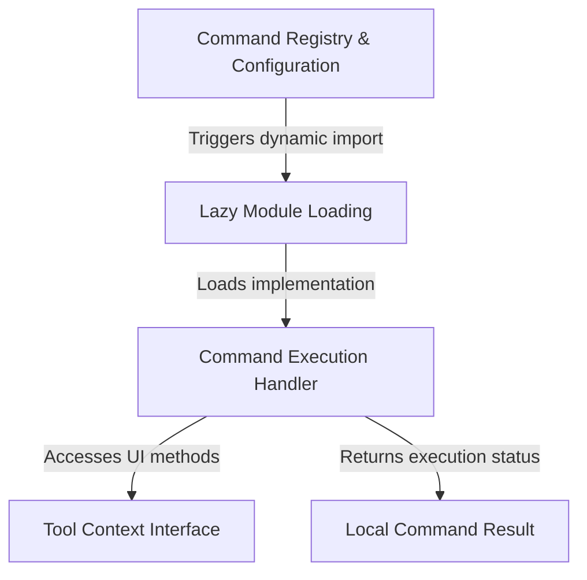

# Tutorial: rewind

This project implements a **rewind** command that acts like a time-machine for the application's conversation history. It defines a configuration "menu entry" that allows users to restore their workspace to a previous *checkpoint* using a visual selection interface. To keep the application fast and clean, the code uses **lazy loading** to only fetch the logic when needed and ensures the rewind action itself doesn't clutter the chat log.

## Chapters

1. [Command Registry & Configuration](01_command_registry___configuration.md)
2. [Tool Context Interface](02_tool_context_interface.md)
3. [Command Execution Handler](03_command_execution_handler.md)
4. [Local Command Result](04_local_command_result.md)
5. [Lazy Module Loading](05_lazy_module_loading.md)

---

Generated by [Code IQ](https://github.com/adityasoni99/Code-IQ)