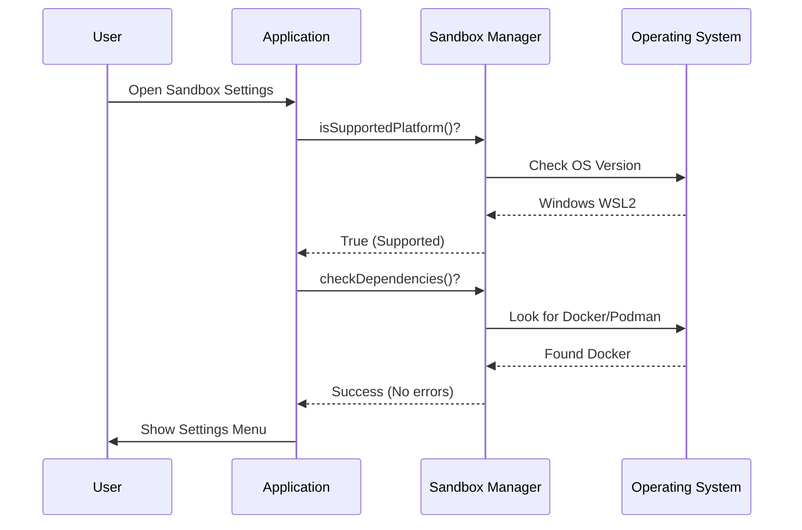

# Chapter 1: Sandbox Manager Interface

Welcome to the first chapter of the **Sandbox Toggle** project! In this series, we will build a robust system to toggle sandboxing features for a command-line interface (CLI).

Before we can flip switches or configure settings, we need a reliable way to know the current state of the system. We need a "Source of Truth."

### The Problem: Is it Safe?
Imagine you are building a feature that isolates dangerous commands inside a secure box (a sandbox). Before you put a command in the box, you need to answer several questions:
1.  **Is the box built?** (Are dependencies installed?)
2.  **Is the box locked?** (Is the feature enabled?)
3.  **Am I allowed to touch the box?** (Are enterprise policies locking the settings?)
4.  **Does this computer even support boxes?** (Platform compatibility).

If you ask these questions in 10 different places in your code, it becomes a mess.

### The Solution: The Sandbox Manager
We solve this by creating a central static class called `SandboxManager`. Think of it as the **Security Guard** of your application. No matter who asks—the UI, the settings menu, or the command runner—they all ask the `SandboxManager`.

---

### Key Concepts

The `SandboxManager` handles three specific layers of validation. Let's break them down using an analogy of driving a car.

#### 1. Platform Compatibility
**Analogy:** Is there a road here?
The manager checks if the operating system (OS) supports sandboxing. For example, it might work on macOS and Linux, but not on older versions of Windows (WSL1).

#### 2. Dependency Checking
**Analogy:** Does the car have an engine?
Even if the road exists, we need the right tools (like Docker or Podman) installed to run the sandbox. The manager runs a check to ensure these tools are present.

#### 3. Policy Enforcement
**Analogy:** Did your parents take the keys?
Sometimes, a system administrator (enterprise policy) might force the sandbox to be "Always On" or "Always Off." The manager checks if local users are allowed to change settings or if they are "locked."

---

### How to Use the Interface

Let's look at how we use `SandboxManager` in our code. These examples are based on how `index.ts` determines what icon to show in the menu.

#### Checking Status
To see if the sandbox is currently turned on:

```typescript
import { SandboxManager } from '../../utils/sandbox/sandbox-adapter.js';

// Returns true or false
const currentlyEnabled = SandboxManager.isSandboxingEnabled();
```
*Explanation:* This simple method hides the complex logic of reading configuration files. It just tells us "Yes" or "No."

#### Checking Policies
To see if settings are locked by an admin:

```typescript
// Returns true if an admin has locked the settings
const isLocked = SandboxManager.areSandboxSettingsLockedByPolicy();

if (isLocked) {
  console.log("You cannot change these settings.");
}
```
*Explanation:* This allows the UI to show a lock icon or disable toggle buttons, preventing user frustration.

#### Checking Dependencies
To ensure the system is healthy:

```typescript
// Returns an object with a list of errors (if any)
const depCheck = SandboxManager.checkDependencies();

const hasDeps = depCheck.errors.length === 0;
```
*Explanation:* If `errors.length` is 0, the system is ready. If not, we usually show a warning icon (⚠).

---

### Under the Hood: The Workflow

When a user tries to interact with the sandbox settings, a specific sequence of events occurs. Here is what happens when the code asks: "Can we show the menu?"



### Code Deep Dive

Let's examine `sandbox-toggle.tsx` to see how the manager protects the code. This file is responsible for rendering the settings menu.

#### Step 1: Guarding the Gate (Platform Check)
At the very top of the function, we stop everything if the platform is wrong.

```typescript
// sandbox-toggle.tsx
const platform = getPlatform();

if (!SandboxManager.isSupportedPlatform()) {
  const errorMessage = 'Error: Sandboxing is not supported on this OS.';
  onDone(color('error')(errorMessage));
  return null;
}
```
*Explanation:* Before doing anything expensive, we ask the manager if we are on a supported platform (like WSL2 or macOS). If not, we show an error and exit (`return null`).

#### Step 2: Enterprise Check (Enabled List)
Next, we check if this specific platform is allowed by enterprise configuration.

```typescript
// sandbox-toggle.tsx
if (!SandboxManager.isPlatformInEnabledList()) {
  const msg = 'Error: Sandboxing disabled via enabledPlatforms setting.';
  onDone(color('error')(msg));
  return null;
}
```
*Explanation:* Even if the OS is technically capable, an admin might have disabled it specifically for this environment. The manager enforces this rule.

#### Step 3: The Policy Lock
Finally, before letting the user change anything, we check for a policy lock.

```typescript
// sandbox-toggle.tsx
if (SandboxManager.areSandboxSettingsLockedByPolicy()) {
  const msg = 'Error: Settings are overridden by policy.';
  onDone(color('error')(msg));
  return null;
}
```
*Explanation:* If `areSandboxSettingsLockedByPolicy()` returns true, we refuse to open the interactive menu. This ensures users don't think they can change settings that will effectively be ignored.

---

### Summary
The **Sandbox Manager Interface** is the foundational layer of our project. It acts as the single source of truth, ensuring that:
1.  We are on a valid computer.
2.  We have the necessary tools installed.
3.  We are allowed to make changes.

By centralizing these checks, we keep our UI code clean and our logic consistent.

Now that we have our manager to keep us safe, we need to define how the user actually calls this tool from the command line.

[Next Chapter: CLI Command Definition](02_cli_command_definition.md)

---

Generated by [Code IQ](https://github.com/adityasoni99/Code-IQ)