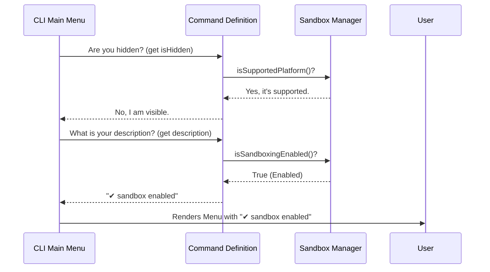

# Chapter 2: CLI Command Definition

In the previous chapter, [Sandbox Manager Interface](01_sandbox_manager_interface.md), we built the "Security Guard" that knows the status of our system.

Now, we need to create the entry point. How does the user actually see and select the "Sandbox" option in the CLI menu? We need to define a **Command**.

### The Motivation: The Dynamic Menu

Imagine a digital restaurant menu.
1.  **Static Item:** "Burger - $10". The text never changes.
2.  **Dynamic Item:** "Catch of the Day - [Salmon]". The text changes based on what the kitchen has.
3.  **Hidden Item:** If the kitchen is closed, the item shouldn't appear at all.

For our CLI, the `sandbox` command is like the "Catch of the Day." We don't just want it to say "Sandbox." We want it to say:
*   "Sandbox (Enabled) ✅"
*   "Sandbox (Disabled) ⚪"
*   "Sandbox (Warning) ⚠"

We need a way to define a command that is **smart enough to update its own label** based on the system status.

---

### Key Concepts

To create this smart command, we use a simple JavaScript object with three special superpowers:

#### 1. Command Registration
This is the ID card. It tells the CLI application, "I exist, and my name is `sandbox`."

#### 2. Getters (The Magic Variable)
In JavaScript, a `getter` looks like a variable, but it behaves like a function. Every time the menu is drawn, the code runs the function to calculate the text *right now*. This allows our description to change dynamically.

#### 3. Conditional Visibility
We don't want to show the Sandbox option to users who can't use it (e.g., wrong Operating System). We use logic to determine if the command should be `hidden`.

---

### How to Use: Defining the Command

We define the command in `index.ts`. Let's look at how we build it step-by-step.

#### Step 1: Naming the Command
First, we export a default object with a `name`. This is what the user types or sees in the list.

```typescript
const command = {
  name: 'sandbox', 
  // ... other properties go here
  type: 'local-jsx',
} 

export default command;
```
*Explanation:* `type: 'local-jsx'` tells the CLI framework that when this command is selected, it will render a graphical interface (React/Ink) rather than just text.

#### Step 2: The Dynamic Description
This is where we connect to the **Sandbox Manager**. We want the description to show an icon and the current status.

```typescript
// Inside the command object...
get description() {
  // Ask the Manager for the truth
  const enabled = SandboxManager.isSandboxingEnabled();
  
  // Decide which icon to use
  const icon = enabled ? '✅' : '⚪'; 
  
  return `${icon} sandbox ${enabled ? 'enabled' : 'disabled'}`;
},
```
*Explanation:* Notice the keyword `get`. The CLI will ask for the description, and this code runs instantly to check if the sandbox is on or off, returning the correct string.

#### Step 3: Hiding the Command
If the computer doesn't support sandboxing, we shouldn't show the option.

```typescript
// Inside the command object...
get isHidden() {
  // If the platform is NOT supported, hide this command
  return !SandboxManager.isSupportedPlatform();
},
```
*Explanation:* This prevents errors. If a user on an incompatible system runs the CLI, the `sandbox` command simply won't exist for them.

#### Step 4: Lazy Loading
We don't want to load all the heavy code for the sandbox UI unless the user actually clicks it.

```typescript
// Inside the command object...
load: () => import('./sandbox-toggle.js'),
```
*Explanation:* This is a performance trick. We only import the actual logic file (`sandbox-toggle.js`) when the command is triggered.

---

### Under the Hood: The Menu Rendering Workflow

When you start the CLI application, it scans `index.ts` to figure out what to draw on the screen. Here is the conversation between the App and our Command Definition:



---

### Code Deep Dive

Let's look at the actual implementation in `index.ts`. It combines all the concepts above.

#### The Description Logic
We use a library called `figures` to get consistent icons (like ticks and circles) across different terminals.

```typescript
// index.ts (simplified)
get description() {
  // 1. Gather all status info from the Manager
  const currentlyEnabled = SandboxManager.isSandboxingEnabled()
  const hasDeps = SandboxManager.checkDependencies().errors.length === 0

  // 2. Pick an Icon
  let icon = figures.circle // Default: Empty circle
  if (!hasDeps) icon = figures.warning // Missing tools
  else if (currentlyEnabled) icon = figures.tick // Sandbox On
  
  // 3. Return the text string
  return `${icon} sandbox status... (⏎ to configure)`
}
```
*Explanation:* This logic creates a "Health Check" right in the main menu. The user knows immediately if dependencies are missing (⚠) or if the sandbox is active (✔) without even entering the submenu.

#### The Argument Hint
The command also tells the user it accepts extra arguments (for advanced users).

```typescript
// index.ts
argumentHint: 'exclude "command pattern"',
immediate: true,
```
*Explanation:*
*   `argumentHint`: Shows help text like `sandbox exclude "git push"`.
*   `immediate: true`: This ensures the command runs immediately without waiting for extra inputs if the user just presses Enter.

---

### Conclusion

In this chapter, we created the **Face** of our feature.
1.  We defined a `command` object.
2.  We used the [Sandbox Manager Interface](01_sandbox_manager_interface.md) to make the description text dynamic.
3.  We ensured the command is hidden on unsupported platforms.

Now the user can *see* the command. But what happens when they actually press **Enter**? We need to hand control over to the actual logic that draws the toggles and switches.

[Next Chapter: Sandbox Controller](03_sandbox_controller.md)

---

Generated by [Code IQ](https://github.com/adityasoni99/Code-IQ)