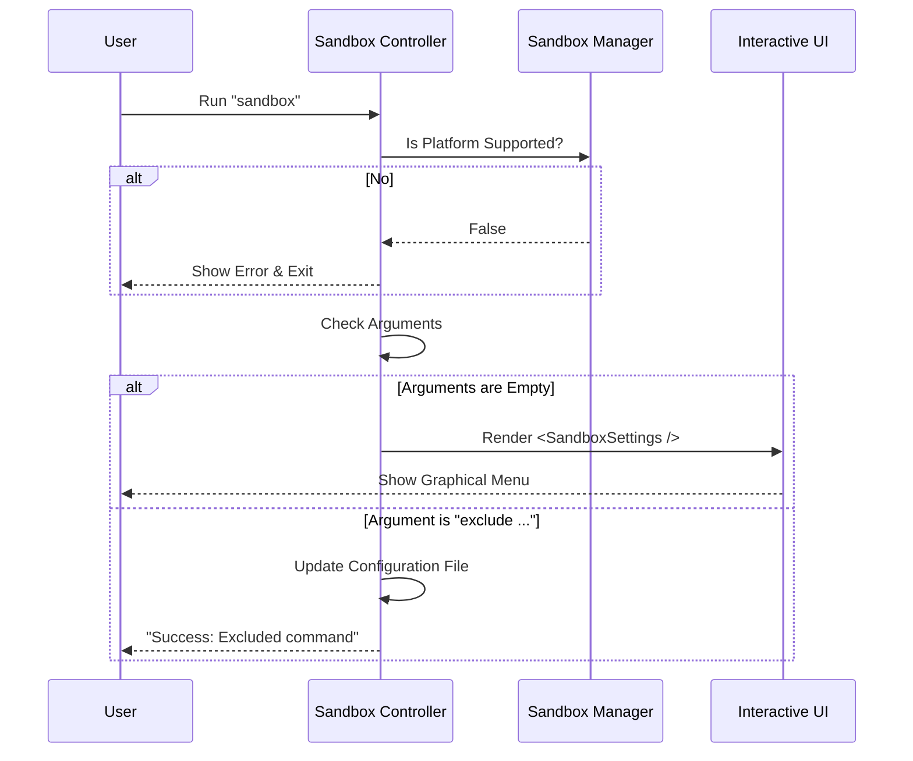

# Chapter 3: Sandbox Controller

In the previous chapter, [CLI Command Definition](02_cli_command_definition.md), we created the menu entry for our feature. We hung the sign on the door. Now, when the user actually walks through that door (presses **Enter**), we need someone to greet them and decide where they should go.

Welcome to the **Sandbox Controller**.

### The Motivation: The Traffic Controller

When a user runs the `sandbox` command, they might want to do different things:
1.  **Open the Menu:** See the graphical toggles and switches.
2.  **Quick Action:** Type `sandbox exclude "git"` to quickly add a rule without opening the menu.
3.  **Mistake:** Try to run it on a Windows computer that doesn't support it.

We cannot just immediately show the graphics. We need a "Traffic Controller" logic layer to:
*   **Stop** invalid users (Pre-flight Checks).
*   **Direct** users with arguments to the specific logic (Headless Mode).
*   **Guide** empty-handed users to the visual menu (Interactive Mode).

In our project, this logic lives in the `call` function inside `sandbox-toggle.tsx`.

---

### Key Concepts

#### 1. Pre-flight Checks
Before a plane takes off, pilots check the engines and the weather. similarly, before we run any sandbox logic, we must ensure the environment is safe. We use the [Sandbox Manager Interface](01_sandbox_manager_interface.md) to ask:
*   Is the OS supported?
*   Are policies locking us out?

#### 2. Argument Parsing
Users can type extra words after the command, like:
`sandbox exclude "npm install"`

The controller needs to take that long string (`exclude "npm install"`) and chop it up to understand the **Intent** (Exclude) and the **Data** ("npm install").

#### 3. Interactive vs. Headless
*   **Interactive:** Returns a React Component (UI) to be drawn on the screen.
*   **Headless:** Performs a calculation, prints a text message, and exits immediately (returns `null`).

---

### The Workflow: Decision Making

Let's visualize how the Controller makes decisions when the `call` function starts.



---

### Code Deep Dive

The `call` function is the heart of this chapter. It is an `async` function that receives `args` (the text the user typed). Let's break down its responsibilities using simplified code.

#### Step 1: Pre-flight Checks (The Bouncer)
First, we act as a bouncer. If the user isn't on the list (unsupported platform) or if the club is closed (policy lock), we stop them at the door.

```typescript
// sandbox-toggle.tsx
export async function call(onDone, _context, args) {
  // 1. Ask the Manager if we are allowed here
  if (!SandboxManager.isSupportedPlatform()) {
    onDone('Error: Sandboxing is not supported on this OS.');
    return null; // Stop execution
  }

  // 2. Check for Enterprise Policy locks
  if (SandboxManager.areSandboxSettingsLockedByPolicy()) {
    onDone('Error: Settings are locked by policy.');
    return null; // Stop execution
  }
```
*Explanation:* We return `null` here because there is nothing else to do. Calling `onDone` prints the error message to the user.

#### Step 2: Dependency Check (The Warning)
We also check if the tools (like Docker) are installed. Note that we don't stop execution here; we just gather the info to pass it along later.

```typescript
  // Check health, but don't exit yet
  const depCheck = SandboxManager.checkDependencies();
```
*Explanation:* We store the result in `depCheck`. We will pass this to the UI so it can show a yellow warning icon if needed.

#### Step 3: Branching Paths
Now we look at what the user typed (`args`).

**Path A: Interactive Mode (No Arguments)**
If the user just typed `sandbox` and hit Enter, `args` will be empty. This is the most common use case.

```typescript
  const trimmedArgs = args?.trim() || '';

  // If the user said nothing else...
  if (!trimmedArgs) {
    // ... Render the Graphical UI
    return <SandboxSettings onComplete={onDone} depCheck={depCheck} />;
  }
```
*Explanation:* Here we return a React Component (`<SandboxSettings />`). The CLI framework will take this and draw it on the terminal screen. This leads us to the topic of Chapter 4.

**Path B: Headless Mode (Specific Command)**
If the user typed `sandbox exclude "git"`, we handle it immediately without showing a UI.

```typescript
  // Split "exclude git" into ["exclude", "git"]
  const parts = trimmedArgs.split(' ');
  const subcommand = parts[0]; // "exclude"

  if (subcommand === 'exclude') {
    // Logic to add the exclusion rule
    const pattern = trimmedArgs.slice('exclude '.length);
    addToExcludedCommands(pattern);
    
    onDone(`Success: Added "${pattern}" to exclusions.`);
    return null;
  }
```
*Explanation:* We perform the logic (updating the settings file) and call `onDone` with a success message. We return `null` because we don't need to render a persistent UI.

#### Step 4: Handling Unknowns
If the user types something crazy like `sandbox dance`, we need to tell them we don't know how to do that.

```typescript
  // If we don't recognize the subcommand
  const errorMsg = `Error: Unknown subcommand "${subcommand}".`;
  onDone(errorMsg);
  return null;
}
```

---

### Summary

The **Sandbox Controller** is the brain that sits between the user's keystrokes and the application's features. It ensures that:
1.  **Safety checks** are run immediately via the [Sandbox Manager Interface](01_sandbox_manager_interface.md).
2.  **Power users** can use quick commands (arguments) to change settings instantly.
3.  **Standard users** are routed to the visual menu.

In the code above, when we returned `<SandboxSettings />`, we promised the user a visual interface. It is time to fulfill that promise.

[Next Chapter: Interactive Configuration Flow](04_interactive_configuration_flow.md)

---

Generated by [Code IQ](https://github.com/adityasoni99/Code-IQ)