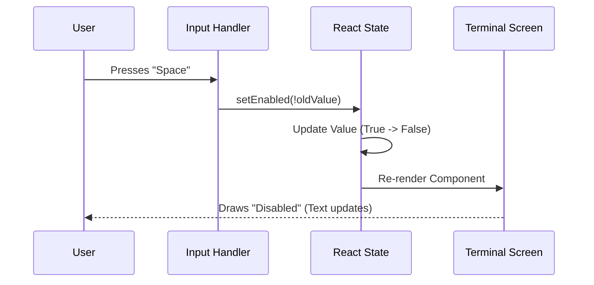

# Chapter 4: Interactive Configuration Flow

In the previous chapter, [Sandbox Controller](03_sandbox_controller.md), we built the logic that decides what to do when the command is run. When a user runs `sandbox` without any arguments, our controller returns a React component called `<SandboxSettings />`.

Now, we will build that component. This is where we leave the world of "logic" and enter the world of **User Experience (UX)**.

### The Motivation: The Dashboard

Standard command-line tools can be intimidating. Usually, to change a setting, you have to type something like:
`my-app config --set sandbox.enabled=true`

If you forget the command, you are stuck. We want to provide a **Visual Dashboard** inside the terminal.

We want the user to see:
1.  **The Main Switch:** Is the sandbox currently On or Off?
2.  **The Engine Check:** Are Docker and other tools working?
3.  **Controls:** Simple instructions like "Press Space to Toggle."

### Key Concepts: React in the Terminal

To build this, we use a library called **Ink**. It allows us to use **React**—typically used for websites—to build text-based interfaces.

#### 1. Components
Just like building a LEGO castle, we build our UI out of small blocks like `<Text>` (to show words) and `<Box>` (to layout items).

#### 2. State (`useState`)
This is the component's short-term memory. It remembers: *"Did the user flip the switch yet?"* even if they haven't saved it.

#### 3. Input Hooks (`useInput`)
On a website, you click a mouse. In a terminal, you press keys. We use a "hook" to listen for specific keys like **Space**, **Enter**, or **Escape**.

---

### How to Use: Building the Component

The file `SandboxSettings.tsx` is responsible for drawing this menu. Let's break down how we build it, piece by piece.

#### Step 1: Receiving Data (Props)
Our component receives data passed down from the Controller (Chapter 3).

```typescript
// SandboxSettings.tsx
interface Props {
  onComplete: (msg?: string) => void; // Function to exit
  depCheck: { errors: string[] };    // Result of dependency check
}

export const SandboxSettings: React.FC<Props> = ({ 
  onComplete, 
  depCheck 
}) => {
  // ... component logic starts here
```
*Explanation:* `onComplete` is our exit door; we call it when the user is done. `depCheck` tells us if the system is healthy.

#### Step 2: Setting up State
We need to know the *current* status of the sandbox to decide whether to show a generic checkbox (☐) or a checked one (☑).

```typescript
// Inside component...
// 1. Read the initial value from the Manager
const initialObj = SandboxManager.getSandboxConfig();
const initialEnabled = initialObj?.enabled ?? false;

// 2. Create state to track changes
const [isEnabled, setEnabled] = useState(initialEnabled);
```
*Explanation:* We ask the [Sandbox Manager Interface](01_sandbox_manager_interface.md) for the initial state so the toggle starts in the correct position.

#### Step 3: Listening for Keys
This is the interactive part. We want **Space** to toggle the setting and **Enter** to save and exit.

```typescript
useInput((input, key) => {
  if (input === ' ') {
    // Flip the switch visually
    setEnabled(!isEnabled);
  }

  if (key.return) {
    // Save to disk using the Manager
    SandboxManager.setSandboxingEnabled(isEnabled);
    onComplete('Settings saved!');
  }
});
```
*Explanation:* `useInput` runs every time a key is pressed. If it's a Spacebar, we update the state (`setEnabled`). If it's Enter (`key.return`), we commit the changes to the file system.

#### Step 4: Rendering the UI
Finally, we draw the text based on our state.

```typescript
return (
  <Box flexDirection="column" borderStyle="round" padding={1}>
    <Text bold>Sandbox Configuration</Text>
    
    <Text>
      Status: {isEnabled ? color('success')('Enabled') : 'Disabled'}
    </Text>

    <Text color="gray">Press [Space] to toggle, [Enter] to save.</Text>
  </Box>
);
```
*Explanation:* This renders a box with a border. Inside, the text "Enabled" turns green (success color) if `isEnabled` is true.

---

### Under the Hood: The Render Loop

It might feel like magic that the text changes without the page reloading. Here is what happens when you press the Spacebar.



### Visualizing Dependencies

In Chapter 3, we passed `depCheck` to this component. We should display that information to the user so they know *why* the sandbox might not work.

We can add a section to our render function to iterate through any errors.

```typescript
// Inside the return statement...
<Box marginTop={1}>
  <Text underline>System Health:</Text>
  
  {depCheck.errors.length === 0 ? (
     <Text color="green">✔ All systems operational</Text> 
  ) : (
     depCheck.errors.map(err => <Text color="red">✖ {err}</Text>)
  )}
</Box>
```
*Explanation:* We use a "ternary operator" (the `? :` symbols).
*   If `errors.length` is 0: Show a green checkmark.
*   If there are errors: Loop through them (`map`) and show a red X for each one.

---

### Code Deep Dive: The Toggle Switch

Creating a nice-looking toggle switch in text is a fun challenge. We usually use distinct icons.

Here is a simplified helper function typically used inside `SandboxSettings`:

```typescript
function renderToggle(isOn: boolean) {
  if (isOn) {
    // Returns a green checked box
    return <Text color="green">◉ Enabled</Text>;
  } else {
    // Returns a gray empty circle
    return <Text color="gray">◯ Disabled</Text>;
  }
}
```

When we combine this with the logic from Step 3, the user gets immediate visual feedback. They press Space, and the icon changes from `◯` to `◉` instantly. The actual file on the hard drive isn't changed until they press **Enter**. This is a pattern called **"Optimistic UI"**—it feels fast because we don't wait for the disk write to update the screen.

---

### Summary

In this chapter, we built the **Interactive Configuration Flow**.
1.  We created a Visual Component using **Ink**.
2.  We managed **State** to track the user's choices.
3.  We used **Input Hooks** to make the keyboard act like a game controller.
4.  We displayed the **Dependency Health** we calculated in previous chapters.

The user can now turn the entire sandbox ON or OFF. But what if they want to keep the sandbox ON, but allow just *one specific command* to run outside of it?

We need a way to manage specific exceptions.

[Next Chapter: Command Exclusion Logic](05_command_exclusion_logic.md)

---

Generated by [Code IQ](https://github.com/adityasoni99/Code-IQ)