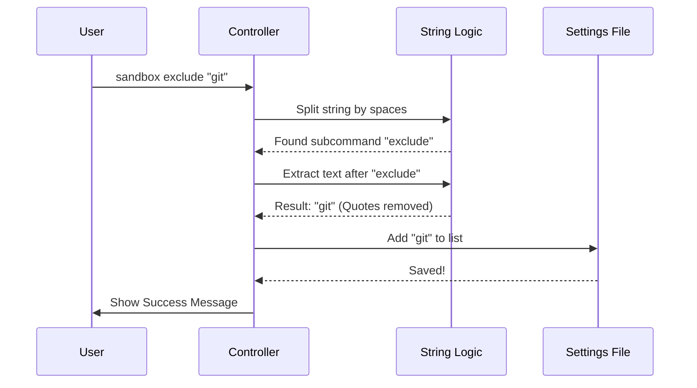

# Chapter 5: Command Exclusion Logic

In the previous chapter, [Interactive Configuration Flow](04_interactive_configuration_flow.md), we built a beautiful visual dashboard that lets users turn the entire sandbox **ON** or **OFF**.

But what if you want the sandbox **ON** for everything *except* one specific command?

### The Motivation: The "VIP List"

Imagine you are running a secure facility. Most visitors must go through security screening (the Sandbox). However, the CEO (a specific command) needs to breeze through without delay.

If you had to shut down security for the *entire building* just to let the CEO in, that would be unsafe and annoying.

**The Problem:**
Sometimes, a specific command (like `npm login` or `git push`) fails inside the sandbox because it needs access to your local keys or specific hardware.

**The Solution:**
We create a **Command Exclusion Logic**. This allows the user to add specific commands to a "VIP List." When the system sees these commands, it lets them run locally, even if the sandbox is technically "On."

---

### Key Concepts

To build this, we need to handle text input from the terminal and save it safely.

#### 1. Subcommands
Up until now, our command was just `sandbox`. Now, we are introducing a "child" command: `sandbox exclude`. This tells our controller: "I don't want the menu; I want to perform a specific action."

#### 2. Pattern Extraction
When a user types:
`sandbox exclude "npm run test"`

We need to separate the **Instruction** (`exclude`) from the **Data** (`"npm run test"`).

#### 3. Input Sanitization
Users often put quotes around arguments to keep them safe from the shell. However, we don't want to save the quotes into our settings file. We need to clean the input (e.g., turn `"git"` into `git`).

#### 4. Local Persistence
We save these exceptions to a **Local** settings file (`.claude/settings.local.json`). Why local? Because your exclusions (like your specific test scripts) might not apply to your teammate's computer.

---

### How to Use: The Command

The user interacts with this logic entirely through the command line, without opening the visual menu.

**Example Input:**
```bash
sandbox exclude "git push"
```

**What Happens:**
1.  The CLI detects the `exclude` keyword.
2.  It takes `"git push"`, cleans it, and adds it to the list.
3.  It prints a success message telling you exactly which file was updated.

**Example Output:**
```text
✔ Added "git push" to excluded commands in .claude/settings.local.json
```

---

### Under the Hood: The Logic Flow

Let's look at what happens inside `sandbox-toggle.tsx` when this command is run. This logic sits inside the `call` function we started in Chapter 3.



---

### Code Deep Dive

Let's break down the implementation in `sandbox-toggle.tsx`. This code runs *before* we try to show the visual menu.

#### Step 1: Identifying the Subcommand
First, we look at the raw arguments (`args`) provided by the user.

```typescript
// sandbox-toggle.tsx

// args might be: 'exclude "npm start"'
const parts = trimmedArgs.split(' ');
const subcommand = parts[0]; // "exclude"

if (subcommand === 'exclude') {
   // ... enter exclusion logic
}
```
*Explanation:* We split the string by spaces. The first word determines our path. If it is `exclude`, we skip the visual menu.

#### Step 2: Extracting the Pattern
We need to get the actual command pattern the user wants to whitelist. We can't just take `parts[1]` because the command might have spaces (like `npm run test`).

```typescript
// Remove "exclude " from the start of the string
const commandPattern = trimmedArgs.slice('exclude '.length).trim();

if (!commandPattern) {
  onDone('Error: Please provide a command pattern.');
  return null;
}
```
*Explanation:* We slice the string to remove the first word. If the result is empty (the user just typed `sandbox exclude`), we show an error.

#### Step 3: Cleaning the Input (Sanitization)
We use a **Regular Expression** (Regex) to gently peel off quotes if they exist.

```typescript
// Remove quotes from start (^) or end ($)
const cleanPattern = commandPattern.replace(/^["']|["']$/g, '');
```
*Explanation:*
*   `"git push"` becomes `git push`.
*   `'npm test'` becomes `npm test`.
*   This ensures our settings file remains clean.

#### Step 4: Persisting the Change
Now we hand the data off to our helper function to actually write to the disk.

```typescript
// Import from the adapter
import { addToExcludedCommands } from '../../utils/sandbox/sandbox-adapter.js';

// Save it!
addToExcludedCommands(cleanPattern);
```
*Explanation:* This helper function handles the messy JSON reading and writing, keeping our Controller code simple.

#### Step 5: Helpful Feedback
Finally, we calculate where the file is so we can tell the user. Users love knowing exactly *what* file we just modified.

```typescript
// Calculate relative path for clarity
const settingsPath = getSettingsFilePathForSource('localSettings');
const relativePath = relative(getCwdState(), settingsPath);

const msg = `Added "${cleanPattern}" to excluded commands in ${relativePath}`;
onDone(color('success')(msg));
```
*Explanation:* Instead of showing a long, ugly absolute path like `/Users/jdoe/project/.claude/...`, we show `.claude/settings.local.json`. It's a small detail that improves User Experience (UX).

---

### Conclusion

Congratulations! You have completed the **Sandbox Toggle** tutorial series.

Let's review what we built:
1.  **[Sandbox Manager Interface](01_sandbox_manager_interface.md):** The central "Brain" that validates the OS and policies.
2.  **[CLI Command Definition](02_cli_command_definition.md):** The "Face" that shows dynamic icons in the main menu.
3.  **[Sandbox Controller](03_sandbox_controller.md):** The "Traffic Cop" that routes users and checks for errors.
4.  **[Interactive Configuration Flow](04_interactive_configuration_flow.md):** The "Dashboard" that lets users toggle settings visually.
5.  **Command Exclusion Logic:** The "VIP List" mechanism for advanced configuration.

You now have a fully functional, robust CLI tool feature that is safe, user-friendly, and configurable. Happy coding!

---

Generated by [Code IQ](https://github.com/adityasoni99/Code-IQ)