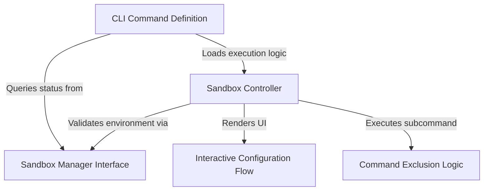

# Tutorial: sandbox-toggle

This project implements a CLI command that manages a **security sandbox** for executing code safely. It serves as a control panel, allowing users to verify platform compatibility, interactively toggle the sandbox via a *UI component*, or configure **exclusion rules** to whitelist specific commands from the sandbox restrictions.

## Chapters

1. [Sandbox Manager Interface](01_sandbox_manager_interface.md)
2. [CLI Command Definition](02_cli_command_definition.md)
3. [Sandbox Controller](03_sandbox_controller.md)
4. [Interactive Configuration Flow](04_interactive_configuration_flow.md)
5. [Command Exclusion Logic](05_command_exclusion_logic.md)

---

Generated by [Code IQ](https://github.com/adityasoni99/Code-IQ)