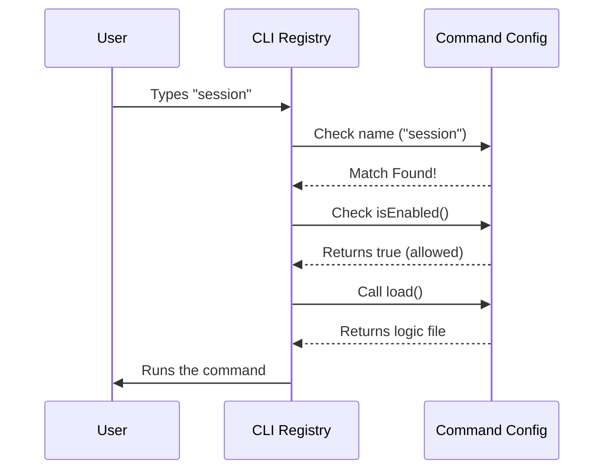

# Chapter 1: Command Configuration

Welcome to the **session** project! If you have ever wondered how a command-line interface (CLI) tool knows what to do when you type a word, you are in the right place.

## The Motivation: The Restaurant Menu

Imagine you are building a CLI tool. You want users to be able to type specific words (commands) to perform actions, like `start`, `build`, or `session`.

Without a structure, you might end up with a giant `if/else` statement trying to guess what the user typed. That gets messy fast!

**The Solution:** Think of your CLI as a restaurant. You need a **Menu**.
A **Command Configuration** is simply a description of one item on that menu. It tells the system:
1.  **Identity:** What is this called? (e.g., "Hamburger")
2.  **Rules:** Is it available right now? (e.g., "Lunch only")
3.  **Action:** What happens when ordered? (e.g., "Tell the chef to cook")

In this chapter, we will build the configuration for a command called `session`.

### Central Use Case
We want to create a command that users can run by typing `session`. However, this command should **only** work if the application is currently in "Remote Mode". If it is running locally, the command should be disabled or hidden.

---

## Defining the Identity

First, we need to give our command a name and a description. This helps the CLI recognize the command and generate help text automatically.

We create a simple JavaScript object to hold this information.

```typescript
const session = {
  type: 'local-jsx', 
  name: 'session',
  // Nicknames for the command
  aliases: ['remote'], 
  description: 'Show remote session URL and QR code',
  // ... more properties later
}
```

**Explanation:**
*   `name`: This is the primary keyword the user types.
*   `aliases`: Users can also type `remote` to trigger the same command.
*   `description`: This text appears when the user runs the `--help` command.

---

## Defining Availability Rules

A powerful feature of the **Command Configuration** is that it doesn't just sit there static; it can make decisions. We can determine if a command is allowed to run based on the application's state.

For our use case, we only want `session` to work if "Remote Mode" is active.

```typescript
import { getIsRemoteMode } from '../../bootstrap/state.js'

// Inside our session object...
isEnabled: () => getIsRemoteMode(),

get isHidden() {
  // Hide from the help menu if not in remote mode
  return !getIsRemoteMode()
},
```

**Explanation:**
*   `isEnabled`: This is a function that returns `true` or `false`. If it returns `false`, the CLI will refuse to run the command.
*   `isHidden`: If this is `true`, the command won't even show up in the list of available commands when the user asks for help.

---

## Connecting the Logic

Finally, we need to tell the configuration *what to do* when the command is selected.

Instead of writing all the complex code right here inside the configuration object, we use a technique to keep things fast. We simply point to where the code lives.

```typescript
// Inside our session object...
load: () => import('./session.js'),
```

**Explanation:**
*   `load`: This function imports the actual code implementation.
*   This ensures we don't load heavy code until the user actually asks for it. We will cover this concept in depth in [Lazy Command Loading](02_lazy_command_loading.md).

---

## Putting It All Together

Here is the complete configuration object. We also use `satisfies Command` at the end. This is a TypeScript feature that acts like a spell-checker, ensuring we didn't forget any required ingredients (like `name` or `load`).

```typescript
import type { Command } from '../../commands.js'

const session = {
  // ... properties we defined above
  name: 'session',
  aliases: ['remote'],
  isEnabled: () => getIsRemoteMode(),
  load: () => import('./session.js'),
} satisfies Command

export default session
```

**Output:**
When the CLI starts, it reads this object. It knows "I have a command called `session`." If the user is in remote mode, it allows the command. If the user types `session`, it follows the `load` instruction.

---

## Under the Hood: How it Works

What happens when the application starts? The system doesn't execute the command immediately. It just "reads the menu."

Here is the flow of how the system uses this configuration object:



### Implementation Details

The beauty of this abstraction is that the **Command Configuration** separates *definition* from *execution*.

1.  **The Registry:** The main program imports this `session` object.
2.  **The Check:** Before running anything, it calls `session.isEnabled()`. If you are looking at the help menu, it checks `session.isHidden`.
3.  **The Trigger:** Only when the check passes does it trigger `session.load()`.

This separation allows us to build complex user interfaces. For example, we can render a list of buttons in the terminal, and grey out the "Session" button dynamically based on the `isEnabled` property! We will see how to build those visual elements in [Terminal UI Components](03_terminal_ui_components.md).

---

## Conclusion

You have just defined your first **Command Configuration**! You learned that a command is just an object that bundles:
1.  **Identity** (Name/Aliases)
2.  **Availability** (Enabled/Hidden rules)
3.  **Logic Pointer** (Load function)

This keeps your code organized. The configuration acts as the "Face" of the command, while the actual hard work is hidden away in a separate file.

But wait, we just glossed over that `load` function. How does the system handle loading code only when needed? Let's explore that in the next chapter.

[Next Chapter: Lazy Command Loading](02_lazy_command_loading.md)

---

Generated by [Code IQ](https://github.com/adityasoni99/Code-IQ)