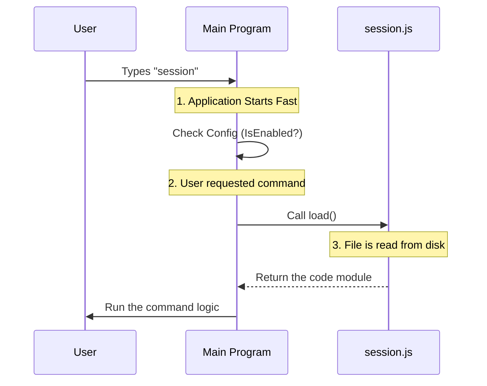

# Chapter 2: Lazy Command Loading

In the previous chapter, [Command Configuration](01_command_configuration.md), we built the "Menu" for our CLI. We created a configuration object that tells the system *about* the `session` command (its name, alias, and rules).

However, we carefully avoided writing the actual code that *runs* the command. We simply pointed to it. In this chapter, we will explain why we did that and how it makes our application faster.

## The Motivation: The Unpacking Analogy

Imagine moving into a new house. You have 50 boxes of stuff.
*   **The "Eager" way:** You unpack *every single box* the moment you step through the front door. You can't sit down or eat until every book and spoon is put away. This takes hours!
*   **The "Lazy" way:** You enter the house. When you get hungry, you unpack the kitchen box. When you get tired, you unpack the bedroom box. You only unpack what you need, when you need it.

### Central Use Case
Our CLI tool might eventually have 20, 50, or 100 commands. Some of these commands might require heavy libraries (like a QR code generator for our `session` command).

If we load the code for all 100 commands every time the user types anything, the CLI will feel slow and "laggy" to start.

**The Solution:** We use **Lazy Command Loading**. We only load the heavy code for the `session` command if the user explicitly asks for it.

---

## The Concept: Dynamic Imports

In standard JavaScript/TypeScript, you usually see imports at the top of a file. This is "Eager" loading.

```typescript
// Eager Loading (Bad for performance here)
import logic from './session.js' // Loads immediately!

const session = {
  // logic is already loaded
  run: logic 
}
```

To achieve "Lazy" loading, we use a special function called `import()`. Instead of running immediately, it waits until we call it.

---

## Implementing the Solution

Let's look at the `load` property we wrote in our configuration file in Chapter 1.

```typescript
// inside index.ts

const session = {
  // ... name and rules
  
  // The Lazy Loader
  load: () => import('./session.js'),
}
```

**Explanation:**
1.  `() => ...`: This is an arrow function. It wraps the import so it doesn't execute yet. It's just a set of instructions waiting to be triggered.
2.  `import('./session.js')`: This tells JavaScript to go find `session.js` and read it into memory.

### The Heavy File
Now, let's create the file that actually does the work. This file sits quietly on the disk until the `load` function summons it.

```typescript
// session.js

// This file is NOT loaded at startup
export default function sessionLogic() {
  console.log("I have been summoned!")
  // Heavy logic, QR codes, and UI go here
}
```

**Explanation:**
*   We use `export default`. This allows the importer to grab the main function easily.
*   We can put as many heavy libraries (like `qrcode-terminal` or complex React components) in this file as we want. They won't slow down the CLI startup.

---

## Under the Hood: How it Works

What actually happens when the user types `session`?

1.  The CLI starts up fast (because it hasn't read `session.js` yet).
2.  It looks at the config (from Chapter 1).
3.  It sees that the user wants `session`.
4.  It calls the `load()` function.
5.  Node.js pauses briefly to read `session.js` from the hard drive.
6.  The code runs.

Here is the flow:



### Internal Implementation Logic

How does the main program handle this? The `import()` function returns a **Promise**. A Promise is JavaScript's way of saying, "I don't have this yet, but I will give it to you in a millisecond."

Here is a simplified version of the code that runs your commands:

```typescript
// The imaginary CLI runner
async function executeCommand(commandConfig) {
  
  // 1. Trigger the lazy load
  // "await" means: Stop and wait for the file to load!
  const module = await commandConfig.load()

  // 2. Get the default function from the file
  const runAction = module.default

  // 3. Execute it
  runAction()
}
```

**Explanation:**
1.  `async/await`: These keywords are required because loading a file takes time (even if just a fraction of a second).
2.  `module.default`: When you use `import()`, the result is an object containing all exports. We grab the `default` export we defined in `session.js`.

---

## Why this matters for `session`

In our specific case, the `session` command is going to display a QR code and a UI for remote connections.

If we look forward to [Terminal UI Components](03_terminal_ui_components.md), we will see that we need to import UI libraries (like React/Ink). These libraries are powerful but large.

By using **Lazy Command Loading**:
1.  Users who just want to use a simple command like `help` or `version` never have to wait for the UI libraries to load.
2.  The memory usage of the application stays low until necessary.

---

## Conclusion

You have successfully set up a high-performance architecture for your CLI!

*   **Chapter 1** taught you to define the *Identity* of the command.
*   **Chapter 2** (this chapter) taught you how to load the *Implementation* only when needed using the `load` function and dynamic `import()`.

Now that we have successfully loaded the `session.js` file, what goes inside it? We need to build a user interface to show the user their session status.

[Next Chapter: Terminal UI Components](03_terminal_ui_components.md)

---

Generated by [Code IQ](https://github.com/adityasoni99/Code-IQ)