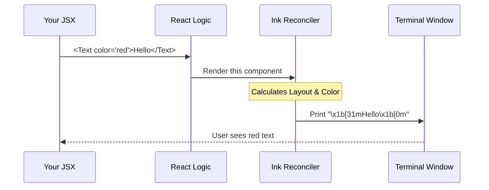

# Chapter 3: Terminal UI Components

In the previous chapter, [Lazy Command Loading](02_lazy_command_loading.md), we learned how to efficiently load our command code only when the user asks for it.

Currently, if we ran our `session` command, it would simply execute a function. But we don't just want to run logic; we want to show the user something beautiful. We want to display a **QR Code**, a **URL**, and **instructions**, all neatly formatted.

If we tried to do this using standard `console.log` statements, calculating spaces and borders would be a nightmare.

## The Motivation: Moving Beyond `console.log`

Imagine trying to build a website using only a typewriter. You have to manually hit "space" twenty times to center a title. If you change the title, you have to recount the spaces.

That is what building a CLI with `console.log` feels like.

### Central Use Case
For the `session` command, we want a user interface (UI) that looks like this:

1.  A bold title: **Remote session**
2.  A QR Code (a block of text characters)
3.  A URL in a specific color (e.g., blue)
4.  A helper text in gray: *(press esc to close)*

**The Solution:** We use a library called **Ink**. It allows us to build Terminal UIs using **React Components**. This works exactly like building a website with HTML, but for the terminal window.

---

## Core Concepts: The Building Blocks

Just like a house is built from bricks, wood, and glass, our CLI interface is built from three main components.

### 1. `Text`: The Content
In HTML, you use `<span>` or `<p>` to write text. In our CLI, we use `<Text>`. It handles the content and the styling (color, bold, dim).

```tsx
import { Text } from '../../ink.js';

// Renders red, bold text
<Text color="red" bold={true}>
  Error: Something went wrong!
</Text>
```

### 2. `Box`: The Structure
In HTML, you use `<div>` to group things together. In our CLI, we use `<Box>`.
`Box` handles the layout. It decides if items should sit next to each other (row) or on top of each other (column). It also handles margins and padding.

```tsx
import { Box, Text } from '../../ink.js';

// Renders two text lines, one on top of the other
<Box flexDirection="column" margin={1}>
  <Text>Line 1</Text>
  <Text>Line 2</Text>
</Box>
```

### 3. `Pane`: The Wrapper
This is a custom component specific to our **session** project. It acts like the main container for our command's output, ensuring consistent spacing across the entire application.

---

## Solving the Use Case

Let's look at how we build the interface for the `session` command inside `session.tsx`. We will construct it piece by piece.

### Step 1: The Header
We want a bold title with a little bit of space underneath it.

```tsx
<Pane>
  <Box marginBottom={1}>
    <Text bold={true}>Remote session</Text>
  </Box>
  {/* Rest of the UI follows... */}
</Pane>
```

**Explanation:**
*   We wrap everything in `<Pane>`.
*   We use a `<Box>` with `marginBottom={1}` to push the content below it down by one line.
*   Inside the box, we put `<Text bold={true}>` to make the title stand out.

### Step 2: The QR Code
A QR code in a terminal is actually just a series of text blocks stacked on top of each other. We receive an array of strings (lines) and map them to `<Text>` components.

```tsx
// "lines" is an array of strings representing the QR code
{lines.map((line, i) => (
  <Text key={i}>
    {line}
  </Text>
))}
```

**Explanation:**
*   This is standard React logic. We loop through the data (`lines`) and output a `<Text>` component for every line of the QR code.

### Step 3: The Footer info
Finally, we want to show the URL and the "Press ESC" hint. We use colors to make it readable.

```tsx
<Box marginTop={1}>
  <Text dimColor={true}>Open in browser: </Text>
  <Text color="ide">{remoteSessionUrl}</Text>
</Box>

<Box marginTop={1}>
  <Text dimColor={true}>(press esc to close)</Text>
</Box>
```

**Explanation:**
*   `dimColor={true}` makes the text gray/faint, implying it is secondary information.
*   `color="ide"` uses a specific theme color defined in our project for URLs.

---

## Under the Hood: How it Works

You might be wondering: *"How does React, which is a web library, work in a black-and-white terminal window?"*

This is the magic of the **Ink** library.

1.  **React Component:** You write standard JSX (like `<Box>`).
2.  **Yoga Layout:** Ink uses a layout engine called "Yoga" (the same one used in React Native for mobile apps) to calculate exactly how wide and tall everything is based on your `flexDirection`, `margin`, etc.
3.  **Renderer:** Instead of creating HTML DOM nodes, Ink translates these calculations into **ANSI Escape Codes**.
4.  **Terminal Output:** ANSI codes are special hidden characters that tell your terminal "Move cursor here," "Make text blue," or "Clear this line."



### Implementation Details

In our file `session.tsx`, the function `SessionInfo` is the main React component.

The `call` function at the bottom of the file is the bridge between our "Command Configuration" (from Chapter 1) and this UI.

```tsx
// session.tsx

export const call = async (onDone) => {
  // Mount the React component to the terminal
  return <SessionInfo onDone={onDone} />;
};
```

When the command loader runs this:
1.  It sees a React element is returned.
2.  The application framework takes over and renders that element using Ink.
3.  The UI appears in your terminal!

---

## Conclusion

You have learned how to create **Terminal UI Components**. Instead of messy string concatenation, we use structured components:
*   **Text** for content and styling.
*   **Box** for layout and spacing.
*   **Pane** for global consistency.

This makes our CLI tool feel professional and easy to read.

However, our `session` command relies on data that changes. The QR code doesn't appear instantly; it takes a moment to generate. The UI needs to handle "Loading" states and update itself when the data arrives.

How do we handle data that changes over time in a CLI? Let's explore that in the next chapter.

[Next Chapter: Reactive State Hook](04_reactive_state_hook.md)

---

Generated by [Code IQ](https://github.com/adityasoni99/Code-IQ)