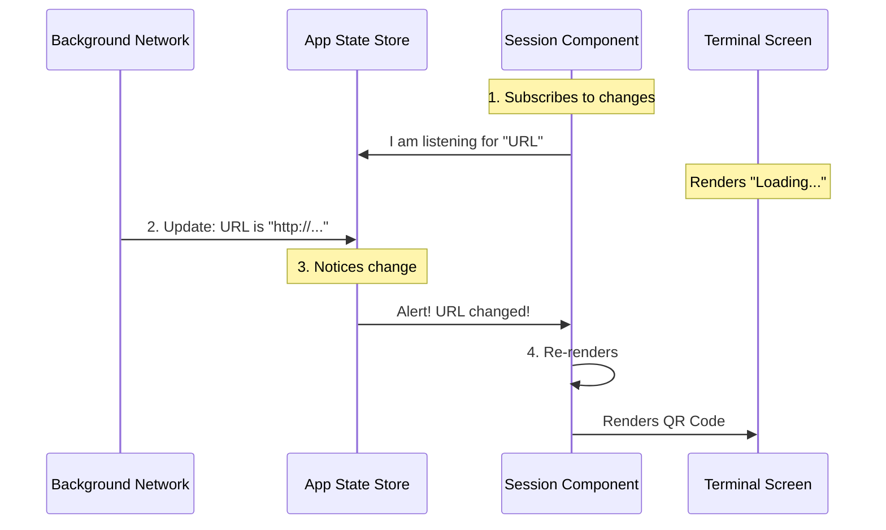

# Chapter 4: Reactive State Hook

In the previous chapter, [Terminal UI Components](03_terminal_ui_components.md), we built a beautiful interface for our `session` command. We created the layout for a title, a QR code, and a URL.

However, right now, our component is a bit "dumb." It doesn't know *what* the URL is. It renders, but it's waiting for data that hasn't arrived yet.

In this chapter, we will connect our UI to the "brain" of the application using the **Reactive State Hook**.

## The Motivation: The Pizza Delivery Tracker

Imagine you order a pizza. You want to know when it leaves the oven and when it is out for delivery.

*   **The "Old" Way (Polling):** You call the pizza place every 10 seconds. "Is it ready? Is it ready? Is it ready?" This is annoying and inefficient.
*   **The "Reactive" Way (Subscription):** You open the delivery app. You stare at the screen. The app connects to the server. As soon as the chef updates the status, your screen *automatically* changes from "Baking" to "Out for Delivery."

### Central Use Case
In our `session` command, the **Remote Session URL** isn't available instantly. The CLI has to talk to a server to get it. This might take 500ms or 2 seconds.

We need a way for our UI component to:
1.  **Listen** to the global application state.
2.  **Wait** until the URL is assigned.
3.  **Re-render** automatically to show the QR code once the URL arrives.

**The Solution:** We use a hook called `useAppState`.

---

## Core Concept: The Global Store

In a React-based application (even in the terminal), we often distinguish between two types of data:

1.  **Local State (`useState`):** Data only *this specific component* cares about (e.g., "Is the dropdown open?").
2.  **Global State (`useAppState`):** Data the *entire application* cares about (e.g., "What is the current Session URL?", "Is the user logged in?").

The `useAppState` hook allows any component, anywhere in the app, to plug into that global data stream.

---

## Solving the Use Case

Let's look at how we implement this in `session.tsx`. We want to grab the `remoteSessionUrl`.

### Step 1: Selecting the Data
We don't want to listen to *everything* (we don't care about user settings or window size right now). We only want the URL.

```typescript
import { useAppState } from '../../state/AppState.js';

// Inside our SessionInfo component:
const remoteSessionUrl = useAppState(state => state.remoteSessionUrl);
```

**Explanation:**
*   `state => state.remoteSessionUrl`: This is a "Selector" function. It's like going to a buffet and putting only the item you want on your plate.
*   If `remoteSessionUrl` changes in the background, this component will automatically re-run.

### Step 2: Reacting to the Change
Now that we have the variable, we need to do something when it changes. We use React's `useEffect` for this.

```typescript
import { useEffect, useState } from 'react';

// Local state to hold the generated block of text
const [qrCode, setQrCode] = useState('');

useEffect(() => {
  // 1. If we don't have a URL yet, do nothing.
  if (!remoteSessionUrl) return;

  // 2. If we DO have it, generate the QR code
  generateQRCode(remoteSessionUrl);
  
}, [remoteSessionUrl]); // <--- The Dependency Array
```

**Explanation:**
*   **The Array `[remoteSessionUrl]`**: This tells React, "Only run this code block if `remoteSessionUrl` has changed."
*   When the app starts, the URL is empty. The code skips.
*   A second later, the URL arrives. `useAppState` triggers a re-render. `useEffect` sees the new URL and generates the QR code.

### Step 3: Handling the "Loading" State
While we wait for the data, we should tell the user what is happening.

```tsx
// Inside our JSX return statement
{isLoading ? (
  <Text dimColor={true}>Generating QR code...</Text>
) : (
  // Show the actual QR code lines
  lines.map((line, i) => <Text key={i}>{line}</Text>)
)}
```

**Output:**
1.  **0.0s:** User types `session`. Terminal shows: "Generating QR code..."
2.  **0.5s:** Network receives URL. `useAppState` fires.
3.  **0.6s:** Terminal updates instantly to show the blocky QR code.

---

## Under the Hood: How it Works

How does the component know the data changed without us calling it manually?

The `useAppState` hook follows a pattern called **Publish/Subscribe** (or Pub/Sub).

1.  **The Store:** Holds the master copy of all data.
2.  **The Subscriber:** Your component says, "Tell me if 'URL' changes."
3.  **The Action:** Some background process (like a network request) updates the Store.



### Internal Implementation Logic
If we looked inside `../../state/AppState.js`, we would see a library (likely something like *Zustand*) managing this.

Here is a simplified view of what `useAppState` does internally:

```typescript
// Simplified pseudo-code of the hook
function useAppState(selector) {
  // 1. Get current value
  const [value, setValue] = useState(selector(globalStore.get()));

  useEffect(() => {
    // 2. Subscribe to the global store
    const unsubscribe = globalStore.subscribe((newState) => {
      
      // 3. Check if the specific slice we want changed
      const newValue = selector(newState);
      if (newValue !== value) {
        setValue(newValue); // Triggers component re-render
      }
    });

    return unsubscribe; // Cleanup when component dies
  }, []);

  return value;
}
```

**Explanation:**
*   The hook acts as a bridge. It sets up a listener when the component mounts.
*   It compares the *old* value with the *new* value.
*   If they are different, it calls `setValue`, which forces React to refresh the UI component we built in Chapter 3.

---

## Conclusion

You have successfully connected your UI to the application's brain!

*   We used **`useAppState`** to listen for the remote session URL.
*   We used **`useEffect`** to trigger the QR code generation only when that URL arrives.
*   We handled the **Loading State** to ensure the user always knows what is happening.

Now our application is alive. It loads data, updates the screen, and looks great. But there is one final piece of the puzzle. How does the user *control* the application? We told them to "press esc to close," but currently, pressing keys does nothing.

Let's fix that in the final chapter.

[Next Chapter: Interactive Keybindings](05_interactive_keybindings.md)

---

Generated by [Code IQ](https://github.com/adityasoni99/Code-IQ)