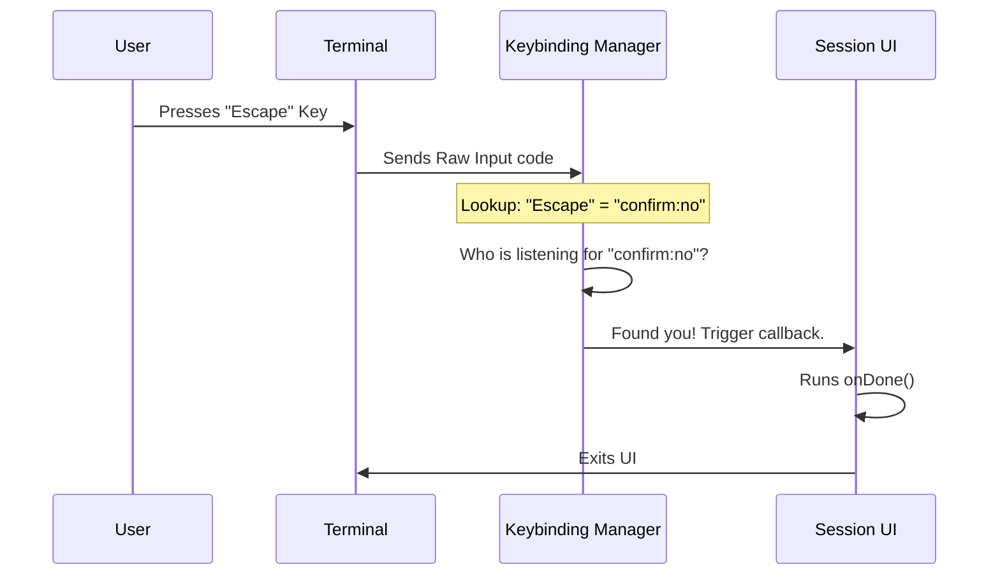

# Chapter 5: Interactive Keybindings

In the previous chapter, [Reactive State Hook](04_reactive_state_hook.md), we brought our `session` command to life by connecting it to live data. The QR code now generates automatically when the network URL is ready.

However, there is one final problem. At the bottom of our screen, we wrote: **"(press esc to close)"**.
But if you press **Esc** right now... nothing happens. The program just sits there. You have to force-quit it (usually with Ctrl+C), which feels broken.

In this final chapter, we will make the application listen to the user.

## The Motivation: The Video Game Controller

Imagine playing a video game. You see instructions on the screen: **"Press A to Jump"**.
*   **Without Keybindings:** You press 'A', but the character stands still. The game isn't "listening" to the controller.
*   **With Keybindings:** The game system is constantly checking: "Did the user press a button? Was it 'A'? If yes, run the `jump()` function."

### Central Use Case
For our `session` command, we want to create a graceful exit.
1.  **Input:** The user presses the `Escape` key.
2.  **Action:** The CLI cleanly shuts down the session UI and returns the user to the command prompt.

**The Solution:** We use a hook called `useKeybinding`. It acts as the bridge between the keyboard and your code functions.

---

## Core Concept: Abstract Actions

You might expect to write code like `if (key === 'Escape')`.
However, our system uses **Abstract Actions** instead of raw key names.

We use an action ID called `'confirm:no'`.
*   **Why?** Because different users might have different preferences. One user might want `Esc` to close things. Another might prefer pressing `n` (for "No").
*   By using `'confirm:no'`, we group these keys together under one logical intent: **"I want to cancel or leave."**

---

## Implementing the Solution

We need to edit our `session.tsx` file one last time. We will tell our component to listen for the "Cancel/No" action.

### Step 1: The Setup
We need a function to run when the user wants to leave. In our code, this function is passed down as a "prop" called `onDone`.

```typescript
type Props = {
  // A function provided by the system to close the command
  onDone: () => void;
};
```

### Step 2: The Hook
Now we import and use the hook inside our component.

```typescript
import { useKeybinding } from '../../keybindings/useKeybinding.js';

function SessionInfo({ onDone }: Props) {
  
  // "When the user signals 'No' or 'Cancel' (Escape key),
  // execute the 'onDone' function."
  useKeybinding('confirm:no', onDone);

  // ... rest of the component
}
```

**Explanation:**
1.  **`'confirm:no'`**: This is the trigger. It maps to standard cancel keys like `Escape`.
2.  **`onDone`**: This is the action. When the trigger fires, this function runs, closing the UI.

### Step 3: Context (Optional but Good)
Sometimes, multiple parts of the screen might be listening for keys. To avoid confusion, we can name the context.

```typescript
useKeybinding('confirm:no', onDone, { 
  context: 'Confirmation' 
});
```

**Output:**
Now, when the QR code is on the screen, if the user presses **Esc**, the `onDone` function fires. The `session` command finishes, and the terminal prompt reappears.

---

## Under the Hood: How it Works

How does a React component inside a text-based terminal know you pressed a physical key?

It involves a chain of events passing through the **Input Manager**.



1.  **Raw Input:** The terminal receives a byte sequence (like `\x1b` for Escape).
2.  **Translation:** The Input Manager translates this raw code into a meaningful intent (`confirm:no`).
3.  **Dispatch:** It checks which active components have registered a `useKeybinding` hook for that intent.
4.  **Execution:** It runs the specific function (`onDone`) bound to that component.

### Internal Implementation Details

The `useKeybinding` hook essentially registers your component into a global list of listeners when the component appears (mounts), and removes it when it disappears (unmounts).

Here is a simplified version of what the hook does:

```typescript
// Simplified pseudo-code
function useKeybinding(actionId, callback) {
  useEffect(() => {
    // 1. Register: "I am interested in 'confirm:no'"
    const listenerId = KeybindingSystem.register(actionId, callback);

    // 2. Cleanup: "I am leaving, stop sending me keys"
    return () => {
      KeybindingSystem.unregister(listenerId);
    };
  }, [actionId, callback]);
}
```

**Why is this cleanup important?**
If we didn't remove the listener, the application might try to run `onDone` even after the command has closed, which would cause the program to crash. React handles this lifecycle automatically with `useEffect`.

---

## Project Conclusion

Congratulations! You have successfully built the `session` command from scratch.

Let's review the journey of the architecture:

1.  **[Command Configuration](01_command_configuration.md):** You defined the command's identity (`name`, `aliases`) and rules (`isEnabled`).
2.  **[Lazy Command Loading](02_lazy_command_loading.md):** You optimized performance by only loading the code when requested.
3.  **[Terminal UI Components](03_terminal_ui_components.md):** You used Ink and React to build a structured interface with `Box` and `Text`.
4.  **[Reactive State Hook](04_reactive_state_hook.md):** You connected the UI to the global app state to generate the QR code dynamically.
5.  **Interactive Keybindings (This Chapter):** You made the UI responsive to user input, allowing a graceful exit.

You now understand the core pillars of building a professional, high-performance CLI tool using this architecture. You can apply these same patterns to create complex forms, selection lists, and interactive dashboards in the terminal!

**End of Tutorial.**

---

Generated by [Code IQ](https://github.com/adityasoni99/Code-IQ)