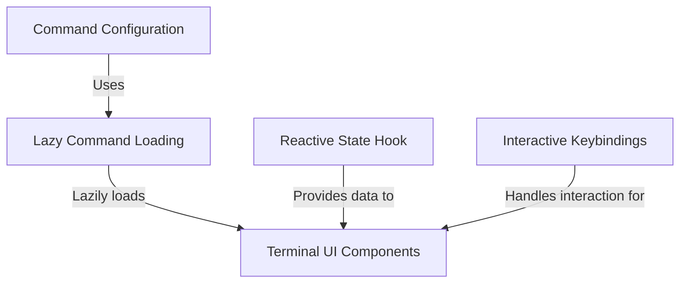

# Tutorial: session

The `session` project is a CLI command module designed to display **remote session details**, specifically a URL and a **QR code**. It employs a **lazy loading** strategy to import the UI logic only when executed and utilizes a **reactive state** system to render real-time connection information within interactive **terminal components**.

## Chapters

1. [Command Configuration](01_command_configuration.md)
2. [Lazy Command Loading](02_lazy_command_loading.md)
3. [Terminal UI Components](03_terminal_ui_components.md)
4. [Reactive State Hook](04_reactive_state_hook.md)
5. [Interactive Keybindings](05_interactive_keybindings.md)

---

Generated by [Code IQ](https://github.com/adityasoni99/Code-IQ)