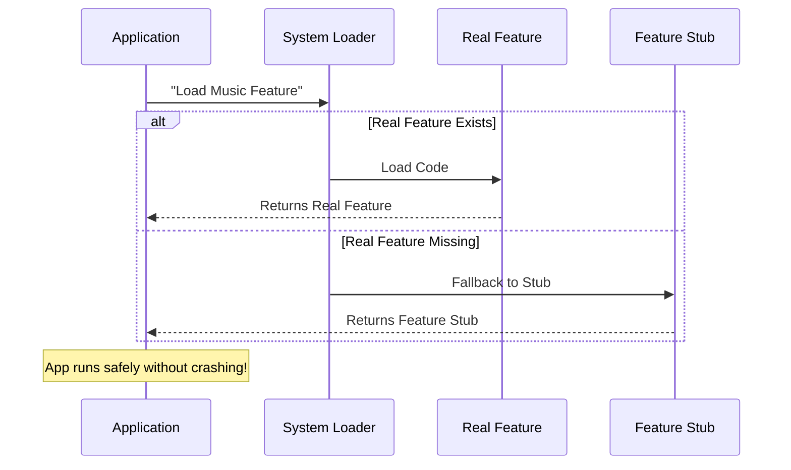

# Chapter 1: Feature Stub

Welcome to the `share` project! If you are new to modular architecture, you are in the right place. We are going to start with the most fundamental safety mechanism in our system: the **Feature Stub**.

## Why do we need a "Stub"?

Imagine you are building a large application, like a **Smart Home Dashboard**. This dashboard is supposed to control lights, music, and temperature.

Now, imagine the "Music Player" team is on vacation, or that specific code fails to load.
**The Problem:** Without safeguards, your entire dashboard might crash (Screen of Death!) just because the Music Player is missing.

**The Solution:** We need a "Feature Stub."

Think of a **Feature Stub** like a **prop in a theater play**. If the script calls for a "Vase" on the table, but the real antique vase hasn't arrived yet, the stage manager puts a cardboard vase there. It doesn't hold water, and you can't put flowers in it, but the actors know it's there, and the play can continue without stopping.

In our code, a Stub allows the system to load a "fake" feature so the application keeps running smoothly, even if the real logic is empty.

---

## Using the Feature Stub

How do we create this "prop"? We simply define an object that *looks* like a feature but does absolutely nothing.

Here is the code structure for a stub. It satisfies the rules (the interface) of a feature but stays hidden and inactive.

### The Stub Code

```javascript
// --- File: index.js ---

export default { 
  isEnabled: () => false, // It is never active
  isHidden: true,         // It is invisible
  name: 'stub'            // Its identity
};
```

**Explanation:**
1.  **`isEnabled`**: This tells the system if the feature is "On". Since this is just a dummy prop, it always returns `false`. We will learn more about how to change this in [Activation Logic](02_activation_logic.md).
2.  **`isHidden`**: This tells the UI not to render anything. Even though the code exists, the user won't see a broken box. We will explore this in [Presentation State](03_presentation_state.md).
3.  **`name`**: This labels the object as a 'stub', helpful for debugging so you know this isn't the real feature.

---

## Under the Hood: The "Backup Plan"

How does the system know when to use the Stub?

When the application starts, it tries to load features. If a specific feature (like our Music Player) cannot be found or initialized, the system automatically swaps in the **Feature Stub**.

### Step-by-Step Flow

1.  **Request:** The Application asks for a specific feature (e.g., "Music").
2.  **Search:** The System looks for the "Music" logic.
3.  **Failure/Empty:** The System realizes "Music" logic is missing.
4.  **Substitution:** Instead of crashing, the System grabs the **Feature Stub**.
5.  **Result:** The Application receives the Stub. It checks `isEnabled`, sees `false`, and simply ignores it safely.

### Visualizing the Process

Here is a simple diagram showing how the system decides to hand over a Stub.



---

## Implementation Details

Let's look closer at the implementation file. In the `share` project, simplicity is key. The stub is defined in `index.js`.

We use a default export so the generic loader can import it easily without knowing the specific name of the feature.

```javascript
// Function returning false guarantees no side effects
const disabledState = () => false;

export default { 
  isEnabled: disabledState, 
  isHidden: true, 
  name: 'stub' 
};
```

**What happens here?**
*   We define the interface that *every* feature in our system must have (`isEnabled`, `isHidden`, `name`).
*   By defaulting `isHidden` to `true`, we ensure that this stub acts as a "Ghost". It occupies the space in the code memory, but it doesn't clutter the user's screen.

This file acts as the ultimate safety net. As long as this file exists, your application can tolerate missing modules without error.

---

## Conclusion

In this chapter, you learned that a **Feature Stub** is a safety mechanism. It is a placeholder object that acts like a real feature but does nothing (`isEnabled: false`) and shows nothing (`isHidden: true`). This prevents the application from crashing when a feature is missing.

Now that we have our safety net in place, how do we actually turn a feature *on* when the real code arrives?

Let's find out in the next chapter: [Activation Logic](02_activation_logic.md).

---

Generated by [Code IQ](https://github.com/adityasoni99/Code-IQ)