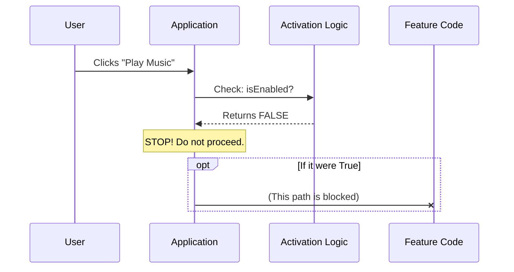

# Chapter 2: Activation Logic

Welcome back! In the previous chapter, [Feature Stub](01_feature_stub.md), we created a safety net—a "fake" feature that prevents our application from crashing when code is missing.

But having a fake feature raises an important question: **How do we make sure this fake code doesn't actually try to do anything?**

If our "cardboard vase" (the Stub) tries to hold water, it will get soggy and fall apart. We need a way to guarantee it stays inactive. This brings us to **Activation Logic**.

## The Problem: The Unfinished Bridge

Imagine you are building a bridge (your code). You have built the entrance, but the middle section isn't finished yet.

If a car drives onto this unfinished bridge, it falls into the river. Disaster!
You need a generic way to tell the Traffic Controller: *"Do not let anyone drive here. The bridge is closed."*

In programming, we often have code that exists but shouldn't run yet because:
1.  It is a **Stub** (placeholder).
2.  It is buggy or unfinished.
3.  It is a feature we want to turn off temporarily.

We need a **Master Switch**.

## The Solution: `isEnabled`

**Activation Logic** is the brain that decides if a feature is "Live".

In the context of our Feature Stub, we want this switch to be permanently taped to the **OFF** position. This ensures that no matter what the rest of the application tries to do, this specific path is blocked safely.

### How to use it

We implement this logic using a simple function called `isEnabled`.

When the system wants to run a feature, it first calls this function. If it returns `false`, the system stops immediately.

Here is the implementation:

```javascript
// --- File: index.js ---

// The "Master Switch" function
const isEnabled = () => {
  // Always return false
  return false;
};

export default { isEnabled };
```

**Explanation:**
*   **Input:** The system asks, "Can I execute this feature?"
*   **Output:** The function returns `false`.
*   **Result:** The system skips the feature entirely. It’s like a circuit breaker that has tripped to protect the house.

---

## Under the Hood: The Gatekeeper

How does the application use this logic effectively? It acts as a **Gatekeeper**.

Before any complex code runs, or before a button is clicked, the Application checks the Activation Logic.

### Step-by-Step Flow

1.  **Trigger:** The User clicks a button or the App loads.
2.  **Check:** The App calls `isEnabled()`.
3.  **Denial:** The Activation Logic returns `false`.
4.  **Safety:** The App acknowledges the feature is "Off" and does nothing. No errors, no crashes.

### Visualizing the Logic

Here is how the decision process works inside the system:



---

## Implementation Details

Let's look at the full code context from our `share` project. We combine this logic with the other properties of the feature.

We use an **Arrow Function** `() => false`. This is a concise way to write a function that takes no arguments and immediately returns a value.

```javascript
// --- File: index.js ---

export default { 
  // 1. The Activation Logic
  isEnabled: () => false, 
  
  // 2. Other properties (covered later)
  isHidden: true, 
  name: 'stub' 
};
```

**Why make it a function?**
You might wonder, why not just set `isEnabled: false` (a simple boolean variable)?

By making it a function (`() => ...`), we make it **future-proof**.
Right now, for the Stub, it simply returns `false`.
However, in a real feature, this function could contain complex logic, such as:
*   `return user.isAdmin;` (Only admins can see this)
*   `return date > launchDate;` (Only active after Christmas)

For the **Feature Stub**, however, simplicity is safety. We hardcode it to `false` to guarantee it never accidentally executes.

---

## Conclusion

In this chapter, you learned about **Activation Logic**. This is the mechanism (`isEnabled`) that determines if a feature is allowed to run.

For our **Feature Stub**, we set this switch to "Off" (`() => false`). This acts as a circuit breaker, ensuring that our placeholder code never causes functionality errors.

But wait—if the feature is turned "Off", does that mean it's invisible to the user? Or is there a broken button sitting on the screen doing nothing?

To control visibility, we need to understand the next concept: [Presentation State](03_presentation_state.md).

---

Generated by [Code IQ](https://github.com/adityasoni99/Code-IQ)