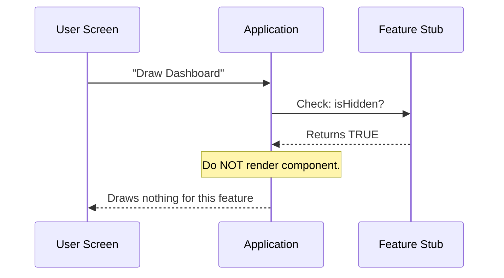

# Chapter 3: Presentation State

Welcome to the final chapter of our "Feature Stub" series!

In the previous chapter, [Activation Logic](02_activation_logic.md), we learned how to turn a feature "Off" internally using `isEnabled`. This ensures that our "fake" placeholder code doesn't try to run and crash the system.

However, simply turning a feature off isn't always enough. Just because a machine is unplugged doesn't mean it disappears from the room.

**The Problem:**
If we have a "Music Player" stub that is disabled, we don't want to show a broken "Play" button or an empty grey box to the user. We want it to vanish completely until the real code is ready.

This brings us to **Presentation State**.

## The Concept: The Stage Curtain

To understand Presentation State, think of a theater stage.

*   **Activation Logic** (`isEnabled`) controls the **Actors**. Are they acting? Or are they standing still?
*   **Presentation State** (`isHidden`) controls the **Curtain**.

Even if the actors are ready to perform, if the curtain is down (`isHidden: true`), the audience sees nothing.

For our **Feature Stub**, we want the curtain to be permanently down. This ensures that the "stub" feature remains completely invisible to the end-user, acting like a ghost in the system.

---

## Using Presentation State

We control this visibility using a simple property called `isHidden`.

While `isEnabled` is about **Behavior** (logic), `isHidden` is about **Appearance** (UI).

### The Code

Here is how we set the curtain to be "down" by default.

```javascript
// --- File: index.js ---

export default {
  // ... other properties
  
  // The Presentation State
  isHidden: true 
};
```

**Explanation:**
*   **Input:** The User Interface (UI) asks, "Should I draw this feature on the screen?"
*   **Output:** The code says `true` (Yes, hide it).
*   **Result:** The UI renders nothing at all. The space where the feature *would* be is left empty or collapsed.

---

## Under the Hood: The UI Decision

How does the visual part of your application respect this setting?

When your application (like a Dashboard) renders, it loops through all available features. Before drawing pixels on the screen, it checks the Presentation State.

### Step-by-Step Flow

1.  **Rendering Start:** The App prepares to draw the "Dashboard".
2.  **Inspection:** The App picks up our Feature Stub.
3.  **Check:** The App asks, "Is this hidden?"
4.  **Confirmation:** The Feature returns `isHidden: true`.
5.  **Action:** The App skips this component entirely. It moves to the next feature as if this one didn't exist.

### Visualizing the Process

Here is a diagram showing how the screen decides what to show.



---

## Implementation Details

Let's put everything together. We now have a complete **Feature Stub**. It satisfies the system requirements from [Feature Stub](01_feature_stub.md), it is safely disabled via [Activation Logic](02_activation_logic.md), and now it is invisible.

Here is the final file content for `index.js`.

```javascript
// --- File: index.js ---

export default { 
  // 1. Safety: Do not run logic
  isEnabled: () => false, 

  // 2. Visibility: Do not show on screen
  isHidden: true, 
  
  // 3. Identity: For debugging
  name: 'stub' 
};
```

**Why separate `isEnabled` and `isHidden`?**

You might ask: *"If it is disabled, shouldn't it automatically be hidden?"*

Not always! Imagine a "Premium Feature" button.
1.  **`isEnabled: false`**: The button is greyed out (disabled) because you haven't paid.
2.  **`isHidden: false`**: You can still *see* the button (so you know what you are missing!).

For our **Stub**, however, we want both: we want it dead (`isEnabled: false`) and invisible (`isHidden: true`).

---

## Conclusion

Congratulations! You have successfully built a robust **Feature Stub**.

Let's recap what we learned in this tutorial series:

1.  **[Feature Stub](01_feature_stub.md)**: We created a placeholder object to prevent the generic loader from crashing when a file is missing.
2.  **[Activation Logic](02_activation_logic.md)**: We used `isEnabled` to ensure the stub never executes any logic.
3.  **Presentation State**: We used `isHidden` to ensure the stub remains invisible to the user.

By combining these three concepts, you have created a "Safe Ghost"—a piece of code that exists to satisfy the system architecture but affects neither the logic nor the user interface. This is the foundation of stable, modular software design.

---

Generated by [Code IQ](https://github.com/adityasoni99/Code-IQ)