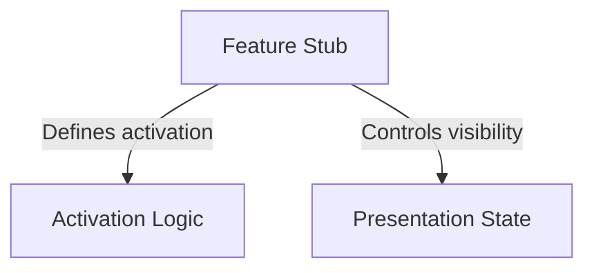

# Tutorial: share

This project component acts as a **placeholder** or "stub" for a specific feature (likely related to sharing). It is intentionally configured to be *inactive* and *invisible* within the user interface, serving as a safe default state that allows the application to function without the actual implementation present.

## Chapters

1. [Feature Stub](01_feature_stub.md)
2. [Activation Logic](02_activation_logic.md)
3. [Presentation State](03_presentation_state.md)

---

Generated by [Code IQ](https://github.com/adityasoni99/Code-IQ)