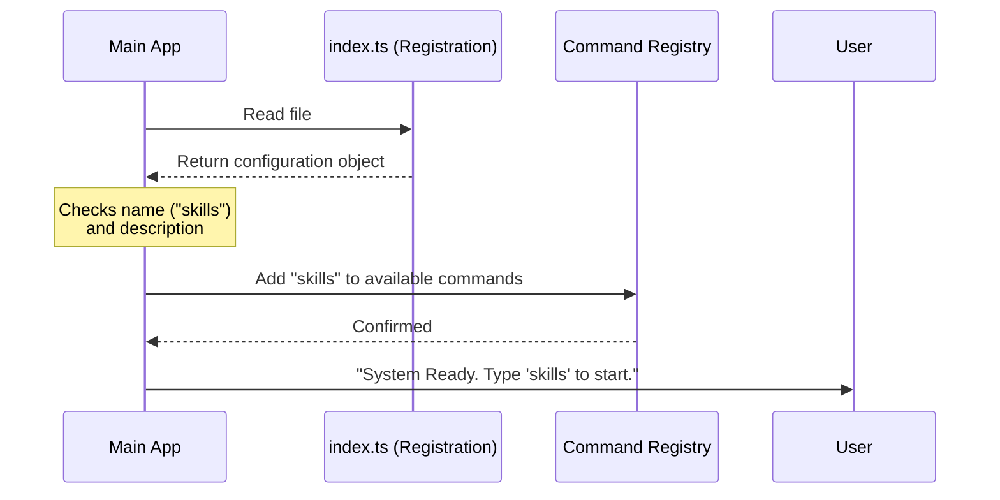

# Chapter 1: Command Registration Pattern

Welcome to the `skills` project! In this first chapter, we are going to look at the foundation of how features are added to our system. We call this the **Command Registration Pattern**.

## Why do we need this?

Imagine you are building a digital assistant or a Command Line Interface (CLI). You want this assistant to have many capabilities, or "skills," like listing files, checking the weather, or processing text.

If you wrote all the code for every single skill in one giant file, your program would become messy, hard to read, and very slow to start up.

**The Solution:** We need a way to tell the system *what* skills exist without actually loading all the heavy code behind them immediately.

### The Restaurant Menu Analogy
Think of this pattern like a **menu in a restaurant**:

1.  **The Menu (Registration):** It lists the name of the dish (e.g., "Cheeseburger") and a description ("Beef patty with cheddar"). It is lightweight and easy to read.
2.  **The Kitchen (Implementation):** This is where the actual cooking happens. The chef doesn't cook the burger until you order it.

In our project, the **Command Registration Pattern** is the menu. It describes the skill so the system knows it exists, but it leaves the "cooking" (loading the actual code) for later.

## The Use Case: Registering the "Skills" Skill

Let's look at a concrete example. We want to add a feature called `skills` that simply lists all the available commands in our system.

Instead of writing the logic right away, we first need to **register** it. We do this in a file called `index.ts`.

### Step 1: Importing the Contract

First, we need to make sure our registration follows the rules. We import a type called `Command`. This acts like a template or a form that ensures we don't forget important details like the name or description.

```typescript
// index.ts
// We import the 'Command' type to ensure our object looks correct
import type { Command } from '../../commands.js'
```

*Explanation:* This line pulls in a blueprint. It tells TypeScript: "We are about to define a Command, so please check strictly if we make any mistakes."

### Step 2: Creating the Configuration Object

Now, we define the "menu item." This object contains the metadata about our skill.

```typescript
// Define the skill configuration
const skills = {
  type: 'local-jsx',
  name: 'skills',
  description: 'List available skills',
  // We will explain 'load' in the next chapter!
  load: () => import('./skills.js'),
} satisfies Command
```

*Explanation:*
*   `type`: Tells the system what kind of output to expect (more on this in [Local JSX Execution Interface](03_local_jsx_execution_interface.md)).
*   `name`: The keyword the user will type to use this feature.
*   `description`: A helpful text that explains what this does.
*   `load`: A function that points to where the *real* code lives.
*   `satisfies Command`: This is our validation. If we forgot the `name`, this line would turn red and warn us.

### Step 3: Exporting the Skill

Finally, we export this object so the main system can find it.

```typescript
// Make this configuration available to the rest of the app
export default skills
```

*Explanation:* By using `export default`, we allow the main application to "read the menu" by importing this file.

## Under the Hood: How it Works

What happens when the application starts? It doesn't run the code inside `skills.js` yet. It simply scans these registration files to build a list of available commands.

### The Registration Flow

Here is a simplified view of how the system reads your registration:



1.  The **System** opens `index.ts`.
2.  It reads the `name` and `description`.
3.  It stores this info in a **Registry** (a list of known commands).
4.  It waits for the user. The heavy code inside `load` has **not** been touched yet.

### Implementation Detail

While the code above is simple, the magic happens because of the `Command` interface. It enforces a strict structure. Here is a simplified version of what that interface looks like elsewhere in the project:

```typescript
// Simplified definition of the Command interface
export interface Command {
  name: string;
  description: string;
  type: string;
  load: () => Promise<any>; // The instructions to fetch the code
}
```

*Explanation:* This interface is the contract. Because our `skills` object in `index.ts` uses `satisfies Command`, we guarantee that our plugin system will always know how to handle this feature.

## Summary

In this chapter, we learned the **Command Registration Pattern**.

*   **Motivation:** We want to list features without loading their heavy code immediately.
*   **Concept:** We separate **Metadata** (name, description) from **Implementation** (the actual logic).
*   **Analogy:** It's like a restaurant menu item vs. the actual meal.

We defined the menu item, but we haven't discussed how the "meal" is cooked yet. You noticed the `load` property in our code:

```typescript
load: () => import('./skills.js'),
```

How does this function work? How does it fetch the code only when needed? We will explore this in the next chapter.

[Next Chapter: Lazy Module Loading](02_lazy_module_loading.md)

---

Generated by [Code IQ](https://github.com/adityasoni99/Code-IQ)