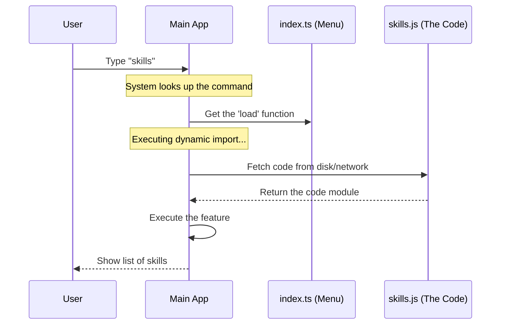

# Chapter 2: Lazy Module Loading

Welcome back! In the previous chapter, [Command Registration Pattern](01_command_registration_pattern.md), we learned how to create a "menu" of commands. We told the system *that* the `skills` command exists, but we didn't actually load the code that performs the action.

Now, we will explore **Lazy Module Loading**. This is the mechanism that ensures our application stays fast and lightweight, no matter how many features we add.

## The Motivation: The Library Vault

Imagine a massive library where millions of books are kept in a deep underground vault.

*   **The "Eager" Way (Bad):** Every morning, the librarian carries *every single book* up to the front desk, just in case someone asks for one. This takes hours, and the front desk runs out of space.
*   **The "Lazy" Way (Good):** The librarian sits at the empty desk. When a reader asks for "Harry Potter," the librarian runs to the vault, retrieves *only* that book, and brings it back.

In programming:
*   **Books** = Code files (Modules).
*   **Carrying books** = Loading code into memory (RAM).
*   **Startup time** = How long the user waits before they can type.

We want the "Lazy" way. We want to load the code for the `skills` command only when the user actually types `skills`.

## The Use Case: Configuring the Loader

Let's look at our `index.ts` file again. We briefly saw the `load` property in the last chapter. Now, let's understand exactly what it does.

### Static vs. Dynamic Imports

Usually, at the top of a file, you see this:

```typescript
// Static Import
import { myFeature } from './myFeature.js';
```

This is an **Eager** load. As soon as the program starts, it loads `./myFeature.js`. If we did this for 100 commands, our app would crawl.

Instead, we use **Dynamic Imports** inside a function.

### Implementing the Load Function

Here is how we apply this to our `skills` command:

```typescript
// index.ts
const skills = {
  name: 'skills',
  // ... other metadata
  
  // This is the magic line:
  load: () => import('./skills.js'),
  
} satisfies Command
```

*Explanation:*
1.  `() => ...`: This is an Arrow Function. It wraps the action. It basically says: "Don't do this yet! Wait until I call you."
2.  `import('./skills.js')`: This is the function that actually goes to the disk to fetch the file.
3.  Because it is wrapped in `() =>`, the file is **not** loaded when the application starts. It is "Lazy."

## Under the Hood: The Loading Process

How does the system use this function? Let's look at the flow when a user actually tries to run the command.

### Sequence Diagram



1.  **User acts:** Nothing happens until the user types a command.
2.  **Trigger:** The system grabs the configuration object we wrote in Chapter 1.
3.  **Fetch:** The system calls our `load()` function.
4.  **Execute:** The `import()` statement runs, finds `skills.js`, and loads it into memory.

### Internal Implementation Logic

To help you understand how the system handles this, here is a simplified version of what the core application logic looks like.

You generally don't have to write this part (it's part of the framework), but understanding it helps you write better plugins.

```typescript
// Simplified system logic
async function executeCommand(commandName: string) {
  // 1. Find the registration object (from Chapter 1)
  const cmd = registry.find(commandName);

  // 2. Call the load function we defined
  console.log("Loading module...");
  const module = await cmd.load();

  // 3. Now we have the actual code from skills.js!
  // We can now run the main function inside it.
  module.default(); 
}
```

*Explanation:*
*   `cmd.load()`: This executes the arrow function `() => import(...)`.
*   `await`: Loading a file takes time (milliseconds). JavaScript waits for the file to be ready before moving to the next line.
*   `module.default`: When we use `import()`, the file contents are returned as an object.

## Summary

In this chapter, we covered **Lazy Module Loading**.

*   **Problem:** Loading all code at once makes applications slow and heavy.
*   **Solution:** We use **Dynamic Imports** (`import()`) wrapped in a function.
*   **Result:** The heavy code (`skills.js`) sits in the "vault" (on the disk) and is only brought into the "front desk" (memory) when the user specifically asks for it.

Now that we have successfully loaded the `skills.js` file, what is inside it? How do we define what the user actually sees on the screen?

In the next chapter, we will explore the file we just loaded and learn about the interface used to render the output.

[Next Chapter: Local JSX Execution Interface](03_local_jsx_execution_interface.md)

---

Generated by [Code IQ](https://github.com/adityasoni99/Code-IQ)